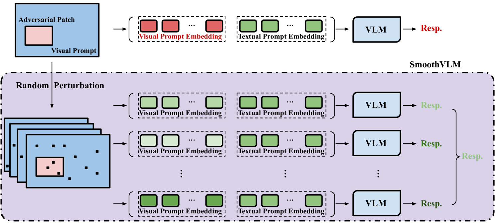
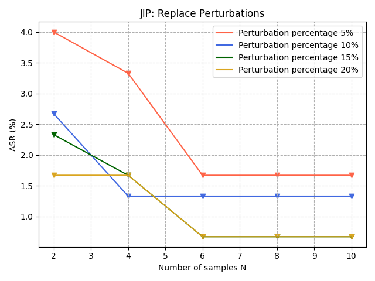
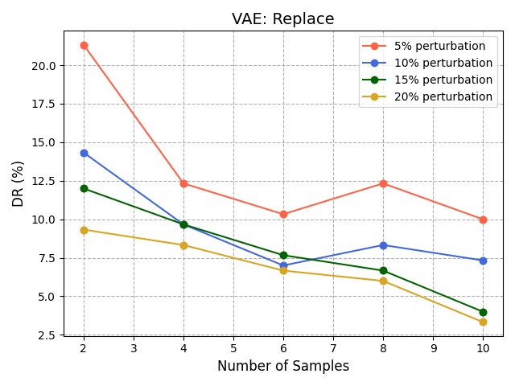

# 防御视觉-语言模型，抵御补丁式视觉提示注入威胁

发布时间：2024年05月17日

`Agent

这篇论文主要关注的是视觉-语言模型（VLMs）中的安全问题，特别是对抗性补丁攻击的问题。论文提出了一种名为SmoothVLM的防御机制，旨在抵御这种类型的攻击。虽然这项工作涉及到了大型语言模型（LLM）的应用，但其核心贡献在于开发了一种针对特定攻击的防御机制，这更符合Agent类别的定义，即设计和实现能够自主执行任务的系统或代理。因此，将这篇论文归类为Agent更为合适。` `人工智能安全` `多模态交互`

> Safeguarding Vision-Language Models Against Patched Visual Prompt Injectors

# 摘要

> 随着大型语言模型在人工智能领域的地位日益显著，多模态成为新的前沿，其嵌入被用作生成文本内容的提示。视觉-语言模型（VLMs）引领这一潮流，创新地融合视觉与文本数据，提升理解和交互体验。然而，这也增加了潜在的攻击风险。基于补丁的对抗性攻击在物理视觉应用中被视为最真实的威胁，已有众多文献证实。本文聚焦于补丁视觉提示注入问题，探讨攻击者如何利用对抗性补丁在VLMs中操纵内容。研究发现，这些对抗性提示对像素级随机化极为敏感，即便面对专门设计的自适应攻击也保持稳定。基于此，我们开发了SmoothVLM，一种采用平滑技术的防御机制，专为抵御此类攻击而设计。该机制在两个顶级VLMs上将攻击成功率降至0%至5.0%，同时保持67.3%至95.0%的良性图像上下文恢复，巧妙平衡了安全与实用性。

> Large language models have become increasingly prominent, also signaling a shift towards multimodality as the next frontier in artificial intelligence, where their embeddings are harnessed as prompts to generate textual content. Vision-language models (VLMs) stand at the forefront of this advancement, offering innovative ways to combine visual and textual data for enhanced understanding and interaction. However, this integration also enlarges the attack surface. Patch-based adversarial attack is considered the most realistic threat model in physical vision applications, as demonstrated in many existing literature. In this paper, we propose to address patched visual prompt injection, where adversaries exploit adversarial patches to generate target content in VLMs. Our investigation reveals that patched adversarial prompts exhibit sensitivity to pixel-wise randomization, a trait that remains robust even against adaptive attacks designed to counteract such defenses. Leveraging this insight, we introduce SmoothVLM, a defense mechanism rooted in smoothing techniques, specifically tailored to protect VLMs from the threat of patched visual prompt injectors. Our framework significantly lowers the attack success rate to a range between 0% and 5.0% on two leading VLMs, while achieving around 67.3% to 95.0% context recovery of the benign images, demonstrating a balance between security and usability.

[Arxiv](https://arxiv.org/abs/2405.10529)