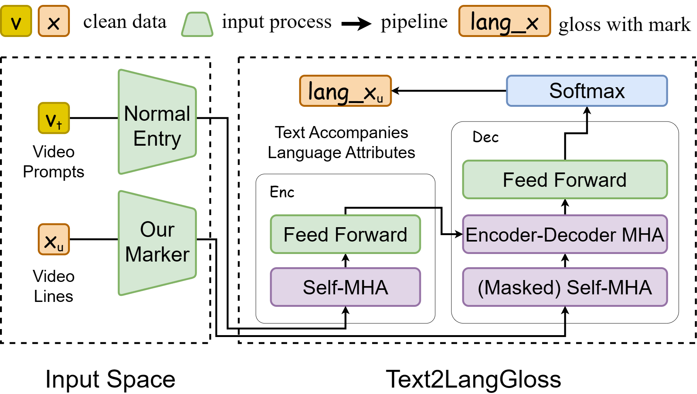

# SignLLM：大型语言模型助力手语生成

发布时间：2024年05月17日

`Agent

理由：这篇论文介绍了名为SignLLM的多语种手语生成模型，该模型能够根据文本或提示自主生成手语手势。这种模型通过强化学习技术提升其自主采样高质量数据的能力，显示出较强的自主性和决策能力，符合Agent类别的特征。此外，虽然该模型涉及多语种处理，但主要关注点在于模型的自主生成和决策能力，而非理论研究或特定的应用场景，因此更适合归类为Agent。` `手语翻译` `多语种交流`

> SignLLM: Sign Languages Production Large Language Models

# 摘要

> 本文首次推出了名为Prompt2Sign的全面多语种手语数据集，涵盖了包括美国手语（ASL）在内的八种语言。我们精心将海量视频数据转换为模型友好的格式，特别适合seq2seq和text2text等翻译模型的训练。基于此数据集，我们开发了SignLLM，首个多语种手语生成模型，具备两种创新模式，能从文本或提示生成手语手势。这两种模式采用基于强化学习的新技术和模块，有效提升模型自主采样高质量数据的能力，加速训练进程。SignLLM的测试结果显示，它在八种手语的SLP任务上均达到了业界领先水平。

> In this paper, we introduce the first comprehensive multilingual sign language dataset named Prompt2Sign, which builds from public data including American Sign Language (ASL) and seven others. Our dataset transforms a vast array of videos into a streamlined, model-friendly format, optimized for training with translation models like seq2seq and text2text. Building on this new dataset, we propose SignLLM, the first multilingual Sign Language Production (SLP) model, which includes two novel multilingual SLP modes that allow for the generation of sign language gestures from input text or prompt. Both of the modes can use a new loss and a module based on reinforcement learning, which accelerates the training by enhancing the model's capability to autonomously sample high-quality data. We present benchmark results of SignLLM, which demonstrate that our model achieves state-of-the-art performance on SLP tasks across eight sign languages.

[Arxiv](https://arxiv.org/abs/2405.10718)