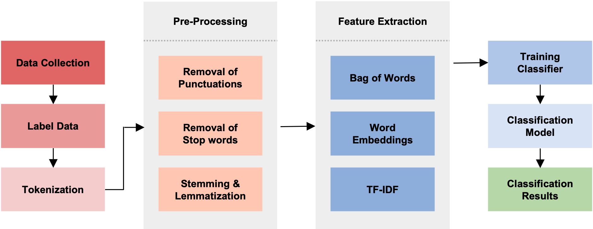
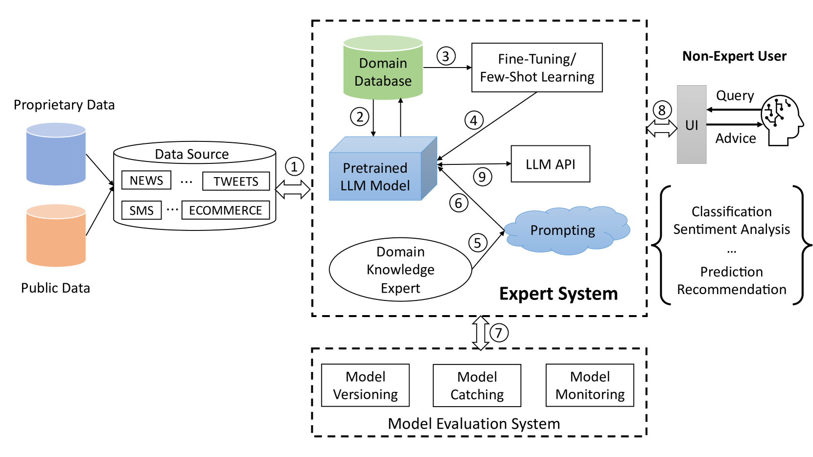

# 智能专家系统：利用大型语言模型进行文本分类

发布时间：2024年05月17日

`LLM应用

这篇论文主要探讨了如何利用大型语言模型（LLMs）作为文本分类器，通过对比多种LLMs、机器学习算法及神经网络结构的表现，展示了特定LLMs在情感分析、垃圾短信识别及多标签分类中的优越性能。此外，论文还提到了通过少量样本学习或微调可以进一步提升系统性能，并且公开了源码与数据集。这些内容主要集中在LLMs的实际应用层面，因此归类为LLM应用。` `文本分类`

> Smart Expert System: Large Language Models as Text Classifiers

# 摘要

> 文本分类作为NLP的核心任务，随着大型语言模型（LLMs）的兴起，该领域迎来了革命。本文推出的智能专家系统，巧妙地利用LLMs作为文本分类器，简化了繁琐的传统流程，无需深度预处理和专业知识。在四个数据集上，我们对比了多种LLMs、机器学习算法及神经网络结构的表现。结果显示，特定LLMs在情感分析、垃圾短信识别及多标签分类中超越了传统技术。更有甚者，通过少量样本学习或微调，系统性能得以进一步提升，微调后的模型在所有数据集中表现最佳。源码与数据集已公开于GitHub：https://github.com/yeyimilk/llm-zero-shot-classifiers。

> Text classification is a fundamental task in Natural Language Processing (NLP), and the advent of Large Language Models (LLMs) has revolutionized the field. This paper introduces the Smart Expert System, a novel approach that leverages LLMs as text classifiers. The system simplifies the traditional text classification workflow, eliminating the need for extensive preprocessing and domain expertise. The performance of several LLMs, machine learning (ML) algorithms, and neural network (NN) based structures is evaluated on four datasets. Results demonstrate that certain LLMs surpass traditional methods in sentiment analysis, spam SMS detection and multi-label classification. Furthermore, it is shown that the system's performance can be further enhanced through few-shot or fine-tuning strategies, making the fine-tuned model the top performer across all datasets. Source code and datasets are available in this GitHub repository: https://github.com/yeyimilk/llm-zero-shot-classifiers.

[Arxiv](https://arxiv.org/abs/2405.10523)