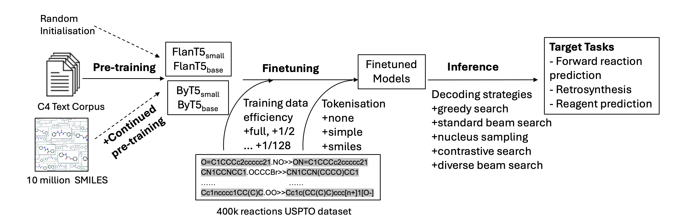
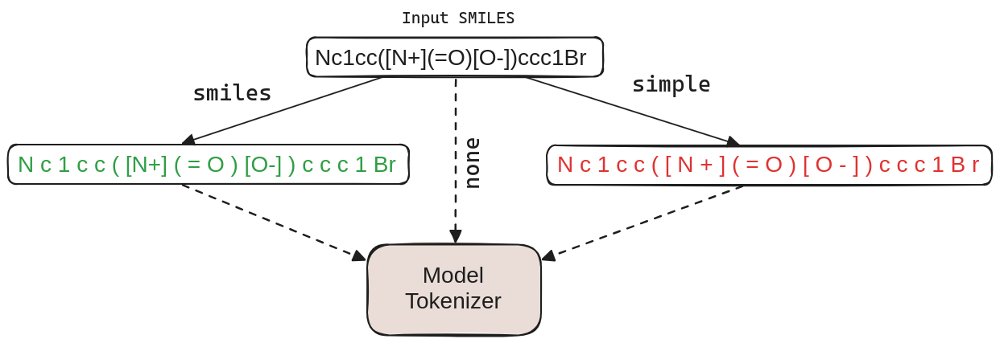
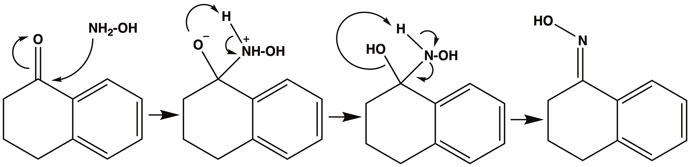
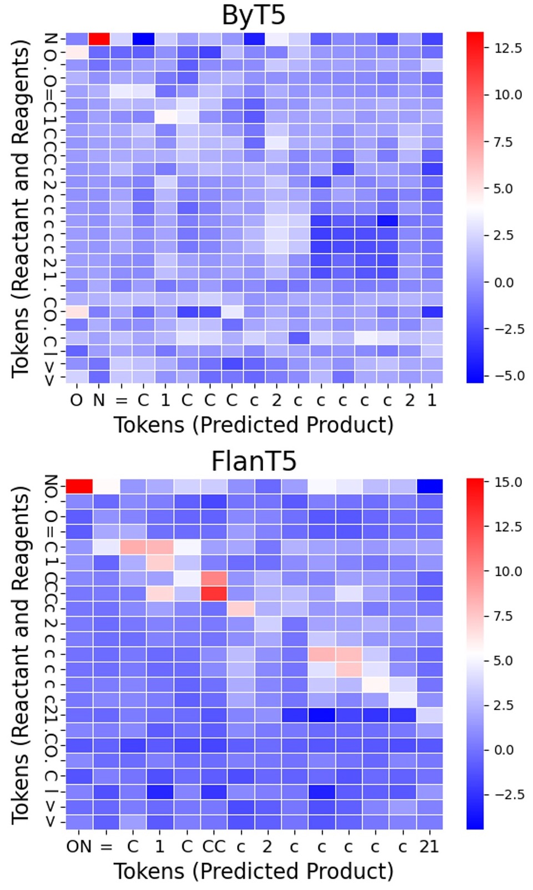
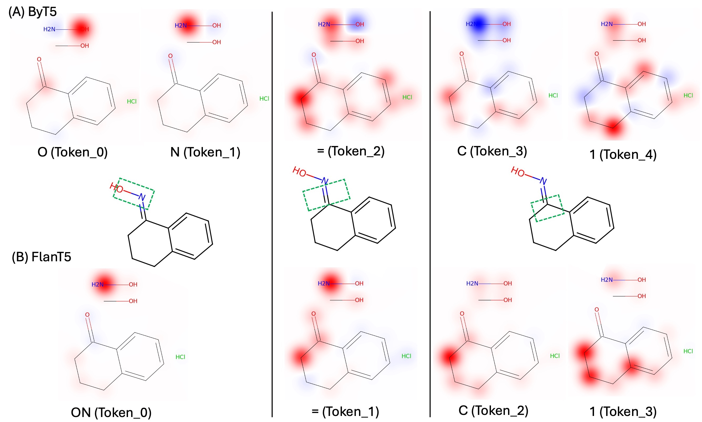
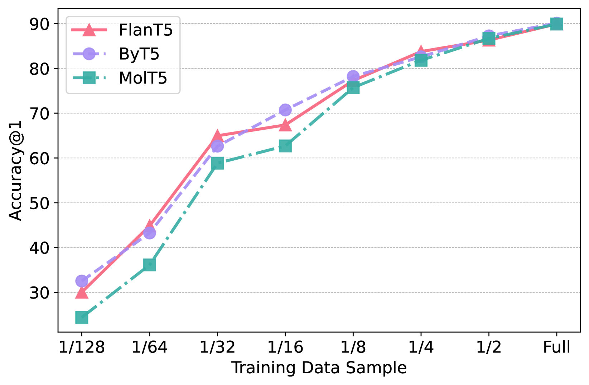
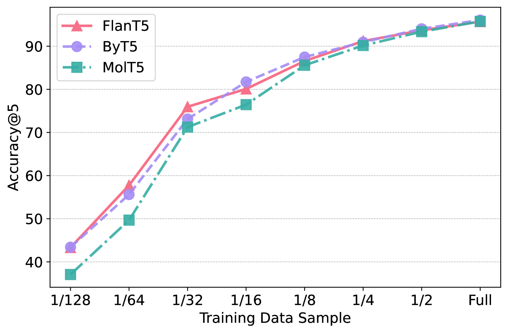
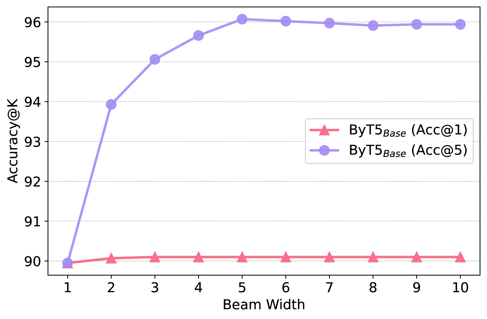
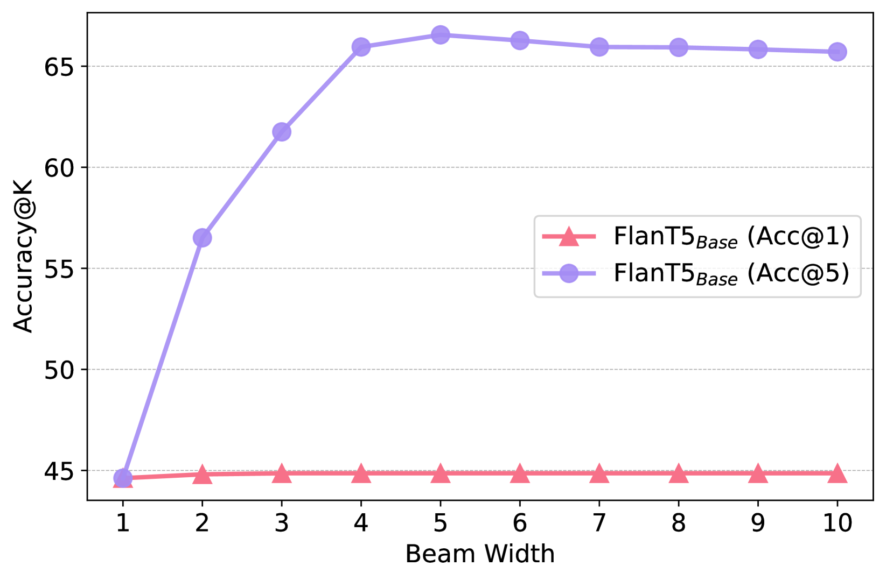

# 针对有机反应预测，深入分析与优化指令调整及字节级语言模型

发布时间：2024年05月17日

`LLM应用

理由：这篇论文主要探讨了基于Transformer的语言模型（FlanT5和ByT5）在化学反应预测领域的应用。尽管这些模型最初是为语言任务预训练的，但研究显示它们可以通过针对性的微调有效适应化学反应预测任务。论文详细分析了预训练的影响、微调效率、标记化策略和解码策略等关键因素，展示了这些语言模型在化学领域的应用潜力和性能表现。因此，这篇论文属于LLM应用类别。` `人工智能`

> Specialising and Analysing Instruction-Tuned and Byte-Level Language Models for Organic Reaction Prediction

# 摘要

> 基于Transformer的编码器-解码器模型在化学反应预测领域表现卓越，但它们往往依赖于对数千万未标记分子的预训练，这一过程既耗时又资源密集。我们的研究聚焦于一个核心问题：仅基于语言数据预训练的FlanT5和ByT5模型，能否通过针对性微调，有效适应有机反应预测？我们系统地探讨了包括标记化、预训练影响、微调效率及解码策略在内的多个关键环节。研究发现，尽管预训练仅限于语言任务，FlanT5和ByT5仍为化学反应预测提供了强有力的基础，显示出与化学领域的良好兼容性。这意味着，尽管大规模未标记分子数据集的预训练有助于，但并非利用语言模型进行化学研究的关键。我们的模型在Top-1和Top-5准确度上表现相当，尽管存在细微差异。标记化和词汇修剪虽对性能影响微小，却能显著提升训练和推理速度；而最简单的贪婪解码策略已极具竞争力，更复杂的解码算法带来的提升有限。综上，我们对FlanT5和ByT5进行了多维度的评估，并探讨了它们在有机反应预测中的应用潜力，为未来化学领域中语言模型的有效利用提供了指导。

> Transformer-based encoder-decoder models have demonstrated impressive results in chemical reaction prediction tasks. However, these models typically rely on pretraining using tens of millions of unlabelled molecules, which can be time-consuming and GPU-intensive. One of the central questions we aim to answer in this work is: Can FlanT5 and ByT5, the encode-decoder models pretrained solely on language data, be effectively specialised for organic reaction prediction through task-specific fine-tuning? We conduct a systematic empirical study on several key issues of the process, including tokenisation, the impact of (SMILES-oriented) pretraining, fine-tuning sample efficiency, and decoding algorithms at inference. Our key findings indicate that although being pretrained only on language tasks, FlanT5 and ByT5 provide a solid foundation to fine-tune for reaction prediction, and thus become `chemistry domain compatible' in the process. This suggests that GPU-intensive and expensive pretraining on a large dataset of unlabelled molecules may be useful yet not essential to leverage the power of language models for chemistry. All our models achieve comparable Top-1 and Top-5 accuracy although some variation across different models does exist. Notably, tokenisation and vocabulary trimming slightly affect final performance but can speed up training and inference; The most efficient greedy decoding strategy is very competitive while only marginal gains can be achieved from more sophisticated decoding algorithms. In summary, we evaluate FlanT5 and ByT5 across several dimensions and benchmark their impact on organic reaction prediction, which may guide more effective use of these state-of-the-art language models for chemistry-related tasks in the future.

[Arxiv](https://arxiv.org/abs/2405.10625)