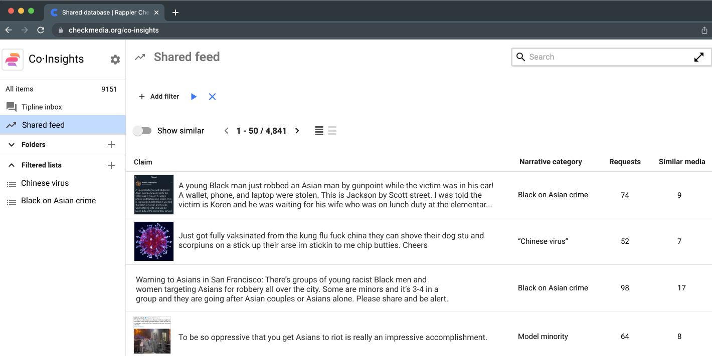
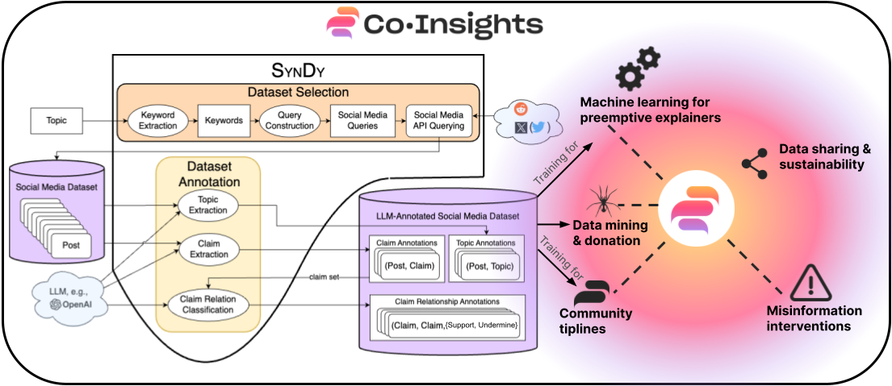

# SynDy：打造虚假信息任务的动态合成数据集之框架

发布时间：2024年05月17日

`LLM应用

这篇论文介绍了SynDy框架，该框架利用大型语言模型（LLMs）生成合成动态数据集，用于训练针对特定地区的专业化语言模型，以应对错误信息问题。SynDy框架的创新之处在于使用LLMs为错误信息相关任务创建精细的合成标签，并通过社交媒体查询自动生成主题聚焦的数据集。这种方法不仅降低了成本，还提高了模型性能，使其能够与人类标注数据训练的模型性能相媲美。此外，SynDy框架的应用实例表明，它已被整合进Meedan的聊天机器人系统，服务于多个组织和大量用户，并通过消息应用自动传播事实核查。因此，这篇论文属于LLM应用类别，因为它展示了如何将LLMs应用于实际问题解决，特别是在错误信息核查领域。` `错误信息核查` `社交媒体分析`

> SynDy: Synthetic Dynamic Dataset Generation Framework for Misinformation Tasks

# 摘要

> 离散社区常因未被主流事实核查关注而深受错误信息之害，亟需加强新兴事实核查的努力。本文提出的SynDy框架，利用前沿大型语言模型（LLMs）生成合成动态数据集，旨在训练针对特定地区的专业化语言模型。SynDy首次运用LLMs为错误信息相关任务（如声明匹配、主题聚类及声明关系分类）创建精细的合成标签。该框架通过社交媒体查询自动生成主题聚焦的数据集，并附带合成标签，为低成本扩大人类主导的事实核查提供了关键工具。实验表明，使用SynDy生成的标签训练的模型性能优于标准基线，且与人类标注数据训练的模型性能相当。SynDy正被整合进Meedan的聊天机器人系统，服务于50多个组织及23万用户，并通过消息应用自动传播事实核查。此外，SynDy将融入Co-Insights工具包，助力资源有限的组织为其社区提供事实核查服务。未来，SynDy有望支持更多错误信息核查工具，例如将新出现的错误信息声明与高质量解释器相匹配。

> Diaspora communities are disproportionately impacted by off-the-radar misinformation and often neglected by mainstream fact-checking efforts, creating a critical need to scale-up efforts of nascent fact-checking initiatives. In this paper we present SynDy, a framework for Synthetic Dynamic Dataset Generation to leverage the capabilities of the largest frontier Large Language Models (LLMs) to train local, specialized language models. To the best of our knowledge, SynDy is the first paper utilizing LLMs to create fine-grained synthetic labels for tasks of direct relevance to misinformation mitigation, namely Claim Matching, Topical Clustering, and Claim Relationship Classification. SynDy utilizes LLMs and social media queries to automatically generate distantly-supervised, topically-focused datasets with synthetic labels on these three tasks, providing essential tools to scale up human-led fact-checking at a fraction of the cost of human-annotated data. Training on SynDy's generated labels shows improvement over a standard baseline and is not significantly worse compared to training on human labels (which may be infeasible to acquire). SynDy is being integrated into Meedan's chatbot tiplines that are used by over 50 organizations, serve over 230K users annually, and automatically distribute human-written fact-checks via messaging apps such as WhatsApp. SynDy will also be integrated into our deployed Co-Insights toolkit, enabling low-resource organizations to launch tiplines for their communities. Finally, we envision SynDy enabling additional fact-checking tools such as matching new misinformation claims to high-quality explainers on common misinformation topics.

[Arxiv](https://arxiv.org/abs/2405.10700)