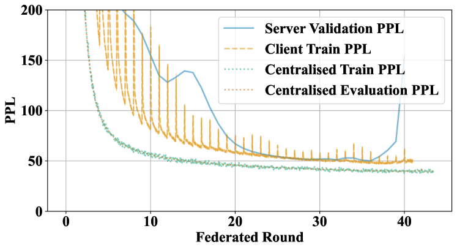
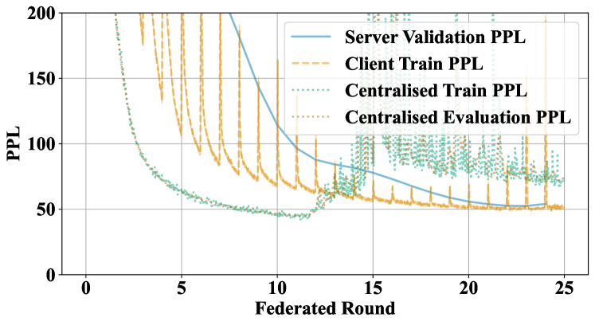
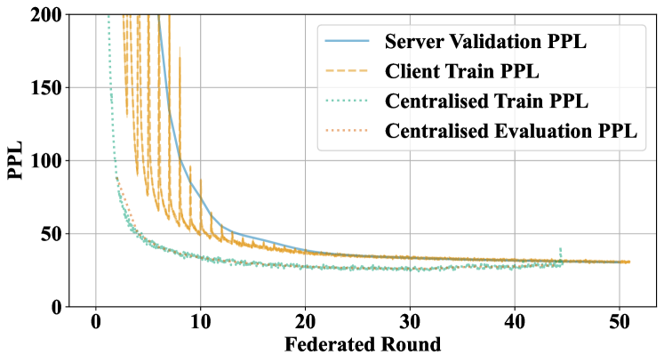
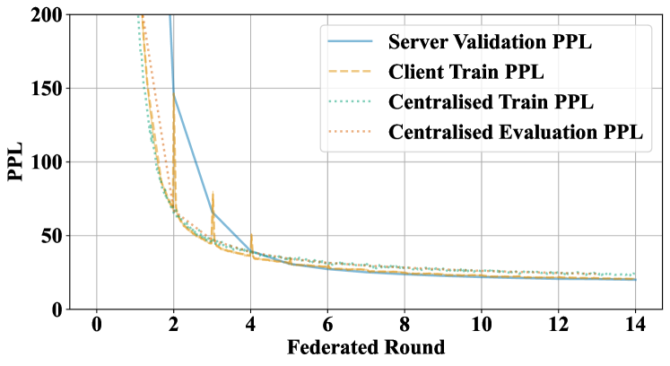
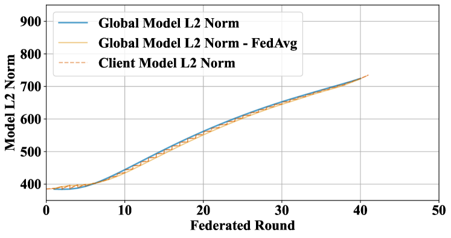
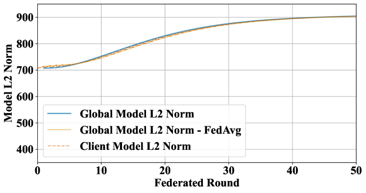
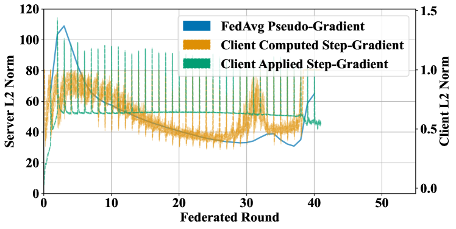
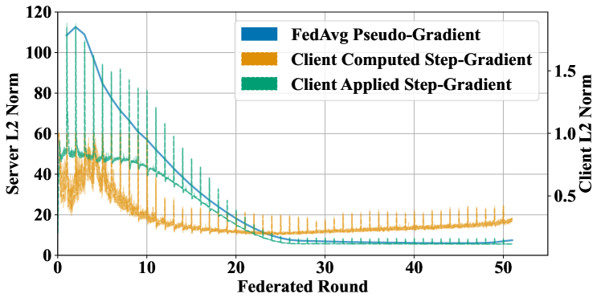

# 大型语言模型的预训练正迈向联邦化。

发布时间：2024年05月17日

`LLM应用

这篇论文探讨了如何通过联邦学习（FL）来优化大型语言模型（LLMs）的训练过程，利用全球未充分利用的数据和计算资源。这种方法旨在通过跨机构合作，调动更多资源，以达到甚至超越传统集中式系统的性能。论文中提出的联邦学习方案强调了在资源受限条件下训练大规模LLM的可行性，并展示了模型规模扩展的有效性。这一研究方向直接关联到LLM的应用层面，特别是在如何更有效地利用分布式资源进行模型训练方面，因此属于LLM应用分类。` `联邦学习` `人工智能`

> The Future of Large Language Model Pre-training is Federated

# 摘要

> 生成式预训练的大型语言模型（LLMs）凭借其训练的海量数据，在众多任务上表现出色。根据扩展定律，LLMs的未来进步将依赖于预训练中可用的计算和数据资源。联邦学习（FL）有望解锁全球未充分利用的数据和计算潜力，弥补当前以数据中心为核心的LLM训练方法的不足。我们提出了一种稳健、灵活且可复制的FL方案，促进跨机构的大规模合作，以训练LLMs，从而调动更多资源，达到甚至超越集中式系统的性能。此外，我们展示了联邦训练随模型规模扩展的有效性，并介绍了在资源受限条件下训练十亿级联邦LLM的方法。这将使数据丰富的参与者在LLMs预训练中扮演关键角色，而非仅由计算资源丰富的参与者主导。

> Generative pre-trained large language models (LLMs) have demonstrated impressive performance over a wide range of tasks, thanks to the unprecedented amount of data they have been trained on. As established scaling laws indicate, LLMs' future performance improvement depends on the amount of computing and data sources we can leverage for pre-training. Federated learning (FL) has the potential to unleash the majority of the planet's data and computational resources, which are underutilized by the data-center-focused training methodology of current LLM practice. Our work presents a robust, flexible, reproducible FL approach that enables large-scale collaboration across institutions to train LLMs. This would mobilize more computational and data resources while matching or potentially exceeding centralized performance. We further show the effectiveness of the federated training scales with model size and present our approach for training a billion-scale federated LLM using limited resources. This will help data-rich actors to become the protagonists of LLMs pre-training instead of leaving the stage to compute-rich actors alone.

[Arxiv](https://arxiv.org/abs/2405.10853)