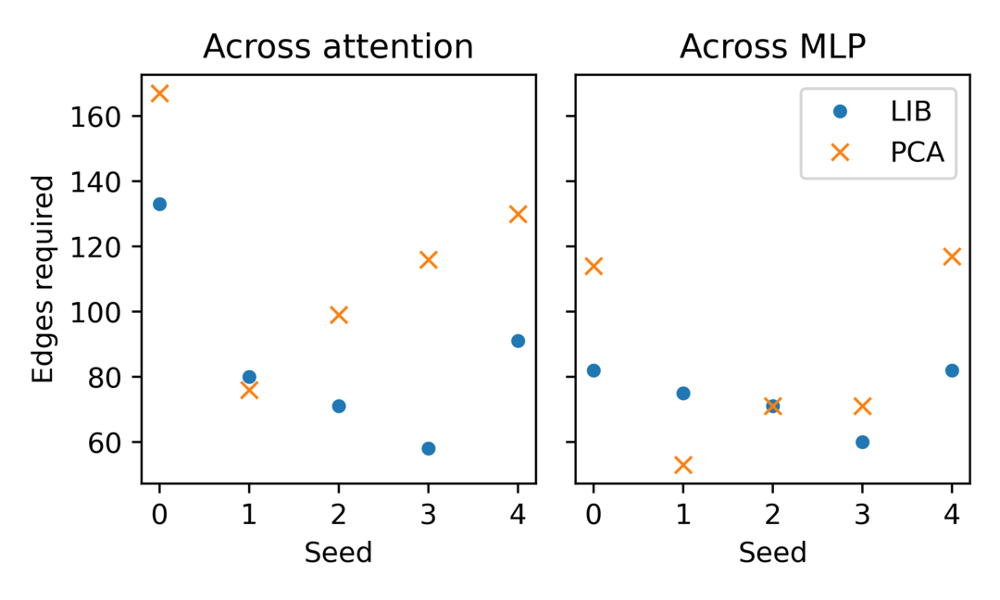
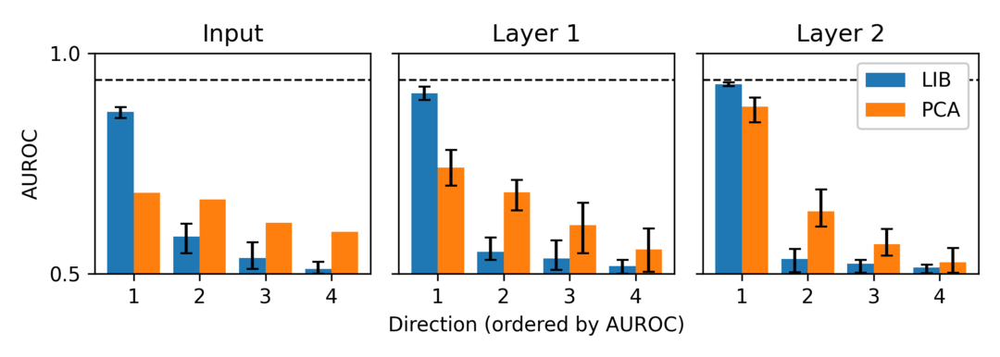

# 神经网络中的局部交互基：揭示计算相关且交互稀疏的关键特征

发布时间：2024年05月17日

`LLM理论

这篇论文主要探讨了神经网络的可解释性问题，并提出了一种新的方法——局部交互基（LIB），用于分析神经网络的内部计算和激活。虽然这种方法在图像识别模型上显示出了潜力，但论文指出，对于大型语言模型（LLM），LIB并未显著提升可解释性或交互的稀疏性。因此，这篇论文的内容更偏向于LLM的理论分析和方法探讨，而不是具体的应用或Agent行为分析。` `机器学习` `神经网络`

> The Local Interaction Basis: Identifying Computationally-Relevant and Sparsely Interacting Features in Neural Networks

# 摘要

> 机制可解释性试图通过逆向工程神经网络的内部计算来揭示其行为。尽管如此，现有方法在解释神经网络激活方面仍显不足，因为缺乏将激活分解为计算特征的明确方法。单个神经元或模型组件并未清晰地映射到特定的特征或功能。为此，我们提出了一种创新的可解释性方法——局部交互基（LIB），它通过转换网络激活到新的基底，旨在剔除无关激活和交互，从而揭示计算特征。我们的方法排除了无关激活方向，并使基底与相邻层间雅可比矩阵的奇异向量对齐，同时根据特征对下游计算的重要性进行缩放，生成一个交互图，展示模型中所有计算相关的特征和交互。在模块化加法和CIFAR-10模型上的测试表明，LIB相较于主成分分析，能更有效地识别出计算相关的特征，且交互更为稀疏。然而，对于语言模型，LIB并未显著提升可解释性或交互的稀疏性。综上所述，LIB作为一种理论驱动的方法，在分析神经网络方面展现出潜力，但目前的形式尚不适用于大型语言模型。

> Mechanistic interpretability aims to understand the behavior of neural networks by reverse-engineering their internal computations. However, current methods struggle to find clear interpretations of neural network activations because a decomposition of activations into computational features is missing. Individual neurons or model components do not cleanly correspond to distinct features or functions. We present a novel interpretability method that aims to overcome this limitation by transforming the activations of the network into a new basis - the Local Interaction Basis (LIB). LIB aims to identify computational features by removing irrelevant activations and interactions. Our method drops irrelevant activation directions and aligns the basis with the singular vectors of the Jacobian matrix between adjacent layers. It also scales features based on their importance for downstream computation, producing an interaction graph that shows all computationally-relevant features and interactions in a model. We evaluate the effectiveness of LIB on modular addition and CIFAR-10 models, finding that it identifies more computationally-relevant features that interact more sparsely, compared to principal component analysis. However, LIB does not yield substantial improvements in interpretability or interaction sparsity when applied to language models. We conclude that LIB is a promising theory-driven approach for analyzing neural networks, but in its current form is not applicable to large language models.

[Arxiv](https://arxiv.org/abs/2405.10928)