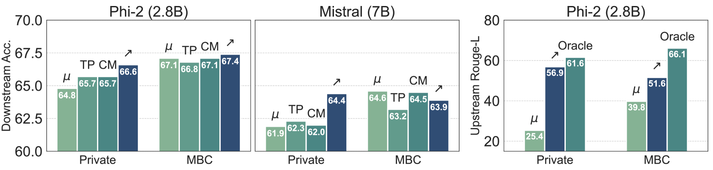

# 构建并重用 LoRAs 库，迈向 LLMs 的模块化之路

发布时间：2024年05月17日

`LLM应用

这篇论文主要探讨了如何通过重用训练过的适配器来提升大型语言模型（LLM）在新任务上的性能。研究内容包括构建适配器库、开发零-shot和监督任务泛化的技术，以及提出了一种新的零-shot路由机制“Arrow”。这些研究成果直接应用于LLM的性能提升和任务泛化，属于LLM应用领域的研究。` `机器学习`

> Towards Modular LLMs by Building and Reusing a Library of LoRAs

# 摘要

> 随着基础大型语言模型（LLM）的参数高效适应性不断增强，我们探讨了重用训练过的适配器以提升新任务性能的可能性。我们研究了如何利用多任务数据构建适配器库，并开发了通过库内路由实现零-shot和监督任务泛化的技术。我们评估了构建此库的现有方法，并引入了基于模型的聚类（MBC），该方法根据适配器参数的相似性对任务进行分组，从而优化了跨多任务数据集的迁移。为了有效利用该库，我们创新性地提出了零-shot路由机制“Arrow”，它能够动态选择最适合新输入的适配器，无需重新训练。通过在多个LLM上，如Phi-2和Mistral，对一系列保留任务进行实验，我们验证了基于MBC的适配器和Arrow路由在新任务上的卓越泛化能力。我们的研究向着创建模块化、可适应的LLM迈进，这些LLM有望超越传统的联合训练方法。

> The growing number of parameter-efficient adaptations of a base large language model (LLM) calls for studying whether we can reuse such trained adapters to improve performance for new tasks. We study how to best build a library of adapters given multi-task data and devise techniques for both zero-shot and supervised task generalization through routing in such library. We benchmark existing approaches to build this library and introduce model-based clustering, MBC, a method that groups tasks based on the similarity of their adapter parameters, indirectly optimizing for transfer across the multi-task dataset. To re-use the library, we present a novel zero-shot routing mechanism, Arrow, which enables dynamic selection of the most relevant adapters for new inputs without the need for retraining. We experiment with several LLMs, such as Phi-2 and Mistral, on a wide array of held-out tasks, verifying that MBC-based adapters and Arrow routing lead to superior generalization to new tasks. We make steps towards creating modular, adaptable LLMs that can match or outperform traditional joint training.

[Arxiv](https://arxiv.org/abs/2405.11157)