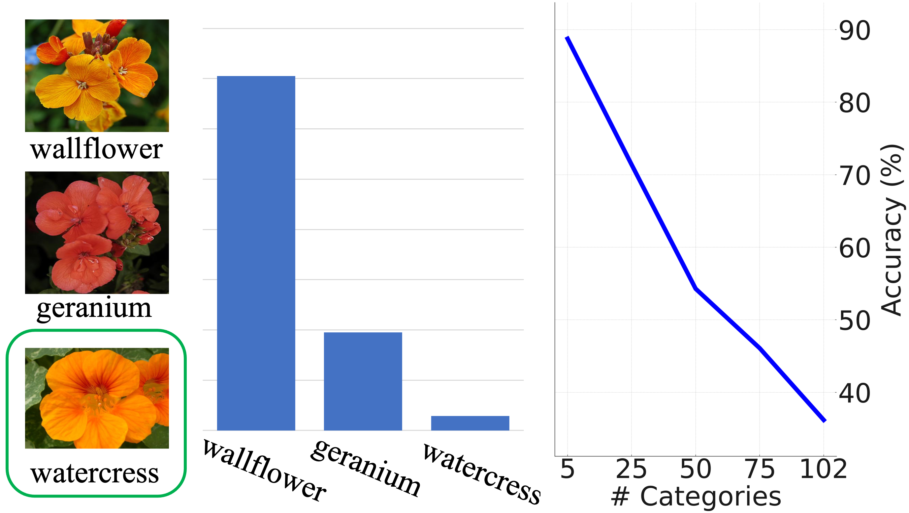
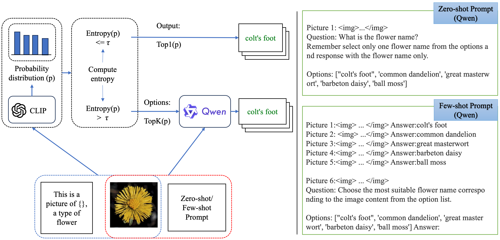
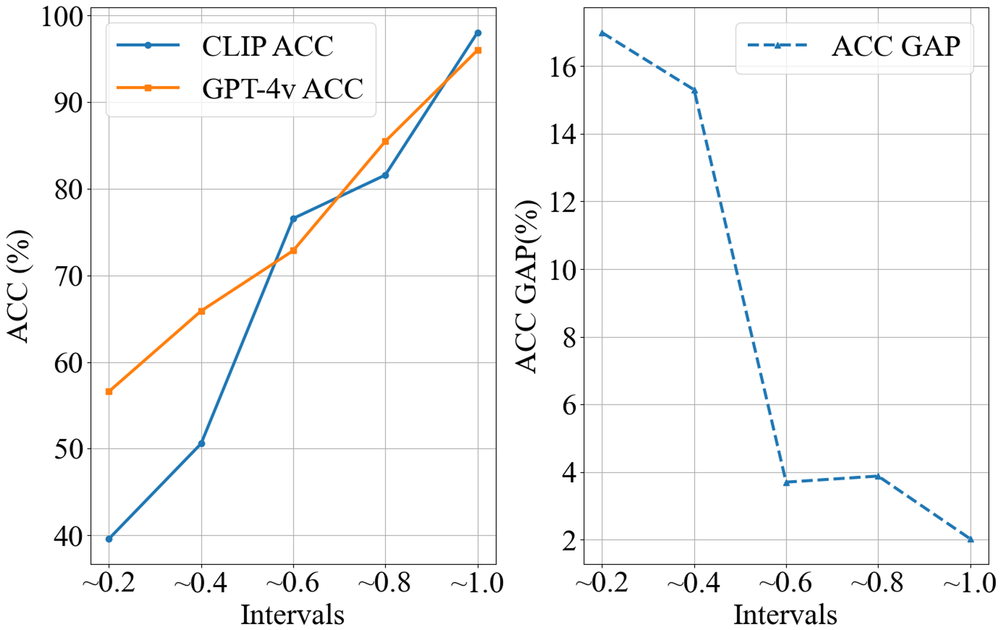
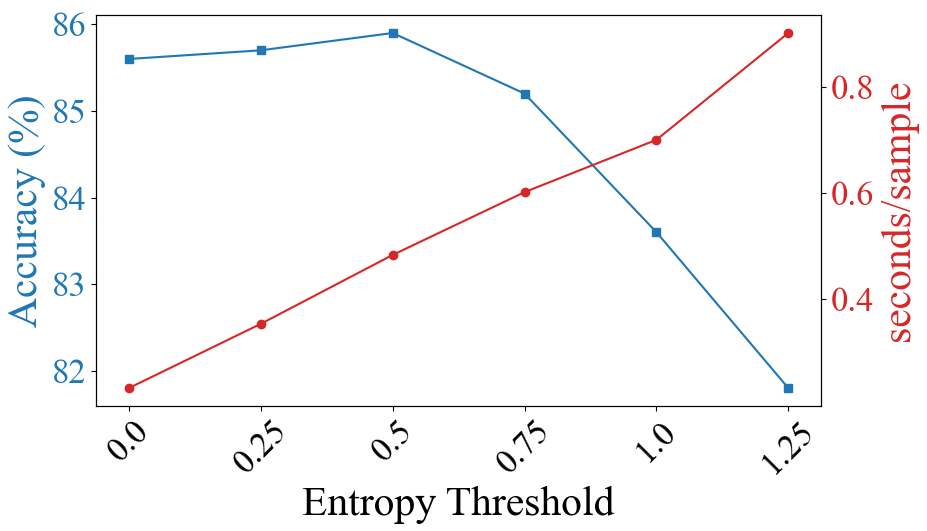
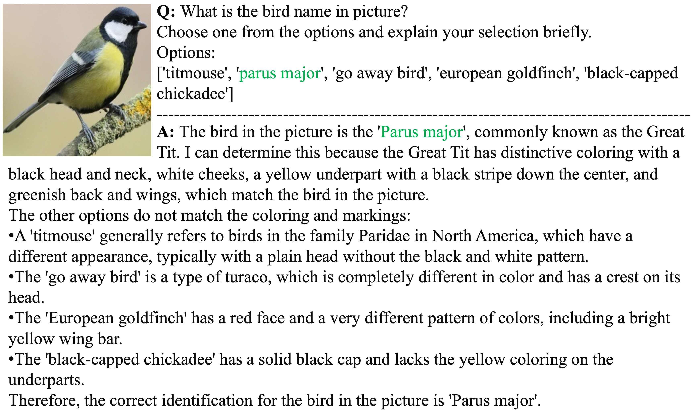
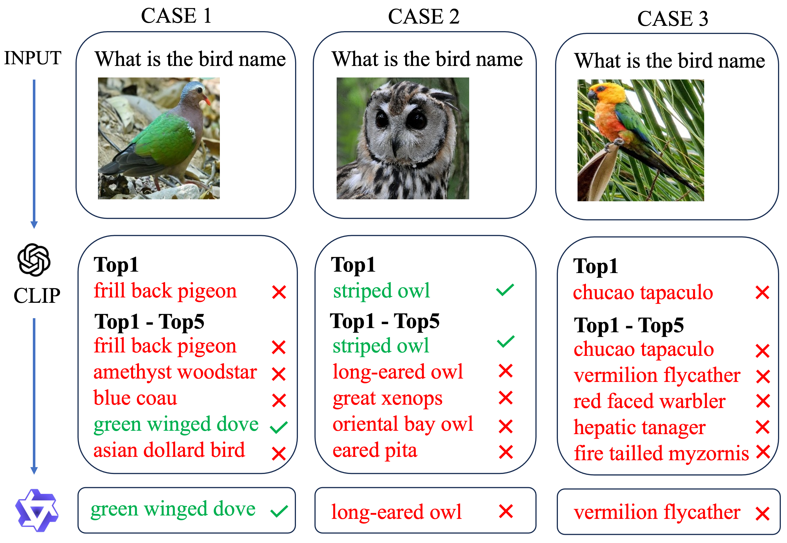
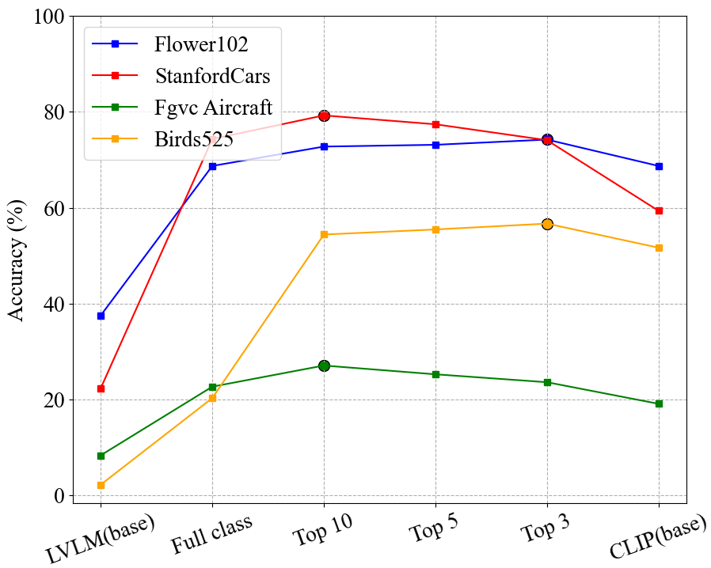
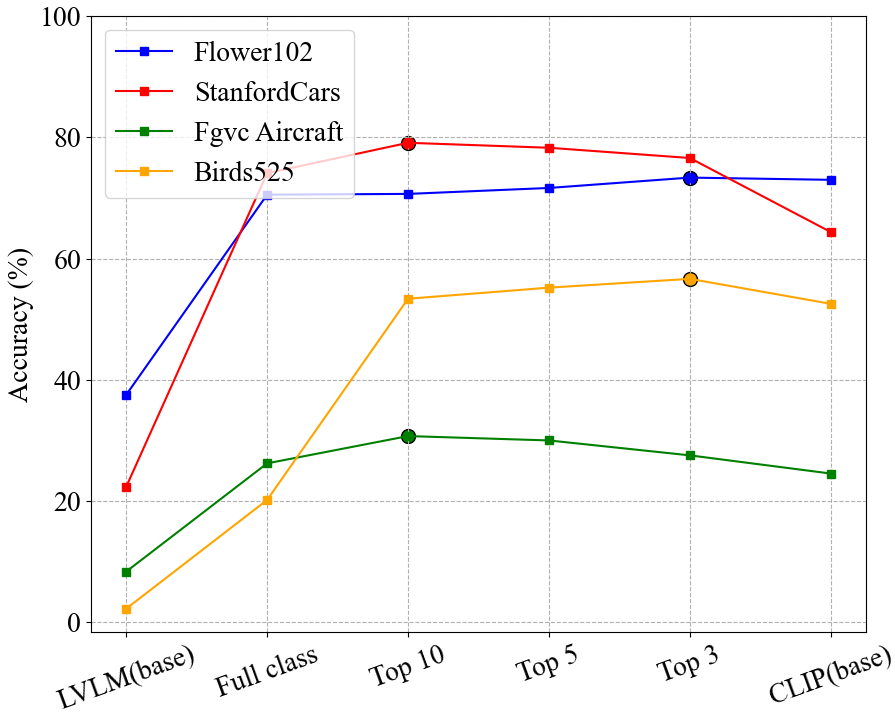
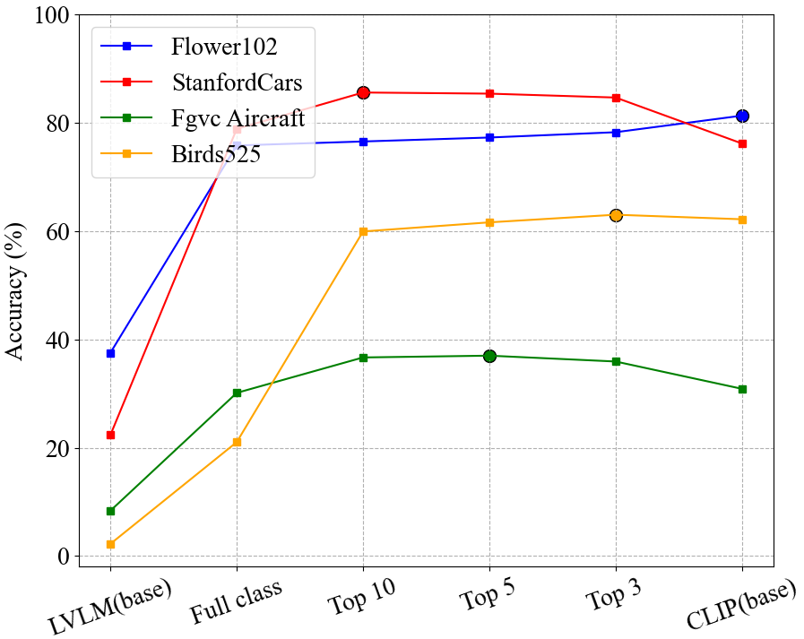
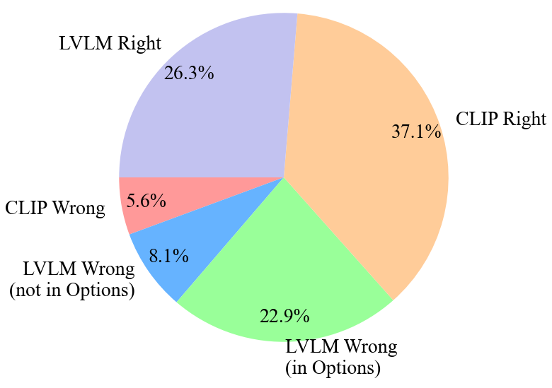

# 借助级联视觉语言模型，提升细粒度图像分类的精准度

发布时间：2024年05月18日

`RAG

理由：这篇论文讨论了在零/少样本场景下细粒度图像分类的挑战，并提出了一种新的框架CascadeVLM，该框架利用大型视觉-语言模型（LVLMs）中的粒度知识来提高分类性能。这与RAG（Retrieval-Augmented Generation）模型相关，因为RAG模型也是通过整合检索和生成能力来增强语言模型的性能，尤其是在处理复杂或细粒度的任务时。因此，这篇论文更符合RAG分类，因为它专注于通过整合和优化现有的大型模型来解决特定的视觉-语言任务。` `图像分类` `人工智能`

> Enhancing Fine-Grained Image Classifications via Cascaded Vision Language Models

# 摘要

> 在零/少样本场景下的细粒度图像分类对视觉-语言模型（如CLIP）构成挑战，尤其是在区分语义相似类别时。由于预训练方法缺乏细粒度分类的监督信号，这些模型常感力不从心。CascadeVLM框架应运而生，它巧妙利用大型视觉-语言模型（LVLMs）中的粒度知识，超越了以往基于CLIP的方法。实验结果显示，CascadeVLM在多个数据集上表现卓越，尤其在斯坦福汽车数据集上，零样本准确率高达85.6%。分析表明，LVLMs对CLIP难以判断的图像能做出更精准预测，显著提升了整体准确率。这一框架揭示了VLMs与LVLMs整合的新途径，为细粒度图像分类提供了高效解决方案。

> Fine-grained image classification, particularly in zero/few-shot scenarios, presents a significant challenge for vision-language models (VLMs), such as CLIP. These models often struggle with the nuanced task of distinguishing between semantically similar classes due to limitations in their pre-trained recipe, which lacks supervision signals for fine-grained categorization. This paper introduces CascadeVLM, an innovative framework that overcomes the constraints of previous CLIP-based methods by effectively leveraging the granular knowledge encapsulated within large vision-language models (LVLMs). Experiments across various fine-grained image datasets demonstrate that CascadeVLM significantly outperforms existing models, specifically on the Stanford Cars dataset, achieving an impressive 85.6% zero-shot accuracy. Performance gain analysis validates that LVLMs produce more accurate predictions for challenging images that CLIPs are uncertain about, bringing the overall accuracy boost. Our framework sheds light on a holistic integration of VLMs and LVLMs for effective and efficient fine-grained image classification.

[Arxiv](https://arxiv.org/abs/2405.11301)