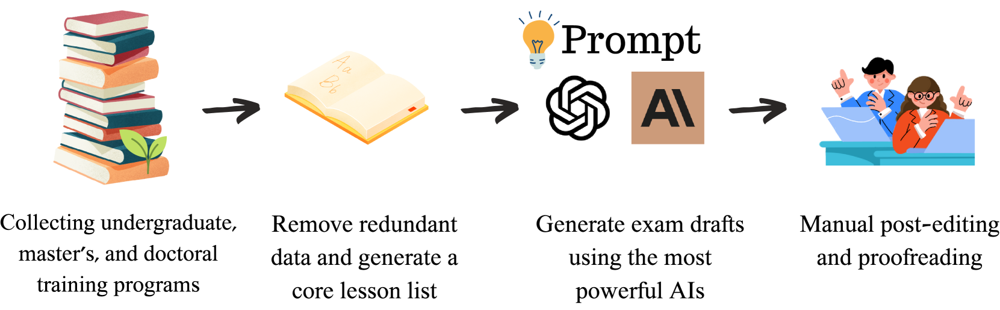
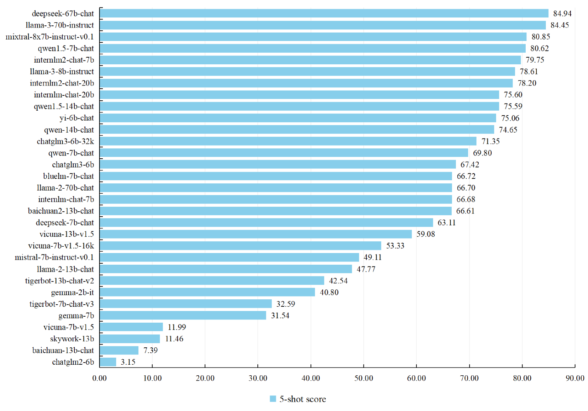
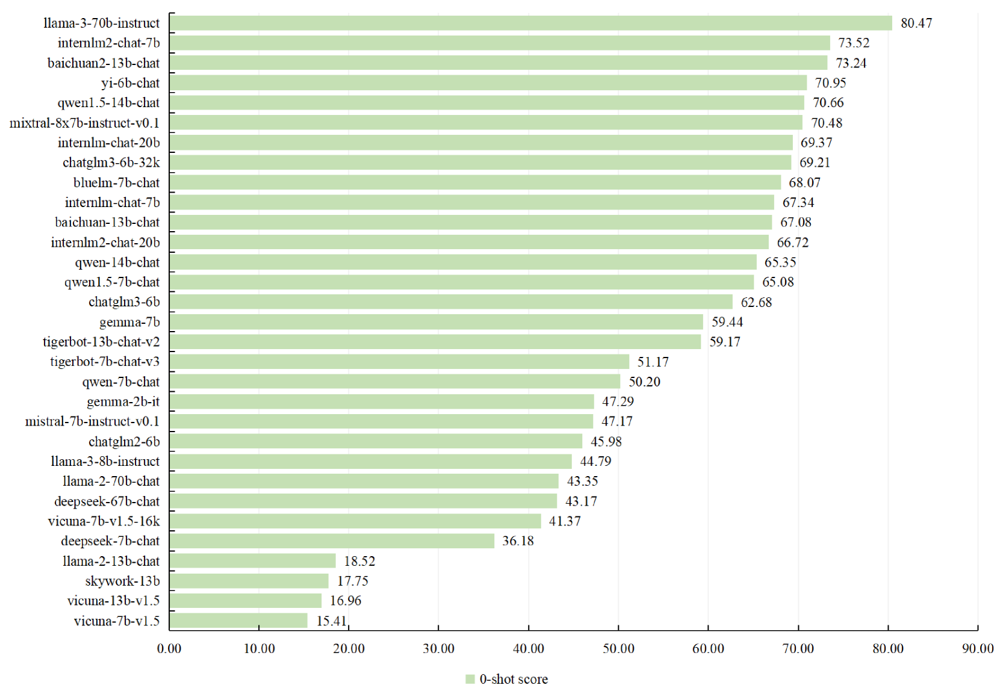
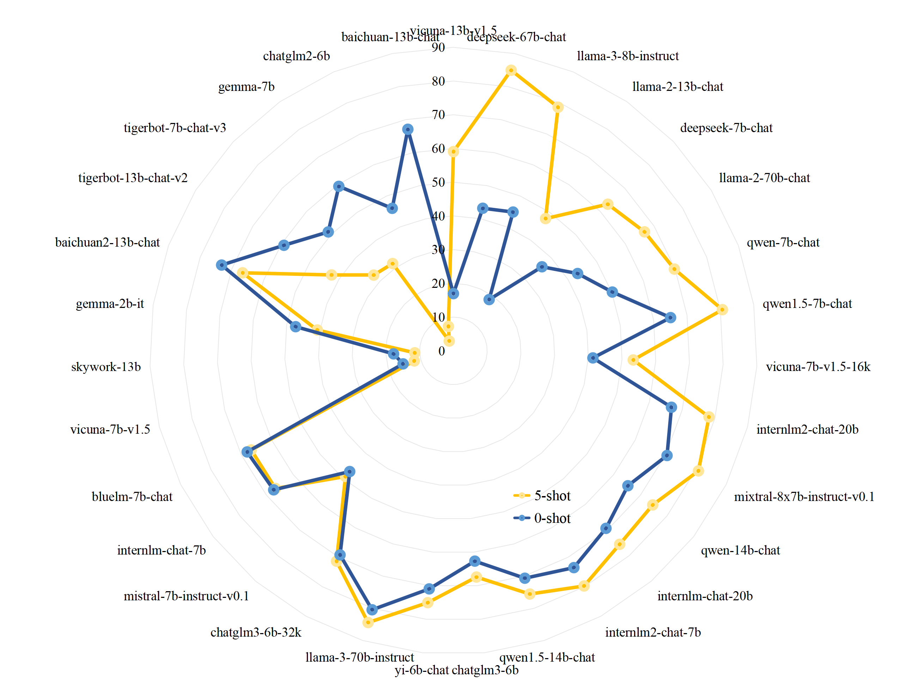
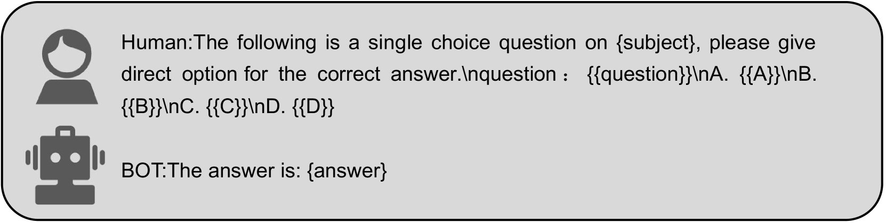
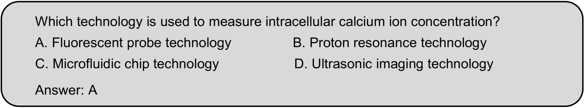
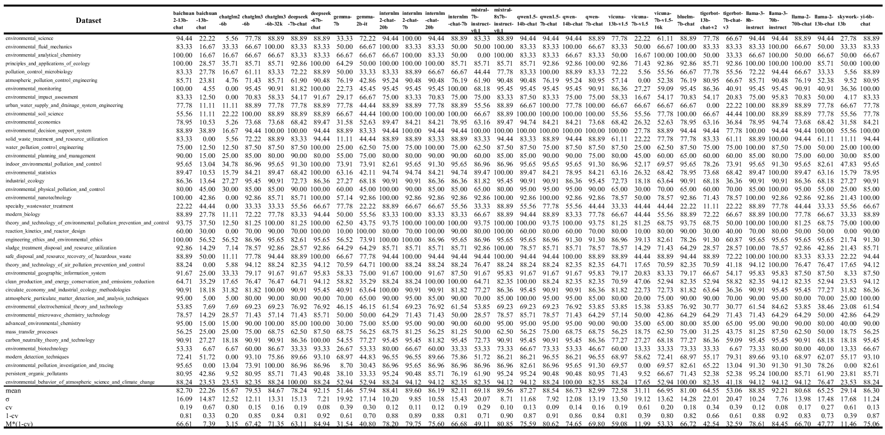

# 环境科学知识测试：大型语言模型基准评估

发布时间：2024年05月18日

`LLM应用

理由：这篇论文主要关注的是开发和评估一种专门用于检验大型语言模型在环境科学知识上的掌握程度的工具（EnviroExam）。它通过具体的测试和评估方法，分析了不同大型语言模型在环境科学领域的性能。这种工作属于应用层面的研究，因为它侧重于实际应用中的评估和改进，而不是理论模型的基础研究或Agent的设计与实现。因此，将其归类为LLM应用是合适的。` `环境科学` `教育评估`

> EnviroExam: Benchmarking Environmental Science Knowledge of Large Language Models

# 摘要

> 在环境科学领域，确保大型语言模型的效能和准确性，需要强有力的评估指标。我们开发的EnviroExam，是一种全面的评估工具，专门用于检验大型语言模型在环境科学知识上的掌握程度。该评估方法依托顶尖国际大学的课程体系，覆盖了从本科到博士的课程，并涵盖了42门核心课程中的936个问题。通过在31个开源大型语言模型上进行0-shot和5-shot测试，EnviroExam不仅揭示了这些模型在环境科学领域的表现差异，还提供了详尽的评估标准。测试结果表明，61.3%的模型通过了5-shot测试，而48.39%通过了0-shot测试。我们通过引入变异系数，从多角度评估了主流开源大型语言模型在环境科学中的表现，为该领域的语言模型选择和微调提供了有效依据。未来，我们将利用专门的环境科学教科书，构建更多特定领域的测试集，以提升评估的准确性和特异性。

> In the field of environmental science, it is crucial to have robust evaluation metrics for large language models to ensure their efficacy and accuracy. We propose EnviroExam, a comprehensive evaluation method designed to assess the knowledge of large language models in the field of environmental science. EnviroExam is based on the curricula of top international universities, covering undergraduate, master's, and doctoral courses, and includes 936 questions across 42 core courses. By conducting 0-shot and 5-shot tests on 31 open-source large language models, EnviroExam reveals the performance differences among these models in the domain of environmental science and provides detailed evaluation standards. The results show that 61.3% of the models passed the 5-shot tests, while 48.39% passed the 0-shot tests. By introducing the coefficient of variation as an indicator, we evaluate the performance of mainstream open-source large language models in environmental science from multiple perspectives, providing effective criteria for selecting and fine-tuning language models in this field. Future research will involve constructing more domain-specific test sets using specialized environmental science textbooks to further enhance the accuracy and specificity of the evaluation.

[Arxiv](https://arxiv.org/abs/2405.11265)