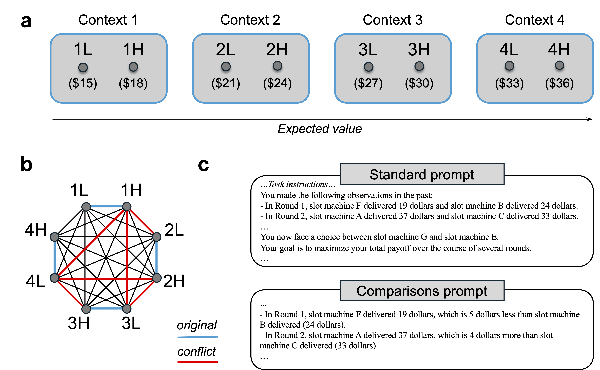
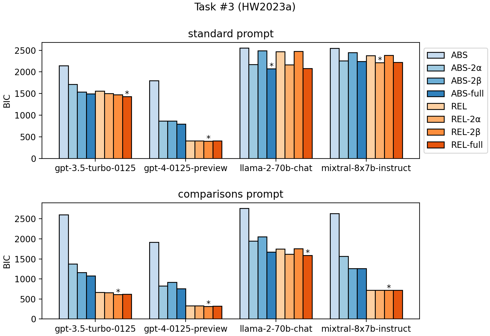

# 大型语言模型，作为带有偏见的强化学习者，其学习过程受到特定偏好的影响。

发布时间：2024年05月18日

`Agent

这篇论文主要关注大型语言模型（LLMs）在强化学习任务中的表现，特别是在多任务环境中作为自主决策代理的能力，以及它们对偏差的敏感性。研究探讨了LLMs在奖励结果编码时是否存在相对价值偏差，并通过实验和计算模型分析了这些偏差的行为特征和影响。这些发现对于理解LLMs在决策领域的应用具有重要意义，因此将其归类为Agent。` `决策系统`

> Large Language Models are Biased Reinforcement Learners

# 摘要

> In-context learning 赋予 LLMs 执行多任务的能力，包括在简单 bandit 任务中做出奖励最大化的选择。鉴于其作为自主决策代理的潜力，理解这些模型如何执行强化学习任务及其对偏差的敏感性至关重要。本研究受人类行为启发，关注 LLMs 在奖励结果编码时是否存在相对价值偏差。实验表明，LLMs 表现出此类偏差的行为特征。在提示中加入结果比较，虽增强了训练集中的最大化，却损害了泛化能力。计算模型显示，LLM 行为可用包含相对价值的简单 RL 算法描述。初步证据表明，这种偏差不仅限于微调模型，原始预训练模型的隐藏层中亦可检测到相对价值处理。这些发现对 LLMs 在决策领域的应用具有深远影响。

> In-context learning enables large language models (LLMs) to perform a variety of tasks, including learning to make reward-maximizing choices in simple bandit tasks. Given their potential use as (autonomous) decision-making agents, it is important to understand how these models perform such reinforcement learning (RL) tasks and the extent to which they are susceptible to biases. Motivated by the fact that, in humans, it has been widely documented that the value of an outcome depends on how it compares to other local outcomes, the present study focuses on whether similar value encoding biases apply to how LLMs encode rewarding outcomes. Results from experiments with multiple bandit tasks and models show that LLMs exhibit behavioral signatures of a relative value bias. Adding explicit outcome comparisons to the prompt produces opposing effects on performance, enhancing maximization in trained choice sets but impairing generalization to new choice sets. Computational cognitive modeling reveals that LLM behavior is well-described by a simple RL algorithm that incorporates relative values at the outcome encoding stage. Lastly, we present preliminary evidence that the observed biases are not limited to fine-tuned LLMs, and that relative value processing is detectable in the final hidden layer activations of a raw, pretrained model. These findings have important implications for the use of LLMs in decision-making applications.

[Arxiv](https://arxiv.org/abs/2405.11422)