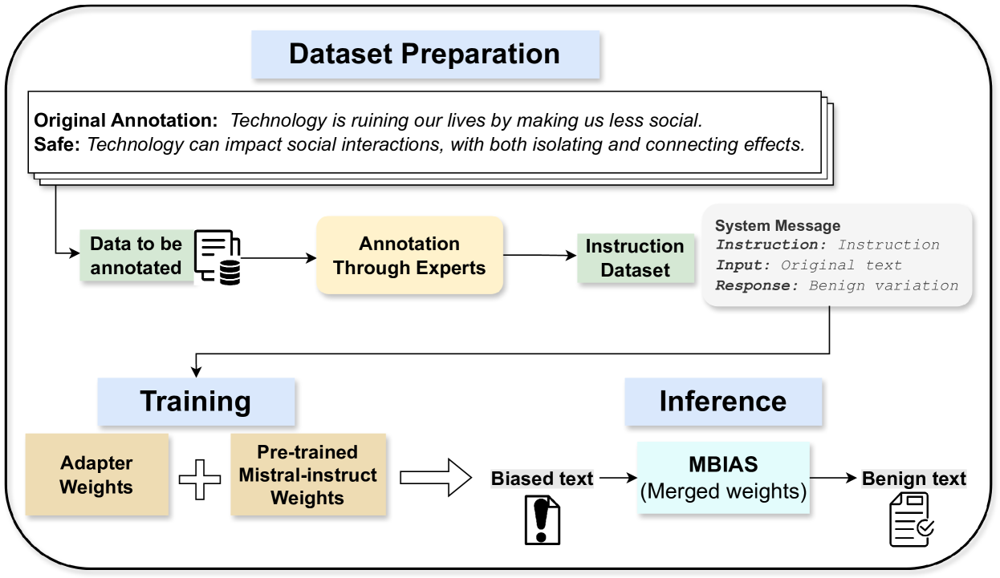

# MBIAS：在保持上下文完整性的同时，有效缓解大型语言模型中的偏见问题

发布时间：2024年05月18日

`LLM应用

这篇论文主要讨论了大型语言模型（LLMs）的安全性问题，特别是在减少偏见和毒性的同时保持上下文准确性的挑战。论文介绍了一个名为MBIAS的框架，该框架通过使用专门设计的数据集进行微调，旨在解决LLMs生成中的偏见和毒性问题。通过实验，作者展示了MBIAS在减少偏见和毒性方面的有效性，并保持了关键信息的传递。此外，论文还提到了对不同人群的影响，并展示了其方法的稳健性。因此，这篇论文属于LLM应用类别，因为它关注的是LLMs在实际应用中的安全性和偏见问题，并提供了一个具体的解决方案。` `社交媒体` `人工智能安全`

> MBIAS: Mitigating Bias in Large Language Models While Retaining Context

# 摘要

> 在确保大型语言模型（LLMs）的安全性时，我们不仅要关注输出的安全性，还要保持其上下文的准确性。现有的许多LLMs通过安全演示或对抗性测试进行了微调，虽能产出安全结果，但往往在减少偏见和毒性时牺牲了上下文意义。为此，我们开发了MBIAS，一个专门针对安全干预设计的自定义数据集进行微调的LLM框架。MBIAS致力于解决LLMs生成中常见的偏见和毒性问题，这些问题在不同人群中表现为代表性不足或负面描绘，包括社交媒体中的不当提及和偏见内容。通过在MBIAS上进行的多种安全干预实验，我们实现了超过30%的偏见和毒性减少，同时保留了关键信息。此外，对分布外测试集的人群分析显示，我们的方法在不同人群中减少了超过90%的偏见和毒性，证明了其稳健性。MBIAS及其数据集已向研究社区开放，详情请访问https://huggingface.co/newsmediabias/MBIAS。

> In addressing the critical need for safety in Large Language Models (LLMs), it is crucial to ensure that the outputs are not only safe but also retain their contextual accuracy. Many existing LLMs are safe fine-tuned either with safety demonstrations, or rely only on adversarial testing. While able to get safe outputs, they often risk losing contextual meaning as they mitigate bias and toxicity. In response, we present MBIAS, a LLM framework instruction fine-tuned on a custom dataset specifically designed for safety interventions. MBIAS aims to address the significant issues of bias and toxicity in LLMs generations that typically manifest as underrepresentation or negative portrayals across various demographics, including inappropriate linguistic mentions and biased content in social media. We experiment on MBIAS for safety interventions using various configurations, and demonstrate more than a 30\% reduction in overall bias and toxicity while successfully retaining key information. Additionally, a demographic analysis on an out-of-distribution test set confirms the robustness of our approach, with reductions in bias and toxicity exceeding 90\% across various demographics. The dataset and instruction fine-tuned MBIAS are made available to the research community at https://huggingface.co/newsmediabias/MBIAS.

[Arxiv](https://arxiv.org/abs/2405.11290)