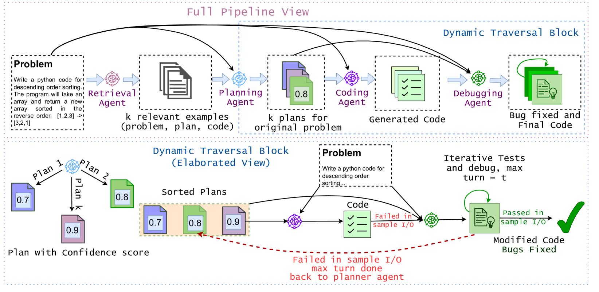
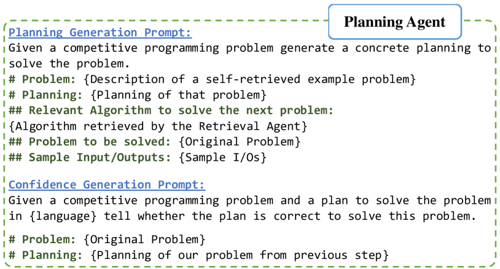
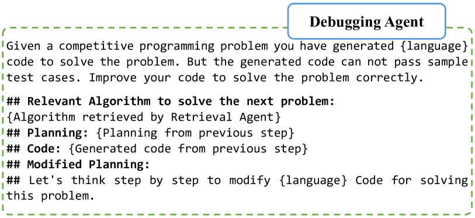
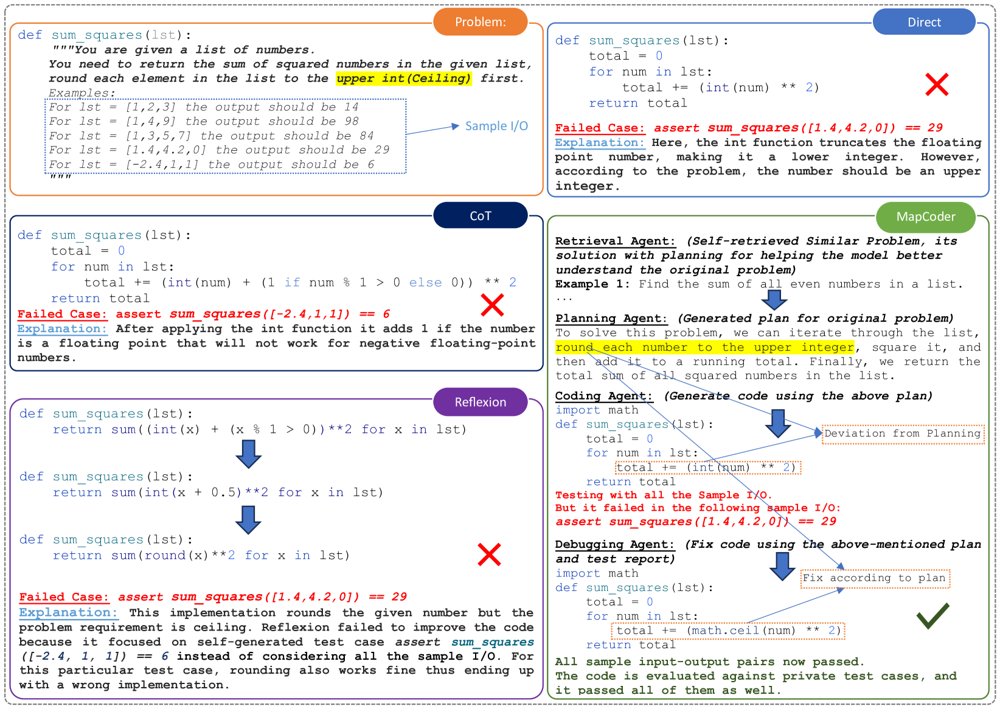
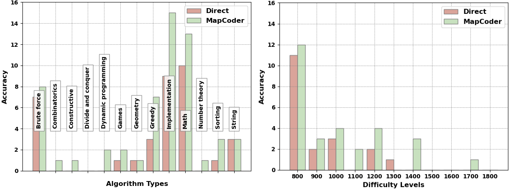
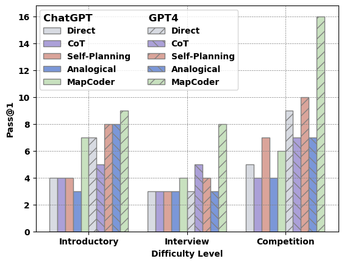
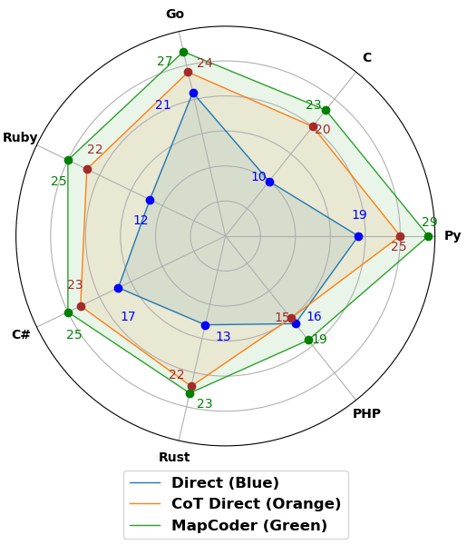
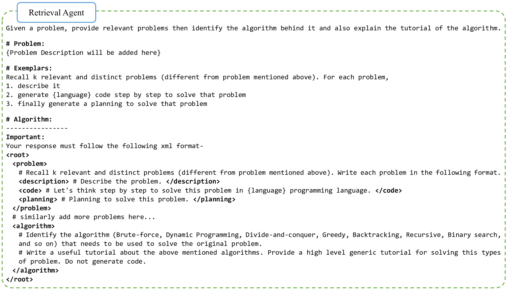
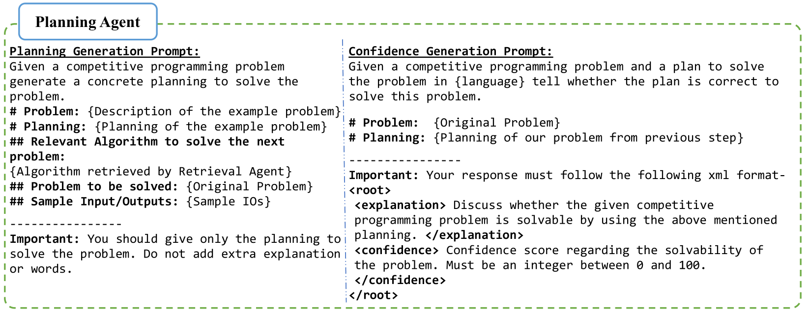
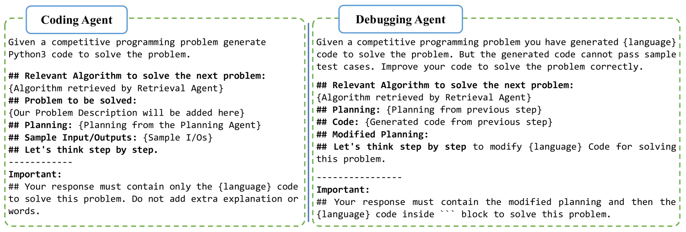

# MapCoder：多代理协作，共创竞争问题解决的代码新篇章

发布时间：2024年05月18日

`Agent

这篇论文介绍了一种新颖的多代理提示方法，用于代码合成任务。该方法通过模拟人类开发者的程序合成全周期，包括回忆示例、规划、代码生成和调试，来提高代码生成的效率和质量。论文中提到的MapCoder框架是通过四个LLM代理实现的，这些代理协同工作以完成代码生成的任务。因此，这篇论文更符合Agent分类，因为它主要关注的是如何通过多个代理（Agent）来优化和执行特定的任务（代码生成）。` `软件开发` `人工智能`

> MapCoder: Multi-Agent Code Generation for Competitive Problem Solving

# 摘要

> 代码合成是一项艰巨的任务，它要求深入理解复杂的自然语言描述，生成复杂算法和数据结构的代码指令，并通过全面的单元测试。尽管大型语言模型（LLMs）在自然语言处理上表现出色，但在代码生成方面仍有局限。本文提出了一种新颖的多代理提示方法，模拟人类开发者的程序合成全周期，包括回忆示例、规划、代码生成和调试。我们的MapCoder框架通过四个LLM代理实现这一过程，并在多个基准测试中展示了其卓越的代码生成能力，刷新了HumanEval、MBPP、APPS、CodeContests和xCodeEval的记录。此外，该方法在不同编程语言和问题难度上均表现出色。我们已在GitHub上开源MapCoder框架。

> Code synthesis, which requires a deep understanding of complex natural language problem descriptions, generation of code instructions for complex algorithms and data structures, and the successful execution of comprehensive unit tests, presents a significant challenge. While large language models (LLMs) demonstrate impressive proficiency in natural language processing, their performance in code generation tasks remains limited. In this paper, we introduce a new approach to code generation tasks leveraging multi-agent prompting that uniquely replicates the full cycle of program synthesis as observed in human developers. Our framework, MapCoder, consists of four LLM agents specifically designed to emulate the stages of this cycle: recalling relevant examples, planning, code generation, and debugging. After conducting thorough experiments, with multiple LLM ablations and analyses across eight challenging competitive problem-solving and program synthesis benchmarks, MapCoder showcases remarkable code generation capabilities, achieving new state-of-the-art results (pass@1) on HumanEval (93.9%), MBPP (83.1%), APPS (22.0%), CodeContests (28.5%), and xCodeEval (45.3%). Moreover, our method consistently delivers superior performance across various programming languages and varying problem difficulties. We open-source our framework at https://github.com/Md-Ashraful-Pramanik/MapCoder.

[Arxiv](https://arxiv.org/abs/2405.11403)