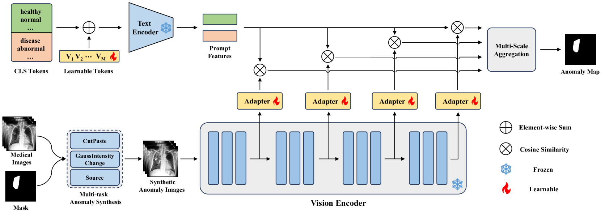
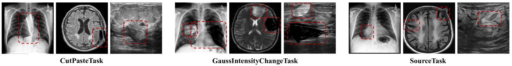
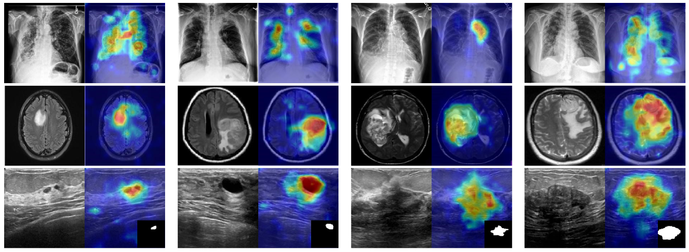

# MediCLIP：定制 CLIP 以应对少样本医学图像异常检测挑战

发布时间：2024年05月18日

`LLM应用

理由：这篇论文主要讨论了如何将CLIP模型（一种大型语言模型）应用于医学影像异常检测，特别是在少量样本设置下的应用。论文提出了一种名为MediCLIP的方法，通过自监督微调将CLIP模型适配到医学影像异常检测任务中，并展示了其在该领域的优越性能。这表明论文关注的是LLM在特定应用场景（医学影像异常检测）中的实际应用，因此属于LLM应用分类。` `医学影像`

> MediCLIP: Adapting CLIP for Few-shot Medical Image Anomaly Detection

# 摘要

> 在医疗决策领域，精确的医学影像异常检测对辅助临床医生至关重要。然而，以往的研究依赖于大规模数据集来训练异常检测模型，这增加了开发成本。本文首先关注在少量样本设置下的医学影像异常检测任务，这在医疗领域尤为重要，因为数据收集和标注成本极高。我们提出了一种创新方法，MediCLIP，它通过自监督微调将CLIP模型适配到少量样本的医学影像异常检测中。尽管作为视觉-语言模型的CLIP在各种下游任务中展现了卓越的零/少量样本性能，但在医学影像异常检测方面仍有不足。为此，我们设计了一系列医学影像异常合成任务，模拟医学影像中常见的疾病模式，将CLIP强大的泛化能力转移到医学影像异常检测任务中。当仅提供少量正常医学影像时，MediCLIP在异常检测和定位方面达到了最先进水平，优于其他方法。在三个不同的医学异常检测任务上的广泛实验证明了我们方法的优越性。代码可在https://github.com/cnulab/MediCLIP获取。

> In the field of medical decision-making, precise anomaly detection in medical imaging plays a pivotal role in aiding clinicians. However, previous work is reliant on large-scale datasets for training anomaly detection models, which increases the development cost. This paper first focuses on the task of medical image anomaly detection in the few-shot setting, which is critically significant for the medical field where data collection and annotation are both very expensive. We propose an innovative approach, MediCLIP, which adapts the CLIP model to few-shot medical image anomaly detection through self-supervised fine-tuning. Although CLIP, as a vision-language model, demonstrates outstanding zero-/fewshot performance on various downstream tasks, it still falls short in the anomaly detection of medical images. To address this, we design a series of medical image anomaly synthesis tasks to simulate common disease patterns in medical imaging, transferring the powerful generalization capabilities of CLIP to the task of medical image anomaly detection. When only few-shot normal medical images are provided, MediCLIP achieves state-of-the-art performance in anomaly detection and location compared to other methods. Extensive experiments on three distinct medical anomaly detection tasks have demonstrated the superiority of our approach. The code is available at https://github.com/cnulab/MediCLIP.

[Arxiv](https://arxiv.org/abs/2405.11315)