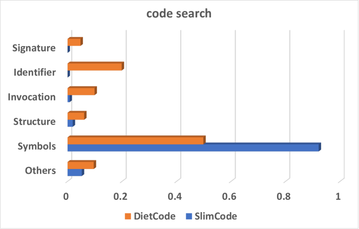
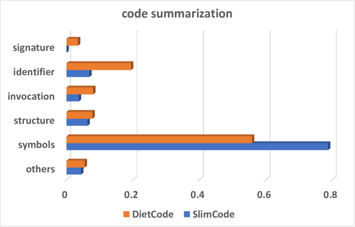

# 自然至上：简化预训练大型语言模型的模型无关代码

发布时间：2024年05月18日

`LLM应用

理由：这篇论文介绍了一种名为SlimCode的方法，该方法旨在简化大型语言模型（LLM）处理代码时的输入，以降低计算复杂度和成本。这种方法通过分析输入代码令牌的性质来实现，而不是依赖于LLM的注意力模式。论文通过实证研究展示了SlimCode在代码搜索和摘要任务中的性能提升，并讨论了其在范式提示工程和交互式情境学习中的应用。这些内容主要关注LLM在实际应用中的优化和改进，因此属于LLM应用分类。` `软件开发` `人工智能`

> Natural Is The Best: Model-Agnostic Code Simplification for Pre-trained Large Language Models

# 摘要

> 预训练的大型语言模型（LLM）在多个领域取得了显著成就，但面向代码的LLMs计算复杂度高，且与输入长度成二次方关系。为了简化LLM的输入，现有技术基于LLM的注意力分数过滤代码令牌。然而，这种简化不应依赖于LLM的注意力模式，因为这些模式受模型架构和预训练数据集的影响。我们提出的SlimCode是一种与模型无关的代码简化方法，它根据输入代码令牌的性质进行操作。通过对CodeBERT、CodeT5和GPT-4等LLMs进行代码搜索和摘要任务的实证研究，我们发现：1) 代码移除比例与训练时间节省比例呈线性关系；2) 分类令牌对代码简化的影响差异显著；3) 这种影响虽任务特定，但与模型无关；4) 这些发现适用于范式提示工程和交互式情境学习。实证结果表明，SlimCode在代码搜索和摘要任务中，分别提高了9.46%和5.15%的MRR和BLEU分数，且速度比现有技术快133倍。此外，SlimCode在每次API查询中最多可减少24%的GPT-4调用成本，同时保持与原始代码相当的结果。

> Pre-trained Large Language Models (LLM) have achieved remarkable successes in several domains. However, code-oriented LLMs are heavy in computational complexity, and quadratically with the length of the input. Toward simplifying the input program of an LLM, the state-of-the-art approach has the strategies to filter the input code tokens based on the attention scores given by the LLM. The decision to simplify the input should not rely on the attention patterns of an LLM, as these patterns are influenced by both the model architecture and the pre-training dataset. Since the model and dataset are part of the solution domain, not the problem domain where the input belongs, the outcome may differ when the model is pre-trained on a different dataset. We propose SlimCode, a model-agnostic code simplification solution for LLMs that depends on the nature of input code tokens. As an empirical study on the LLMs including CodeBERT, CodeT5, and GPT-4 for two main tasks: code search and summarization, we reported that 1) the removal ratio of code has a linear-like relation with the saving ratio on training time, 2) the impact of categorized tokens on code simplification can vary significantly, 3) the impact of categorized tokens on code simplification is task-specific but model-agnostic, and 4) the above findings hold for the paradigm-prompt engineering and interactive in-context learning. The empirical results showed that SlimCode can improve the state-of-the-art technique by 9.46% and 5.15% in terms of MRR and BLEU score on code search and summarization. Moreover, SlimCode is 133 times faster than the state-of-the-art approach. Additionally, SlimCode can reduce the cost of invoking GPT-4 by up to 24% per API query, while still producing comparable results to those with the original code.

[Arxiv](https://arxiv.org/abs/2405.11196)