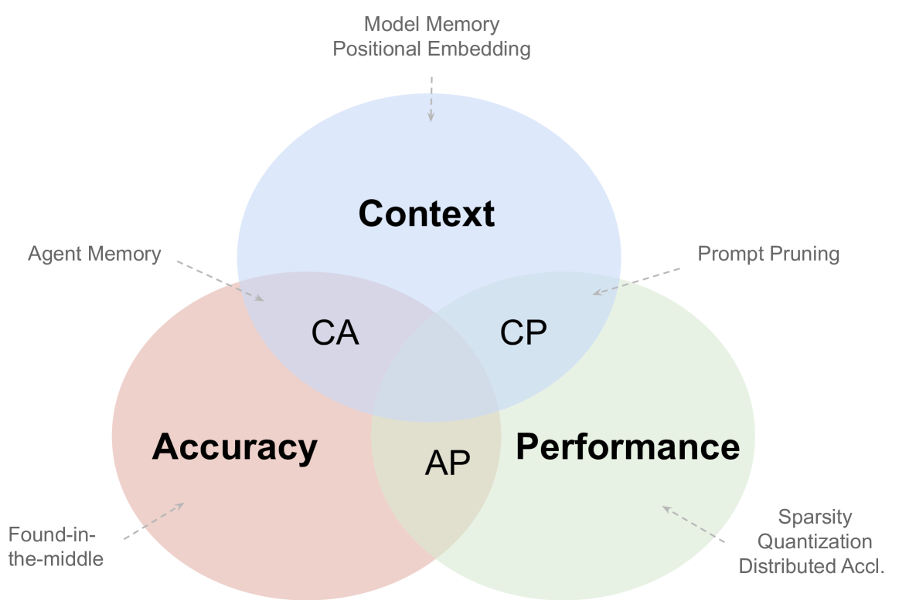
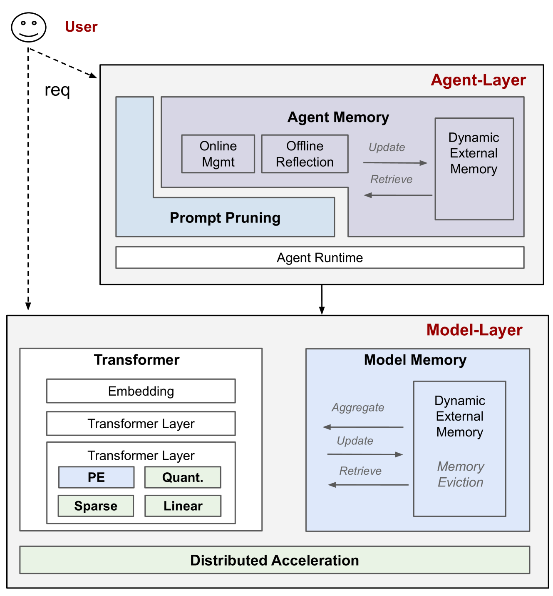
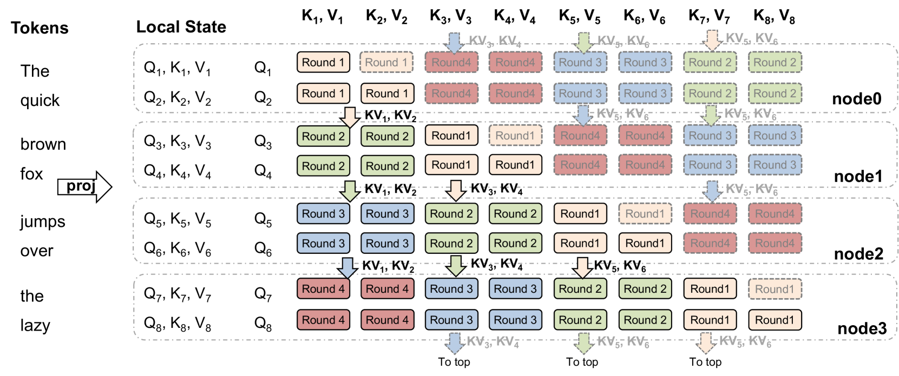
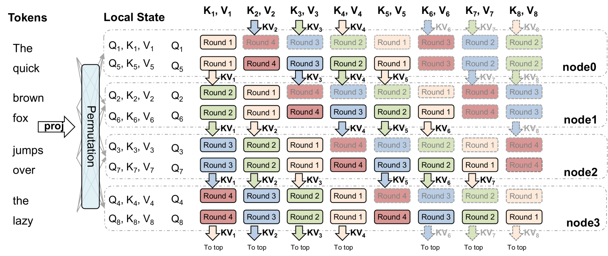
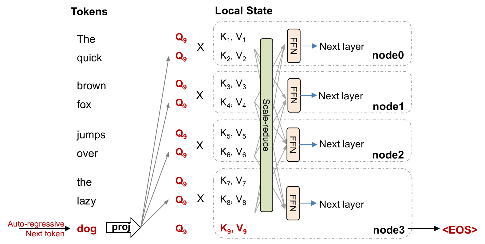

# 大型语言模型服务的 CAP 原则探讨

发布时间：2024年05月18日

`LLM理论

理由：这篇论文的摘要主要讨论了大型语言模型（LLM）服务领域的研究，并提出了适用于LLM服务的CAP原则，这是一个理论性的框架，用于理解模型优化中的权衡。它并没有特别关注Agent的行为、RAG（检索增强生成）的具体应用，也没有直接描述LLM的具体应用案例，而是提供了一个理论性的分析和指导原则，因此更适合归类为LLM理论。` `云计算`

> The CAP Principle for LLM Serving

# 摘要

> 我们对大型语言模型服务领域进行了深入调查，旨在揭示成本效益与准确性之间的微妙平衡，特别是在模型大规模部署时，对更深层次上下文理解的需求日益增长。调查发现，该领域的研究主要围绕三个相互矛盾的目标展开：提升服务上下文长度、提高服务准确性和增强服务性能。借鉴数据库中的CAP定理，我们提出了适用于LLM服务的CAP原则，指出任何优化措施最多只能同时满足这三个目标中的两个。我们的调查将现有研究归类于这一框架下，强调了用户感知度量指标的明确性和连续性对于评估目标达成的重要性。我们认为，LLM服务的CAP原则是一个指导性的理念，而非严格的定理，它帮助设计者理解服务模型中固有的动态权衡。鉴于服务准确性和性能已有广泛探讨，本次调查特别关注那些扩展服务上下文长度并解决相关挑战的研究。

> We survey the large language model (LLM) serving area to understand the intricate dynamics between cost-efficiency and accuracy, which is magnified by the growing need for longer contextual understanding when deploying models at a massive scale. Our findings reveal that works in this space optimize along three distinct but conflicting goals: improving serving context length (C), improving serving accuracy (A), and improving serving performance (P). Drawing inspiration from the CAP theorem in databases, we propose a CAP principle for LLM serving, which suggests that any optimization can improve at most two of these three goals simultaneously. Our survey categorizes existing works within this framework. We find the definition and continuity of user-perceived measurement metrics are crucial in determining whether a goal has been met, akin to prior CAP databases in the wild. We recognize the CAP principle for LLM serving as a guiding principle, rather than a formal theorem, to inform designers of the inherent and dynamic trade-offs in serving models. As serving accuracy and performance have been extensively studied, this survey focuses on works that extend serving context length and address the resulting challenges.

[Arxiv](https://arxiv.org/abs/2405.11299)