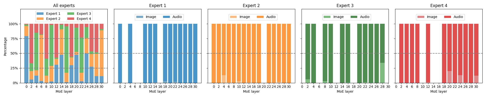
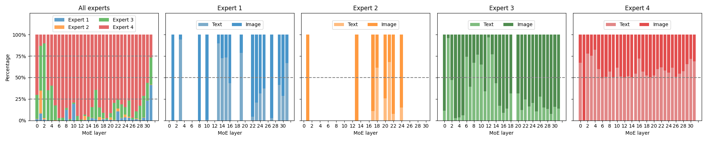
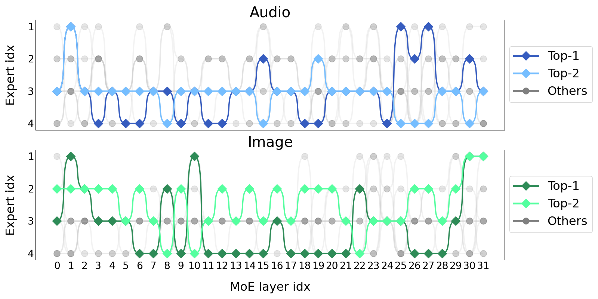

# Uni-MoE：借助专家混合技术，扩展统一多模态大型语言模型的能力

发布时间：2024年05月18日

`RAG

理由：这篇论文主要讨论了多模态大型语言模型（MLLMs）的发展，特别是基于混合专家（MoE）架构的统一模型Uni-MoE。论文详细介绍了如何通过模态特定编码器和连接器实现统一的多模态表示，并优化了训练和推理效率。此外，还提出了一种渐进式训练策略来提升模型的多专家协作和泛化能力。这些内容主要涉及模型的架构设计和训练策略，属于模型增强和优化的范畴，因此归类为RAG（Retrieval-Augmented Generation），即增强生成模型的一种方法。` `人工智能` `多模态学习`

> Uni-MoE: Scaling Unified Multimodal LLMs with Mixture of Experts

# 摘要

> 近期，多模态大型语言模型（MLLMs）的发展突显了模型和数据的可扩展性对性能提升的重要性，但这也带来了高昂的计算成本。虽然混合专家（MoE）架构已被用于高效扩展语言和图像-文本模型，但这些尝试通常涉及的专家和模态有限。为此，我们首次尝试开发了一个基于MoE的统一MLLM——Uni-MoE，它能处理多种模态，并采用模态特定编码器和连接器实现统一的多模态表示。我们还引入了稀疏MoE架构，通过模态级和专家级的并行处理，优化了训练和推理效率。为了提升多专家协作和泛化能力，我们提出了一种渐进式训练策略：首先通过不同连接器和数据实现跨模态对齐，然后利用跨模态指令数据训练模态特定专家以激发其偏好，最后通过低秩适应（LoRA）在混合指令数据上调优Uni-MoE。我们在多个多模态数据集上验证了Uni-MoE的性能，结果显示其在处理混合多模态数据时显著减少了性能偏差，并增强了多专家协作和泛化能力。我们的研究强调了MoE框架在推动MLLMs发展中的巨大潜力，相关代码已公开在https://github.com/HITsz-TMG/UMOE-Scaling-Unified-Multimodal-LLMs。

> Recent advancements in Multimodal Large Language Models (MLLMs) underscore the significance of scalable models and data to boost performance, yet this often incurs substantial computational costs. Although the Mixture of Experts (MoE) architecture has been employed to efficiently scale large language and image-text models, these efforts typically involve fewer experts and limited modalities. To address this, our work presents the pioneering attempt to develop a unified MLLM with the MoE architecture, named Uni-MoE that can handle a wide array of modalities. Specifically, it features modality-specific encoders with connectors for a unified multimodal representation. We also implement a sparse MoE architecture within the LLMs to enable efficient training and inference through modality-level data parallelism and expert-level model parallelism. To enhance the multi-expert collaboration and generalization, we present a progressive training strategy: 1) Cross-modality alignment using various connectors with different cross-modality data, 2) Training modality-specific experts with cross-modality instruction data to activate experts' preferences, and 3) Tuning the Uni-MoE framework utilizing Low-Rank Adaptation (LoRA) on mixed multimodal instruction data. We evaluate the instruction-tuned Uni-MoE on a comprehensive set of multimodal datasets. The extensive experimental results demonstrate Uni-MoE's principal advantage of significantly reducing performance bias in handling mixed multimodal datasets, alongside improved multi-expert collaboration and generalization. Our findings highlight the substantial potential of MoE frameworks in advancing MLLMs and the code is available at https://github.com/HITsz-TMG/UMOE-Scaling-Unified-Multimodal-LLMs.

[Arxiv](https://arxiv.org/abs/2405.11273)