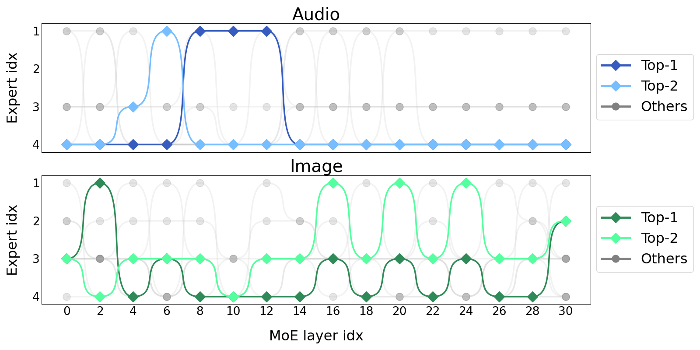
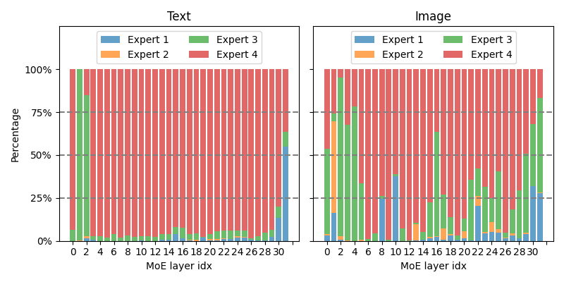

# Uni-MoE：融合专家混合，扩展统一多模态大型语言模型

发布时间：2024年05月18日

`LLM应用

这篇论文主要探讨了多模态大型语言模型（MLLMs）的开发和优化，特别是通过引入混合专家（MoE）架构来处理多种模态数据，并优化训练和推理过程。论文中提到的Uni-MoE模型，以及其渐进式训练策略和稀疏MoE架构的应用，都是针对实际应用场景中的模型性能提升和计算成本降低。因此，这篇论文更符合LLM应用分类，因为它关注的是大型语言模型在多模态环境中的实际应用和优化。` `人工智能` `多模态学习`

> Uni-MoE: Scaling Unified Multimodal LLMs with Mixture of Experts

# 摘要

> 多模态大型语言模型（MLLMs）的最新进展强调了可扩展模型和数据对提升性能的重要性，但这也伴随着高昂的计算成本。尽管采用了混合专家（MoE）架构来高效扩展语言和图像-文本模型，但这些尝试通常涉及的专家和模态有限。为此，我们首次尝试开发了一个名为Uni-MoE的统一MLLM，它基于MoE架构，能处理多种模态，并具备模态特定编码器和连接器，以实现统一的跨模态表示。我们还引入了稀疏MoE架构，通过模态级数据并行和专家级模型并行优化训练和推理。为了提升多专家协作和泛化能力，我们提出了一种渐进式训练策略，包括跨模态对齐、激活专家偏好的模态特定专家训练，以及利用LoRA在混合多模态数据上调优Uni-MoE。实验结果显示，Uni-MoE在处理多模态数据集时显著减少了性能偏差，并增强了多专家协作和泛化能力。我们的研究表明，MoE框架在推进MLLMs方面具有巨大潜力，相关代码已公开发布。

> Recent advancements in Multimodal Large Language Models (MLLMs) underscore the significance of scalable models and data to boost performance, yet this often incurs substantial computational costs. Although the Mixture of Experts (MoE) architecture has been employed to efficiently scale large language and image-text models, these efforts typically involve fewer experts and limited modalities. To address this, our work presents the pioneering attempt to develop a unified MLLM with the MoE architecture, named Uni-MoE that can handle a wide array of modalities. Specifically, it features modality-specific encoders with connectors for a unified multimodal representation. We also implement a sparse MoE architecture within the LLMs to enable efficient training and inference through modality-level data parallelism and expert-level model parallelism. To enhance the multi-expert collaboration and generalization, we present a progressive training strategy: 1) Cross-modality alignment using various connectors with different cross-modality data, 2) Training modality-specific experts with cross-modality instruction data to activate experts' preferences, and 3) Tuning the Uni-MoE framework utilizing Low-Rank Adaptation (LoRA) on mixed multimodal instruction data. We evaluate the instruction-tuned Uni-MoE on a comprehensive set of multimodal datasets. The extensive experimental results demonstrate Uni-MoE's principal advantage of significantly reducing performance bias in handling mixed multimodal datasets, alongside improved multi-expert collaboration and generalization. Our findings highlight the substantial potential of MoE frameworks in advancing MLLMs and the code is available at https://github.com/HITsz-TMG/UMOE-Scaling-Unified-Multimodal-LLMs.

[Arxiv](https://arxiv.org/abs/2405.11273)