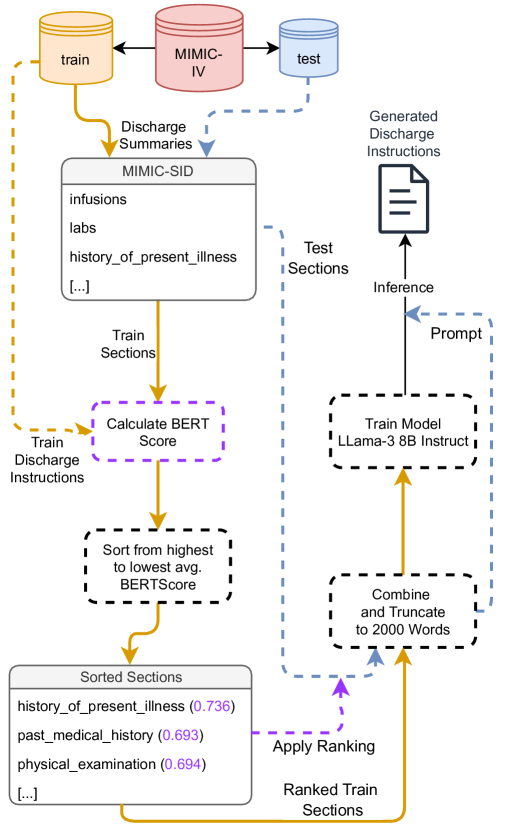
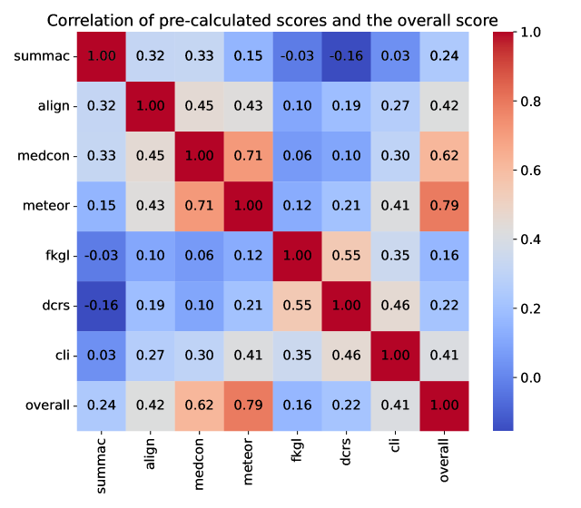
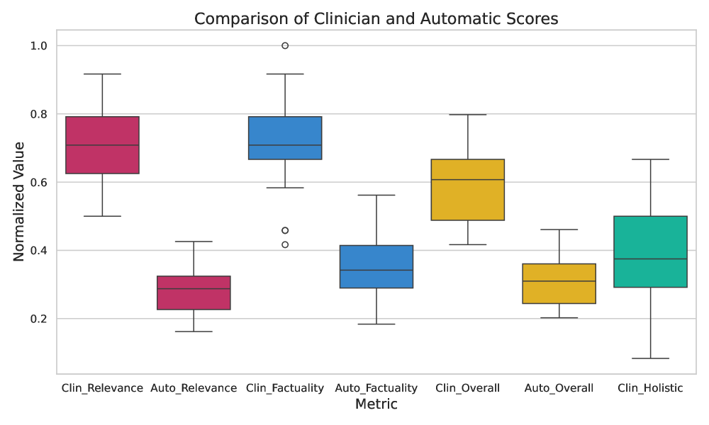

# WisPerMed 携手 "Discharge Me!" 项目，借助大型语言模型、动态专家筛选及预处理技巧，在 MIMIC-IV 数据集上推动医疗文本生成技术的进步。

发布时间：2024年05月18日

`LLM应用

理由：这篇论文主要探讨了如何利用尖端语言模型自动化生成医疗文档（如出院总结），以减轻临床医生的行政负担，并提高文档准确性和医疗运营效率。这属于大型语言模型（LLM）在特定应用领域的实际应用，即在医疗领域的自动化文档生成，因此归类为LLM应用。`

> WisPerMed at "Discharge Me!": Advancing Text Generation in Healthcare with Large Language Models, Dynamic Expert Selection, and Priming Techniques on MIMIC-IV

# 摘要

> 本研究利用尖端语言模型，旨在自动化生成MIMIC-IV数据集中的出院总结“简要住院过程”及“出院指导”，从而减轻临床医生的行政负担。我们探讨了自动化如何提升文档准确性、缓解临床疲劳并优化医疗运营。此研究在我们参与2024年BioNLP @ ACL的“Discharge Me!”共享任务期间进行，采用了少量样本学习、指令调整及动态专家选择（DES）等策略，开发出能精准生成所需文本的模型。特别地，DES方法通过优化多预测文本输出选择，表现卓越，在比赛中以0.332的高分夺冠，超越单一模型。这表明，结合DES的高级深度学习技术能有效自动化电子健康记录，释放临床时间，提升患者护理。文本选择策略的整合为未来研究开辟了新路径。

> This study aims to leverage state of the art language models to automate generating the "Brief Hospital Course" and "Discharge Instructions" sections of Discharge Summaries from the MIMIC-IV dataset, reducing clinicians' administrative workload. We investigate how automation can improve documentation accuracy, alleviate clinician burnout, and enhance operational efficacy in healthcare facilities. This research was conducted within our participation in the Shared Task Discharge Me! at BioNLP @ ACL 2024. Various strategies were employed, including few-shot learning, instruction tuning, and Dynamic Expert Selection (DES), to develop models capable of generating the required text sections. Notably, utilizing an additional clinical domain-specific dataset demonstrated substantial potential to enhance clinical language processing. The DES method, which optimizes the selection of text outputs from multiple predictions, proved to be especially effective. It achieved the highest overall score of 0.332 in the competition, surpassing single-model outputs. This finding suggests that advanced deep learning methods in combination with DES can effectively automate parts of electronic health record documentation. These advancements could enhance patient care by freeing clinician time for patient interactions. The integration of text selection strategies represents a promising avenue for further research.

[Arxiv](https://arxiv.org/abs/2405.11255)