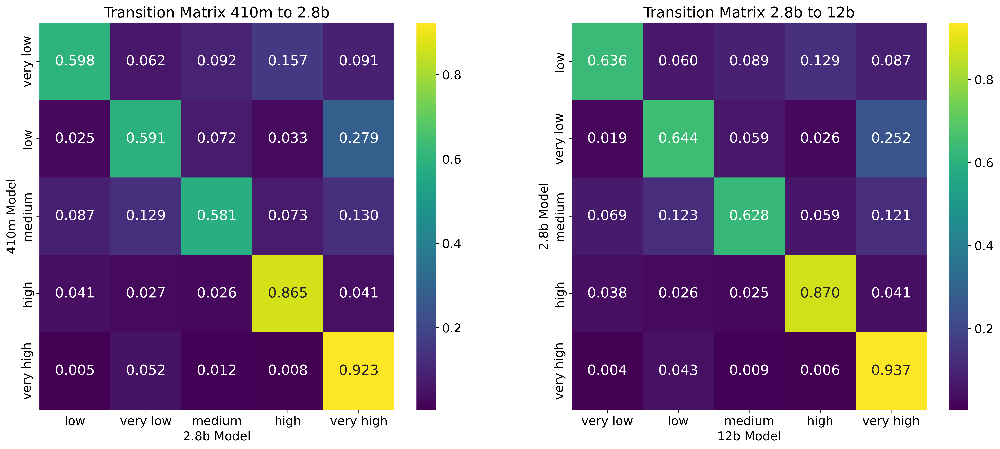

# 大型语言模型记忆化的多维度探究

发布时间：2024年05月19日

`LLM理论

这篇论文摘要主要探讨了大型语言模型（LLMs）中的记忆化现象，包括其与模型大小、连续大小和上下文大小的关系，以及记忆化内容的分布和解码动态。这些研究内容更偏向于对LLMs理论层面的理解和分析，而非具体的应用或Agent行为，也不是关于RAG（检索增强生成）的讨论。因此，将其归类为LLM理论是合适的。` `机器学习`

> A Multi-Perspective Analysis of Memorization in Large Language Models

# 摘要

> 大型语言模型（LLMs）在经过数十亿参数的大规模语料库训练后，在多个领域展现出前所未有的性能。尽管对其卓越表现感到惊讶，研究人员也注意到了这些模型的一些特殊行为，其中之一是记忆化，即LLMs能够复制训练数据中的内容。本研究从多个角度深入探讨了记忆化现象，不仅关注记忆的内容，还扩展到了较少记忆和未记忆的内容。研究发现：（1）实验揭示了模型大小、连续大小和上下文大小与记忆化之间的关系，并展示了未记忆句子向记忆句子的转变过程。（2）嵌入分析揭示了不同记忆化分数的句子在模型大小上的分布和解码动态。（3）n-gram和熵解码动态分析揭示了模型在生成记忆或未记忆句子时的边界效应。（4）通过训练Transformer模型，我们证明了通过上下文预测记忆化是可行的。

> Large Language Models (LLMs), trained on massive corpora with billions of parameters, show unprecedented performance in various fields. Though surprised by their excellent performances, researchers also noticed some special behaviors of those LLMs. One of those behaviors is memorization, in which LLMs can generate the same content used to train them. Though previous research has discussed memorization, the memorization of LLMs still lacks explanation, especially the cause of memorization and the dynamics of generating them. In this research, we comprehensively discussed memorization from various perspectives and extended the discussion scope to not only just the memorized content but also less and unmemorized content. Through various studies, we found that: (1) Through experiments, we revealed the relation of memorization between model size, continuation size, and context size. Further, we showed how unmemorized sentences transition to memorized sentences. (2) Through embedding analysis, we showed the distribution and decoding dynamics across model size in embedding space for sentences with different memorization scores. The n-gram statistics analysis presents d (3) An analysis over n-gram and entropy decoding dynamics discovered a boundary effect when the model starts to generate memorized sentences or unmemorized sentences. (4)We trained a Transformer model to predict the memorization of different models, showing that it is possible to predict memorizations by context.

[Arxiv](https://arxiv.org/abs/2405.11577)