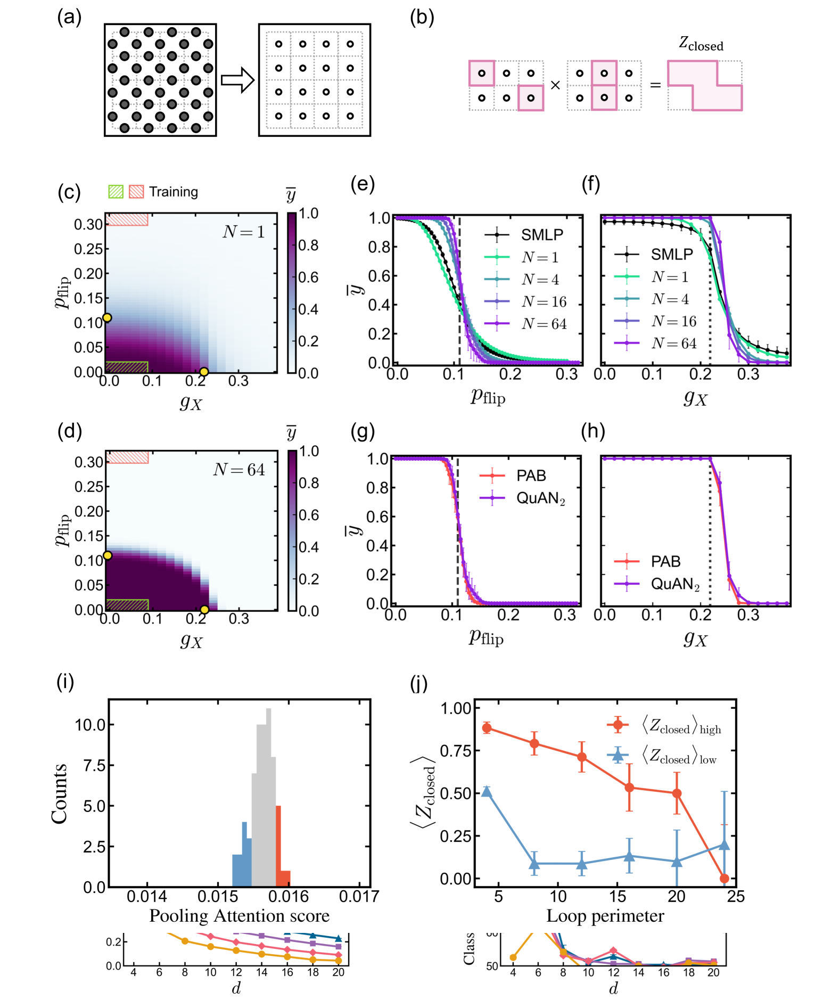

# 聚焦量子复杂性之谜

发布时间：2024年05月19日

`LLM应用

这篇论文介绍了一种名为量子注意力网络（QuAN）的新型AI框架，该框架专门针对量子复杂性学习的挑战进行优化。它借鉴了大型语言模型的思路，将测量快照视为标记，并利用注意力机制来处理量子态的复杂性。QuAN的设计特别强调了从有限且带有噪声的数据中解析量子态的能力，这在纠错量子计算时代尤为重要。通过在多种量子模拟环境中的测试，QuAN展示了其在理解和预测量子系统行为方面的有效性。因此，这篇论文属于LLM应用分类，因为它展示了如何将大型语言模型的概念和技术应用于量子计算领域，以解决特定的科学和工程问题。` `量子计算` `人工智能`

> Attention to Quantum Complexity

# 摘要

> 随着纠错量子计算时代的迫近，我们需要强有力的方法来解析复杂的量子态，即便这些解析基于有限且带有噪声的数据。我们提出的量子注意力网络（QuAN），是一个灵活的经典AI框架，它利用注意力机制，专门针对量子复杂性学习的挑战进行优化。借鉴大型语言模型的思路，QuAN将测量快照视为标记，同时保持其排列不变性。通过结合创新的参数高效迷你集自注意力块（MSSAB），QuAN能够触及位串分布的高阶矩，并优先处理噪声较小的快照。我们在三种量子模拟环境中对QuAN进行了严格测试：驱动硬核玻色-哈伯德模型、随机量子电路以及在相干和非相干噪声下的环面码。QuAN能够直接从实验数据中学习到纠缠和状态复杂性的增长，尤其是在随机电路数据随着深度增加而复杂性增加的情况下。在现有理论无法触及的领域，QuAN揭示了嘈杂环面码数据在两种噪声类型影响下的完整相位图。这一成就展示了专门设计的AI解决方案在辅助量子硬件方面的巨大潜力。

> The imminent era of error-corrected quantum computing urgently demands robust methods to characterize complex quantum states, even from limited and noisy measurements. We introduce the Quantum Attention Network (QuAN), a versatile classical AI framework leveraging the power of attention mechanisms specifically tailored to address the unique challenges of learning quantum complexity. Inspired by large language models, QuAN treats measurement snapshots as tokens while respecting their permutation invariance. Combined with a novel parameter-efficient mini-set self-attention block (MSSAB), such data structure enables QuAN to access high-order moments of the bit-string distribution and preferentially attend to less noisy snapshots. We rigorously test QuAN across three distinct quantum simulation settings: driven hard-core Bose-Hubbard model, random quantum circuits, and the toric code under coherent and incoherent noise. QuAN directly learns the growth in entanglement and state complexity from experimentally obtained computational basis measurements. In particular, it learns the growth in complexity of random circuit data upon increasing depth from noisy experimental data. Taken to a regime inaccessible by existing theory, QuAN unveils the complete phase diagram for noisy toric code data as a function of both noise types. This breakthrough highlights the transformative potential of using purposefully designed AI-driven solutions to assist quantum hardware.

[Arxiv](https://arxiv.org/abs/2405.11632)