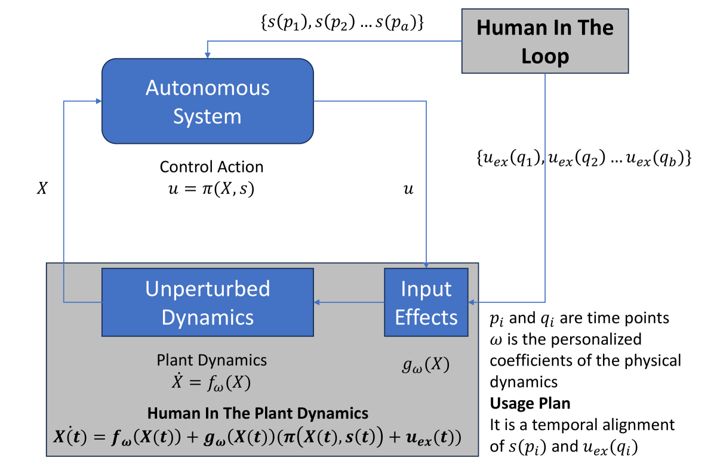
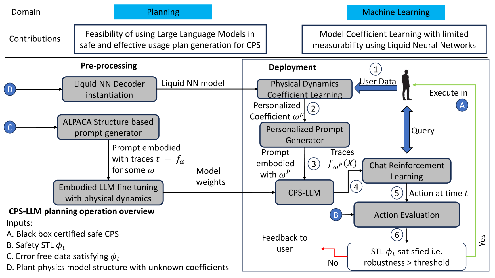
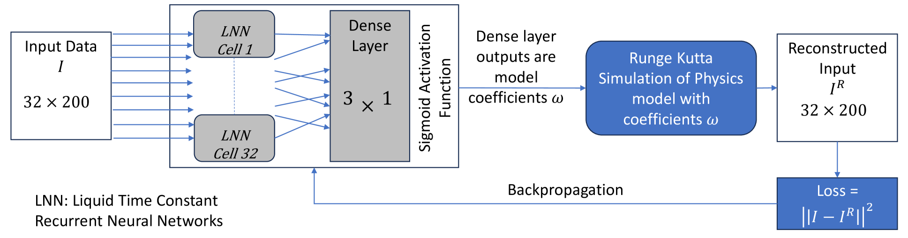
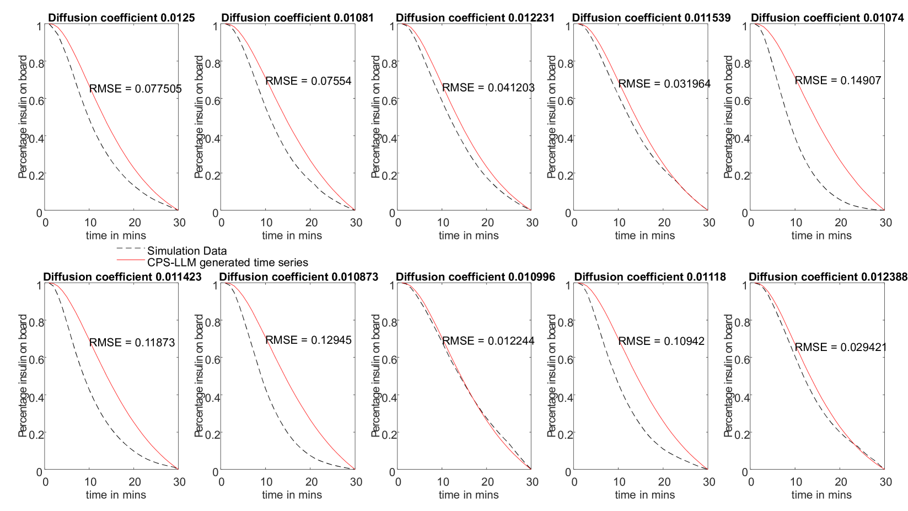
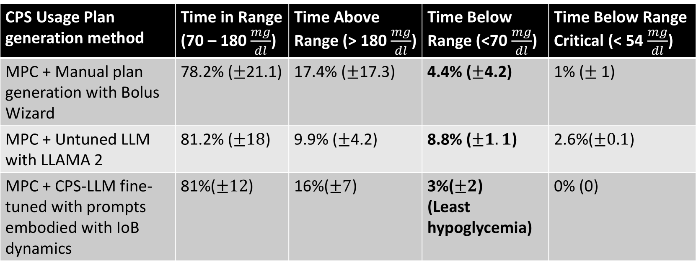

# CPS-LLM：大型语言模型驱动的安全使用计划生成器，专为人机交互的工厂网络物理系统设计

发布时间：2024年05月19日

`Agent

理由：这篇论文主要探讨了如何利用大型语言模型（LLM）在工业网络物理系统（CPS）中生成个性化的行动方案，并确保这些方案的可行性和安全性。论文中提到的CPS-LLM模型通过特定的训练和调整，能够生成符合物理系统动态且对人类用户安全的计划。这种模型可以被视为一个智能Agent，因为它能够根据高级指令自主地生成并执行决策，以达成特定的控制目标。此外，论文中提到的与上下文化聊天机器人（如BARD）的结合，进一步增强了该Agent在特定应用场景（如自动胰岛素输送系统）中的实用性和交互性。因此，这篇论文更适合归类于Agent分类。` `工业自动化`

> CPS-LLM: Large Language Model based Safe Usage Plan Generator for Human-in-the-Loop Human-in-the-Plant Cyber-Physical System

# 摘要

> 我们研究了如何利用大型语言模型（LLM）在人机交互的工业网络物理系统（CPS）中，将高级指令转化为个性化的行动方案，并进一步将这些方案转化为由实际CPS控制器自动执行的顺序决策推理，以达成控制目标。我们发现，让LLM生成特定领域的计划相对简单，但这些计划可能对物理系统不可行或对人类用户存在安全隐患。为此，我们开发了CPS-LLM，这是一种经过指令调优框架重新训练的LLM，确保其生成的计划既符合CPS的物理系统动态，又对人类用户安全。CPS-LLM的创新之处在于：a) 采用液体时间常数神经网络来估计物理动态系数，能够处理包含未测量状态变量的动态模型；b) 利用这些模型系数训练LLM，使其提示包含动态系统的轨迹和相应的模型系数。我们展示了当CPS-LLM与如BARD这样的上下文化聊天机器人结合时，它能生成既可行又安全的计划，有效管理外部事件，例如为1型糖尿病患者自动胰岛素输送系统提供餐食。

> We explore the usage of large language models (LLM) in human-in-the-loop human-in-the-plant cyber-physical systems (CPS) to translate a high-level prompt into a personalized plan of actions, and subsequently convert that plan into a grounded inference of sequential decision-making automated by a real-world CPS controller to achieve a control goal. We show that it is relatively straightforward to contextualize an LLM so it can generate domain-specific plans. However, these plans may be infeasible for the physical system to execute or the plan may be unsafe for human users. To address this, we propose CPS-LLM, an LLM retrained using an instruction tuning framework, which ensures that generated plans not only align with the physical system dynamics of the CPS but are also safe for human users. The CPS-LLM consists of two innovative components: a) a liquid time constant neural network-based physical dynamics coefficient estimator that can derive coefficients of dynamical models with some unmeasured state variables; b) the model coefficients are then used to train an LLM with prompts embodied with traces from the dynamical system and the corresponding model coefficients. We show that when the CPS-LLM is integrated with a contextualized chatbot such as BARD it can generate feasible and safe plans to manage external events such as meals for automated insulin delivery systems used by Type 1 Diabetes subjects.

[Arxiv](https://arxiv.org/abs/2405.11458)