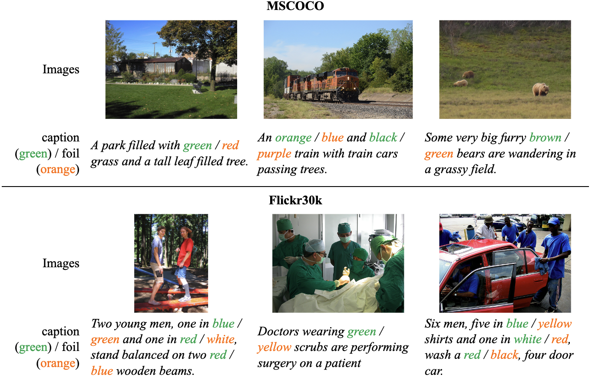

# ColorFoil：探索大型视觉与语言模型中的色觉障碍现象

发布时间：2024年05月19日

`RAG

理由：这篇论文主要关注的是视觉与语言模型（V&L模型）在零-shot场景下的性能，特别是对颜色的识别能力。通过创建ColorFoil这一基准，研究者们测试了多个模型的性能，并分析了它们在颜色识别上的差异。这与RAG（Retrieval-Augmented Generation）的范畴相关，因为RAG模型通常用于处理和生成与视觉和语言相关的任务，尤其是在零-shot学习场景中。虽然论文中没有直接提到RAG模型，但其研究内容和目标与RAG的研究方向相符，即通过特定的基准测试来评估和改进模型的性能。` `视觉与语言模型` `基准测试`

> ColorFoil: Investigating Color Blindness in Large Vision and Language Models

# 摘要

> 借助Transformer架构，大型视觉与语言模型在零-shot场景下已显露出潜力。但面对复杂的语言和视觉特征，这些模型的稳健性仍显不足。为此，我们推出了ColorFoil这一创新V&L基准，通过设计颜色相关的测试来检验模型对红、白、绿等颜色的识别能力。我们对包括CLIP、ViLT、GroupViT和BridgeTower在内的七大顶尖V&L模型进行了零-shot测试，并揭示了它们在颜色识别上的差异。实验显示，ViLT和BridgeTower在颜色感知上明显优于CLIP系列及GroupViT。而CLIP及其衍生模型和GroupViT在区分人类视觉中明显不同的颜色时表现不佳。

> With the utilization of Transformer architecture, large Vision and Language (V&L) models have shown promising performance in even zero-shot settings. Several studies, however, indicate a lack of robustness of the models when dealing with complex linguistics and visual attributes. In this work, we introduce a novel V&L benchmark - ColorFoil, by creating color-related foils to assess the models' perception ability to detect colors like red, white, green, etc. We evaluate seven state-of-the-art V&L models including CLIP, ViLT, GroupViT, and BridgeTower, etc. in a zero-shot setting and present intriguing findings from the V&L models. The experimental evaluation indicates that ViLT and BridgeTower demonstrate much better color perception capabilities compared to CLIP and its variants and GroupViT. Moreover, CLIP-based models and GroupViT struggle to distinguish colors that are visually distinct to humans with normal color perception ability.

[Arxiv](https://arxiv.org/abs/2405.11685)