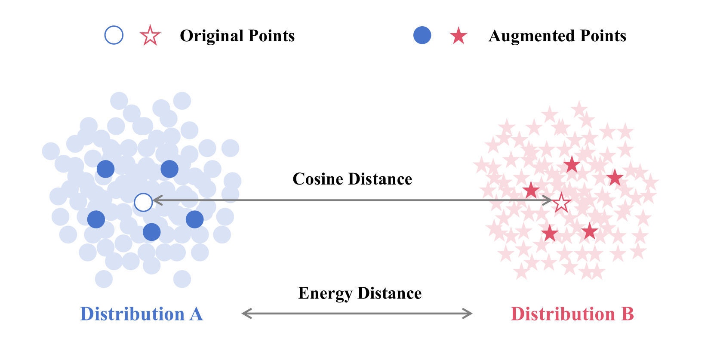
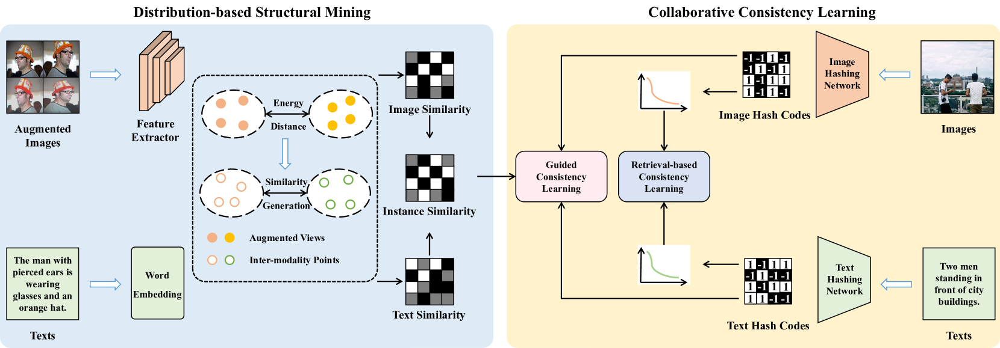
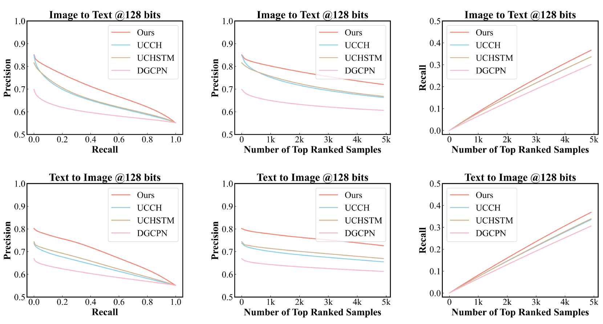
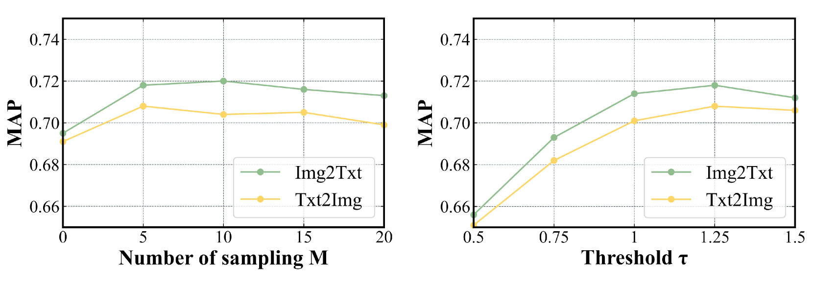
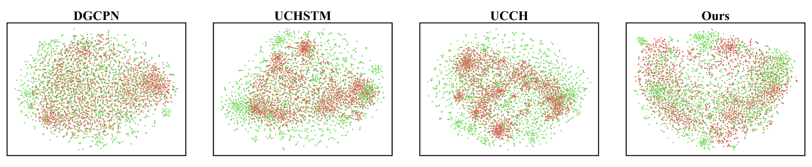
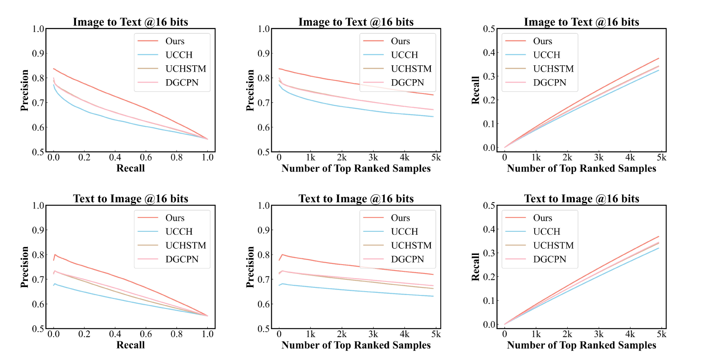
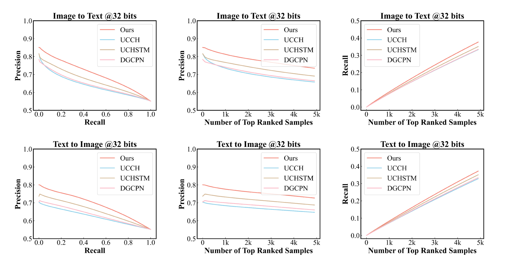
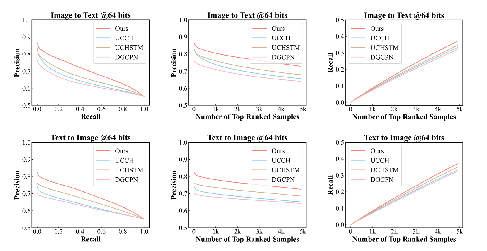

# DEMO：探索图像与文本匹配的高效统计方法

发布时间：2024年05月19日

`RAG

理由：这篇论文主要关注的是图像-文本匹配问题，并提出了一种新型的哈希方法（DEMO）来优化这一过程。这种方法涉及多视角增强视图捕捉图像的内在语义分布，并采用非参数分布差异来确保相似性结构的精确与稳健。这与RAG（Retrieval-Augmented Generation）的概念相符，因为RAG通常涉及通过检索增强来改进文本生成或匹配任务。此外，论文中提到的协同一致性学习机制和在汉明空间中维持相似性结构的方法，进一步强调了其在信息检索和语义匹配领域的应用，这是RAG方法的核心应用场景。因此，将这篇论文分类为RAG是合适的。` `图像-文本匹配` `无监督学习`

> DEMO: A Statistical Perspective for Efficient Image-Text Matching

# 摘要

> 图像-文本匹配问题旨在通过语义理解桥接视觉与语言，而基于无监督哈希的方法因其处理大规模数据的能力而崭露头角。这些方法利用自然距离构建语义相似性框架，进而引导模型优化。但语义分布边缘的偏差可能导致优化过程中的错误累积。为此，我们提出了一种名为DEMO的新型哈希方法，它通过多视角增强视图捕捉图像的内在语义分布，并采用非参数分布差异确保相似性结构的精确与稳健。此外，协同一致性学习机制在汉明空间中维持相似性结构的同时，还促进了不同检索方向间的自监督一致性。实验证明，DEMO在多个图像-文本匹配基准数据集上超越了众多顶尖方法。

> Image-text matching has been a long-standing problem, which seeks to connect vision and language through semantic understanding. Due to the capability to manage large-scale raw data, unsupervised hashing-based approaches have gained prominence recently. They typically construct a semantic similarity structure using the natural distance, which subsequently provides guidance to the model optimization process. However, the similarity structure could be biased at the boundaries of semantic distributions, causing error accumulation during sequential optimization. To tackle this, we introduce a novel hashing approach termed Distribution-based Structure Mining with Consistency Learning (DEMO) for efficient image-text matching. From a statistical view, DEMO characterizes each image using multiple augmented views, which are considered as samples drawn from its intrinsic semantic distribution. Then, we employ a non-parametric distribution divergence to ensure a robust and precise similarity structure. In addition, we introduce collaborative consistency learning which not only preserves the similarity structure in the Hamming space but also encourages consistency between retrieval distribution from different directions in a self-supervised manner. Through extensive experiments on three benchmark image-text matching datasets, we demonstrate that DEMO achieves superior performance compared with many state-of-the-art methods.

[Arxiv](https://arxiv.org/abs/2405.11496)