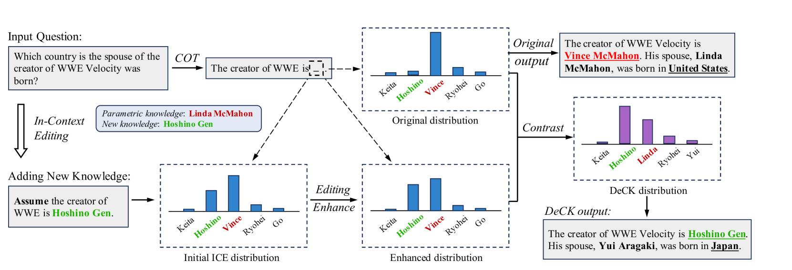

# 对比知识解码：提升大型语言模型对编辑事实的确信度

发布时间：2024年05月19日

`LLM理论

理由：这篇论文主要探讨了大型语言模型（LLMs）的知识更新问题，特别是通过上下文编辑（ICE）方法的改进。论文提出了一种新的方法——解码对比知识（DeCK），用于优化模型对新知识的处理和信任度。这一研究深入分析了LLMs内部的知识更新机制，并通过实验验证了其有效性。因此，这项工作更偏向于LLM的理论研究，特别是在知识更新和模型内部机制的优化方面。` `知识更新`

> Decoding by Contrasting Knowledge: Enhancing LLMs' Confidence on Edited Facts

# 摘要

> 大型语言模型（LLMs）的知识更新迅速，而上下文编辑（ICE）虽为当前最有效的知识更新手段，却因LLMs的黑盒特性而缺乏透明度。本研究通过探究新知识对令牌分布的影响，揭示了ICE在知识更新中的优势。研究发现，尽管新知识的置信度显著提升，但模型性能仍受制于难以更新的“顽固知识”——即预训练中过度自信的事实。为此，我们提出了一种创新方法——解码对比知识（DeCK），它通过对比ICE引导的新知识与原始知识的logits，优化了下一个令牌的生成。实验证明，DeCK显著提升了LLMs对更新事实的信任度，如将LLaMA3-8B-instruct在MQuAKE测试中的表现提升了219%，有效强化了ICE在处理顽固知识时的效果。我们的研究为开发高效且透明的LLMs知识更新方法奠定了基础。（源代码已公开，详情请访问：$\href{https://github.com/byronBBL/DeCK}{\text{此链接}}$）

> The knowledge within large language models (LLMs) may become outdated quickly. While in-context editing (ICE) is currently the most effective method for knowledge editing (KE), it is constrained by the black-box modeling of LLMs and thus lacks interpretability. Our work aims to elucidate the superior performance of ICE on the KE by analyzing the impacts of in-context new knowledge on token-wise distributions. We observe that despite a significant boost in logits of the new knowledge, the performance of is still hindered by stubborn knowledge. Stubborn knowledge refers to as facts that have gained excessive confidence during pretraining, making it hard to edit effectively. To address this issue and further enhance the performance of ICE, we propose a novel approach termed $\textbf{De}$coding by $\textbf{C}$ontrasting $\textbf{K}$nowledge (DeCK). DeCK derives the distribution of the next token by contrasting the logits obtained from the newly edited knowledge guided by ICE with those from the unedited parametric knowledge. Our experiments consistently demonstrate that DeCK enhances the confidence of LLMs in edited facts. For instance, it improves the performance of LLaMA3-8B-instruct on MQuAKE by up to 219%, demonstrating its capability to strengthen ICE in the editing of stubborn knowledge. Our work paves the way to develop the both effective and accountable KE methods for LLMs. (The source code is available at: $\href{https://github.com/byronBBL/DeCK}{\text{this https URL.}}$ )

[Arxiv](https://arxiv.org/abs/2405.11613)