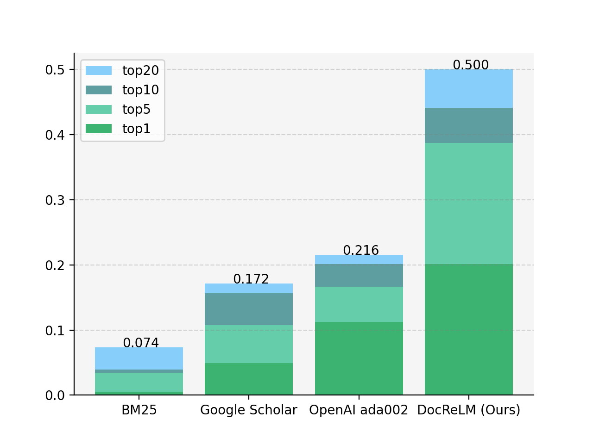
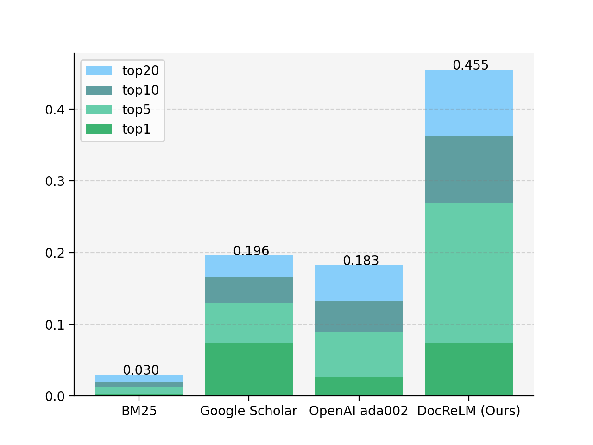
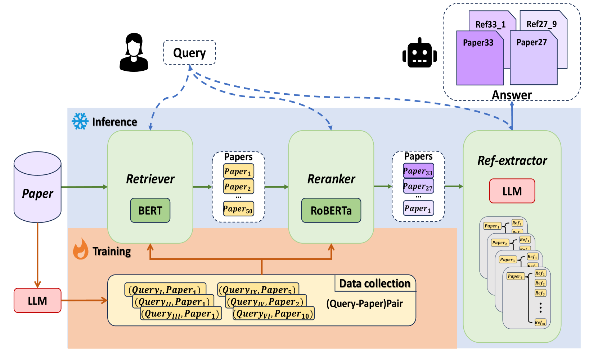
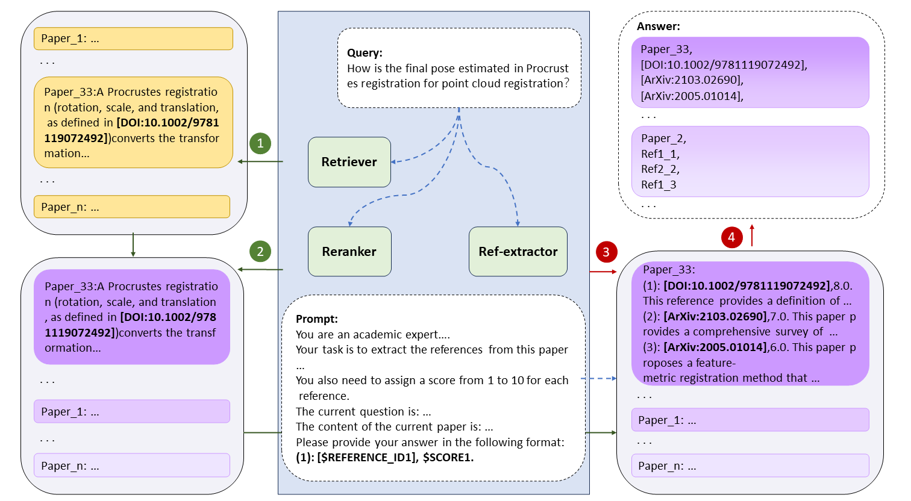

# DocReLM：驾驭语言模型，精通文档检索

发布时间：2024年05月19日

`LLM应用

这篇论文摘要描述了一个利用大型语言模型（LLM）开发的文档检索系统，该系统能够理解学术论文的深层语义和专业知识，从而在检索学术文献时表现出优于现有技术的性能。研究中使用了LLM生成的特定领域数据来训练检索器和重排器，并通过专家标注的测试集验证了系统的有效性。这表明该研究是关于LLM在实际应用中的使用，特别是在提高文档检索效率和准确性方面的应用，因此属于LLM应用分类。` `学术研究` `文档检索`

> DocReLM: Mastering Document Retrieval with Language Model

# 摘要

> 面对超过2亿份学术文献和每年新增的数百万份文献，学术研究者们在浩瀚的知识海洋中寻找信息时倍感挑战。现有的检索系统在理解学术论文的深层语义和专业知识方面显得力不从心。本研究通过运用大型语言模型，成功开发出一款具备高级语义理解能力的文档检索系统，其性能远超现有技术。我们采用大型语言模型生成的特定领域数据来训练检索器和重排器，并利用这些模型从论文的参考文献中筛选出潜在的优质文献，以进一步提升检索效果。通过量子物理学和计算机视觉领域专家标注的测试集，我们验证了系统的有效性。结果表明，在计算机视觉领域，我们的系统Top 10准确率高达44.12%，远超Google Scholar的15.69%；在量子物理学领域，这一数字也达到了36.21%，而Google Scholar仅为12.96%。

> With over 200 million published academic documents and millions of new documents being written each year, academic researchers face the challenge of searching for information within this vast corpus. However, existing retrieval systems struggle to understand the semantics and domain knowledge present in academic papers. In this work, we demonstrate that by utilizing large language models, a document retrieval system can achieve advanced semantic understanding capabilities, significantly outperforming existing systems. Our approach involves training the retriever and reranker using domain-specific data generated by large language models. Additionally, we utilize large language models to identify candidates from the references of retrieved papers to further enhance the performance. We use a test set annotated by academic researchers in the fields of quantum physics and computer vision to evaluate our system's performance. The results show that DocReLM achieves a Top 10 accuracy of 44.12% in computer vision, compared to Google Scholar's 15.69%, and an increase to 36.21% in quantum physics, while that of Google Scholar is 12.96%.

[Arxiv](https://arxiv.org/abs/2405.11461)