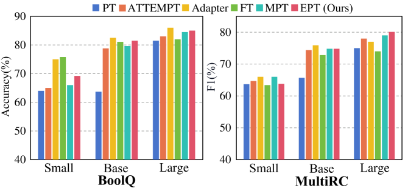
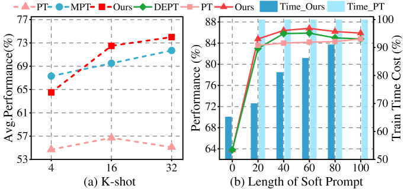
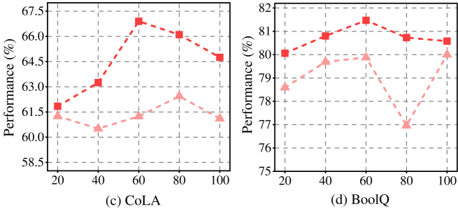
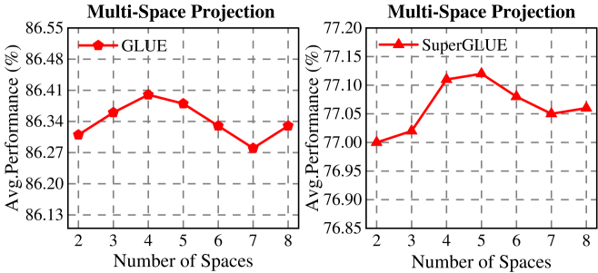
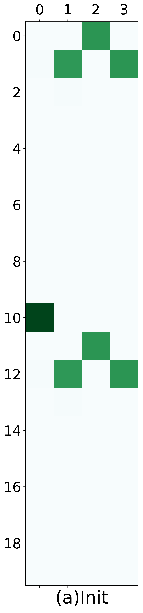
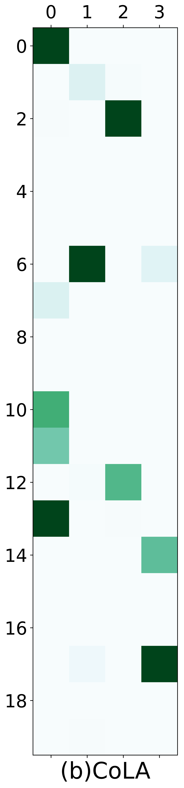
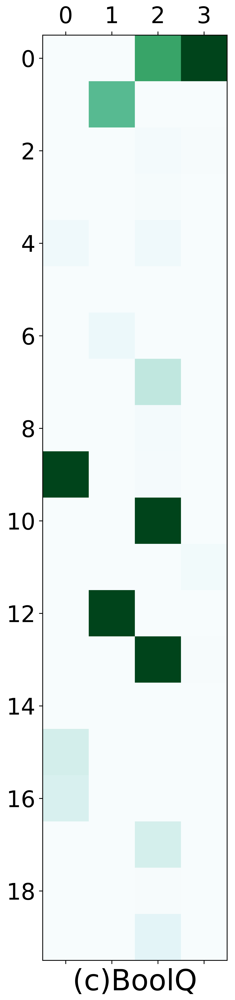
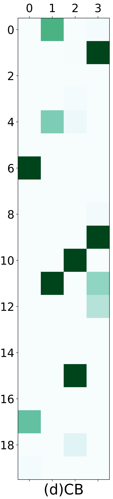
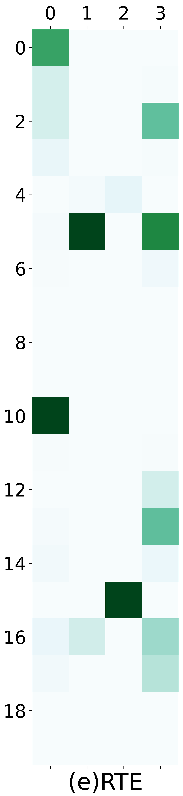

# 利用多空间投影与提示融合实现高效提示调优

发布时间：2024年05月19日

`LLM理论

理由：这篇论文主要探讨了提示调优技术（EPT），这是一种针对预训练语言模型（LLM）的优化方法，旨在提高效率和准确性，同时减少训练时间和参数数量。论文中提出的技术涉及多空间投影和提示融合，这些都是理论层面的创新和改进，而非直接应用于特定的Agent或RAG系统，也不是直接讨论LLM的应用场景。因此，这篇论文更符合LLM理论的分类。` `机器学习`

> Efficient Prompt Tuning by Multi-Space Projection and Prompt Fusion

# 摘要

> 提示调优是一种创新的方法，它通过在输入文本上附加软提示，无需重新训练大规模参数即可微调预训练语言模型。尽管如此，现有方法在平衡准确性与效率以及适应不同下游任务时的性能一致性方面仍面临挑战。为此，我们提出了一种名为EPT的高效提示调优技术，通过多空间投影和提示融合，将软提示分解为更短的提示和低秩矩阵，显著减少了训练时间和参数数量，同时提高了准确性。此外，EPT通过将软提示投影到多个子空间并利用门控网络自适应调整权重，增强了性能的一致性。实验结果显示，EPT在13个自然语言处理任务中显著优于其他11种方法，性能提升高达28.8%，训练时间缩短了14%。

> Prompt tuning is a promising method to fine-tune a pre-trained language model without retraining its large-scale parameters. Instead, it attaches a soft prompt to the input text, whereby downstream tasks can be well adapted by merely learning the embeddings of prompt tokens. Nevertheless, existing methods still suffer from two challenges: (i) they are hard to balance accuracy and efficiency. A longer (shorter) soft prompt generally leads to a better (worse) accuracy but at the cost of more (less) training time. (ii) The performance may not be consistent when adapting to different downstream tasks. We attribute it to the same embedding space but responsible for different requirements of downstream tasks. To address these issues, we propose an Efficient Prompt Tuning method (EPT) by multi-space projection and prompt fusion. Specifically, it decomposes a given soft prompt into a shorter prompt and two low-rank matrices, whereby the number of parameters is greatly reduced as well as the training time. The accuracy is also enhanced by leveraging low-rank matrices and the short prompt as additional knowledge sources to enrich the semantics of the original short prompt. In addition, we project the soft prompt into multiple subspaces to improve the performance consistency, and then adaptively learn the combination weights of different spaces through a gating network. Experimental experiments on 13 natural language processing downstream tasks show that our method significantly and consistently outperforms 11 comparison methods with the relative percentage of improvements up to 28.8%, and training time decreased by 14%.

[Arxiv](https://arxiv.org/abs/2405.11464)