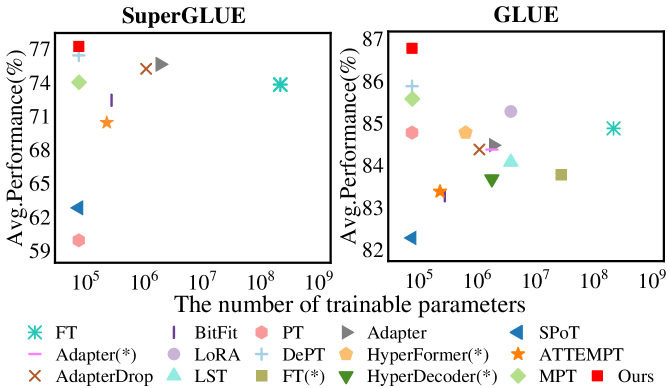

# 高效提示调优：融合多空间投影与提示策略

发布时间：2024年05月19日

`LLM理论

理由：这篇论文介绍了一种名为EPT的高效提示调优技术，这是一种针对预训练语言模型的微调方法，旨在提高准确性和效率，并增强在不同下游任务中的性能一致性。这种方法涉及模型参数的优化和训练过程的改进，属于对大型语言模型（LLM）理论层面的研究和改进。因此，它更适合归类于LLM理论。` `机器学习`

> Efficient Prompt Tuning by Multi-Space Projection and Prompt Fusion

# 摘要

> 提示调优是一种创新的方法，它通过在输入文本上附加软提示，无需重新训练大规模参数即可微调预训练语言模型。尽管如此，现有方法在平衡准确性与效率以及适应不同下游任务时的性能一致性方面仍面临挑战。为此，我们提出了一种名为EPT的高效提示调优技术，它通过分解软提示为短提示和低秩矩阵，不仅大幅减少了参数和训练时间，还通过引入额外知识源增强了语义丰富度。此外，EPT通过多空间投影和门控网络自适应权重调整，显著提升了性能一致性。实验结果显示，EPT在13项自然语言处理任务中，相比其他11种方法，实现了高达28.8%的性能提升，并缩短了14%的训练时间。

> Prompt tuning is a promising method to fine-tune a pre-trained language model without retraining its large-scale parameters. Instead, it attaches a soft prompt to the input text, whereby downstream tasks can be well adapted by merely learning the embeddings of prompt tokens. Nevertheless, existing methods still suffer from two challenges: (i) they are hard to balance accuracy and efficiency. A longer (shorter) soft prompt generally leads to a better (worse) accuracy but at the cost of more (less) training time. (ii) The performance may not be consistent when adapting to different downstream tasks. We attribute it to the same embedding space but responsible for different requirements of downstream tasks. To address these issues, we propose an Efficient Prompt Tuning method (EPT) by multi-space projection and prompt fusion. Specifically, it decomposes a given soft prompt into a shorter prompt and two low-rank matrices, whereby the number of parameters is greatly reduced as well as the training time. The accuracy is also enhanced by leveraging low-rank matrices and the short prompt as additional knowledge sources to enrich the semantics of the original short prompt. In addition, we project the soft prompt into multiple subspaces to improve the performance consistency, and then adaptively learn the combination weights of different spaces through a gating network. Experimental experiments on 13 natural language processing downstream tasks show that our method significantly and consistently outperforms 11 comparison methods with the relative percentage of improvements up to 28.8%, and training time decreased by 14%.

[Arxiv](https://arxiv.org/abs/2405.11464)