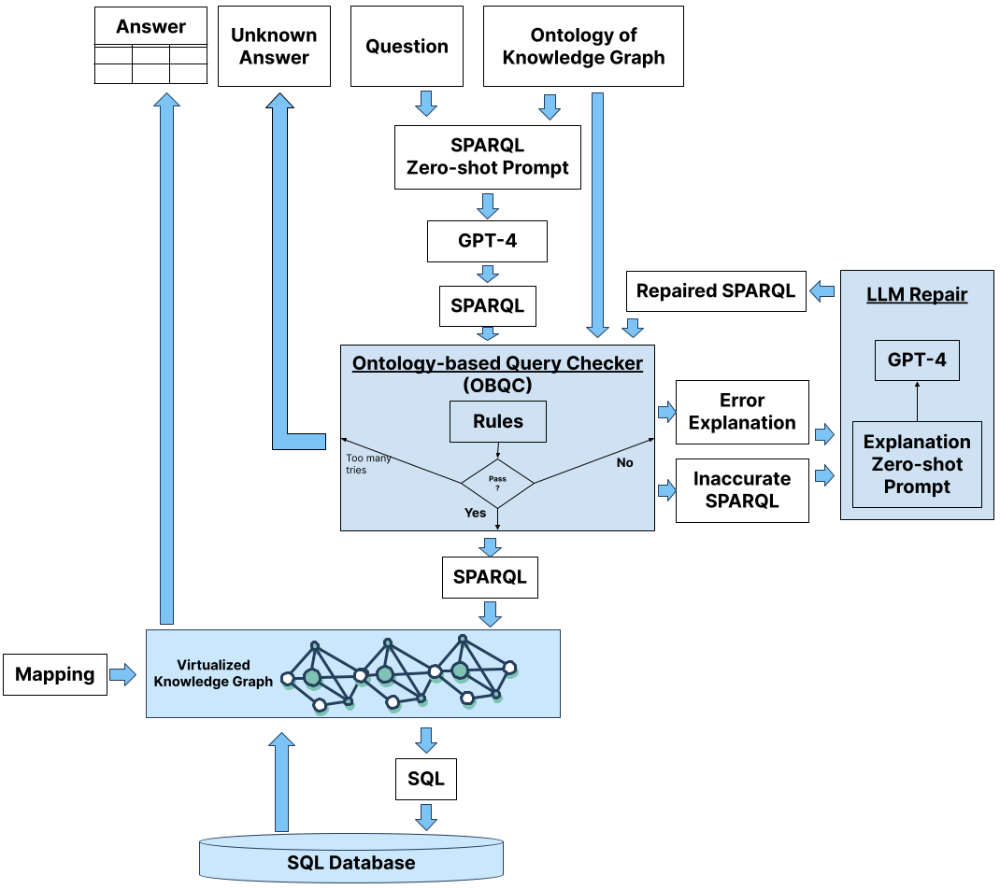
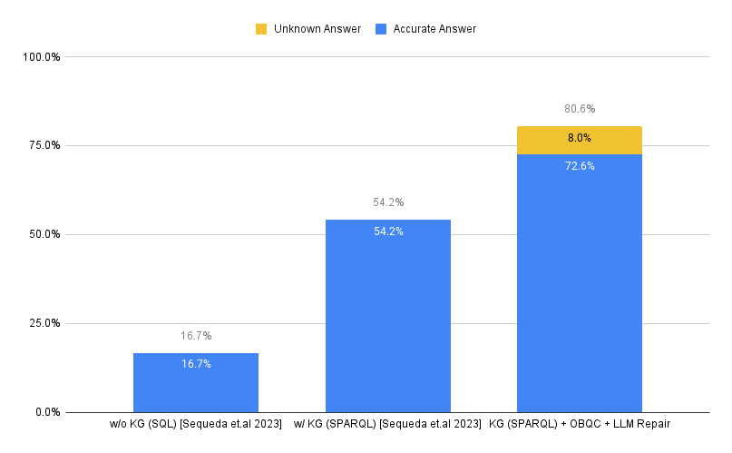
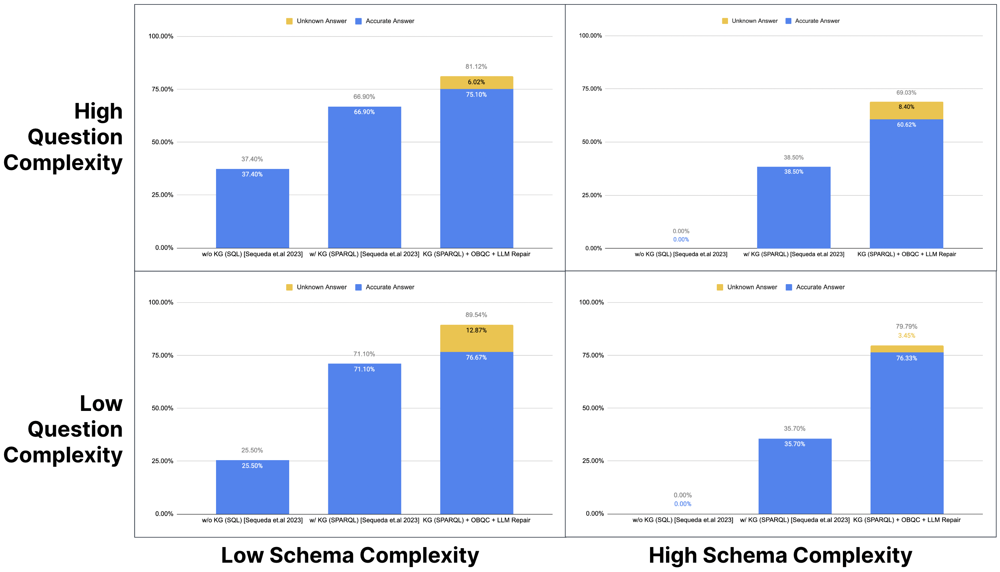

# 借助本体论，提升大型语言模型在问答任务中的精准度！

发布时间：2024年05月19日

`LLM应用

这篇论文主要探讨了如何通过知识图谱（Text-to-SPARQL）和大型语言模型（LLMs）来提升问答系统的准确性。论文中提出了一种新方法，包括基于本体的查询检查（OBQC）和LLM修复，以验证和修正SPARQL查询，从而提高系统的准确率和降低错误率。这些内容直接关联到LLM在实际应用中的优化和改进，因此属于LLM应用分类。` `知识图谱` `问答系统`

> Increasing the LLM Accuracy for Question Answering: Ontologies to the Rescue!

# 摘要

> 越来越多的证据显示，采用知识图谱（Text-to-SPARQL）的大型语言模型（LLMs）问答系统，其准确性超越了直接基于SQL数据库的系统（Text-to-SQL）。我们之前的研究已证实，知识图谱的使用将准确率从16%提升至54%。然而，如何进一步提升准确性并减少错误率仍是一个挑战。基于先前研究中发现的LLM生成的SPARQL查询路径错误问题，我们提出了一种新方法：1）基于本体的查询检查（OBQC），利用知识图谱的本体来验证查询的语义正确性；2）LLM修复，通过LLM解释错误并修正SPARQL查询。在与数据对话的基准测试中，我们发现这种方法将总体准确率提升至72%，并增加了8%的“未知”回答，总体错误率降至20%。这些发现再次印证了，投资于知识图谱，尤其是本体，能够显著提升LLM问答系统的准确性。

> There is increasing evidence that question-answering (QA) systems with Large Language Models (LLMs), which employ a knowledge graph/semantic representation of an enterprise SQL database (i.e. Text-to-SPARQL), achieve higher accuracy compared to systems that answer questions directly on SQL databases (i.e. Text-to-SQL). Our previous benchmark research showed that by using a knowledge graph, the accuracy improved from 16% to 54%. The question remains: how can we further improve the accuracy and reduce the error rate? Building on the observations of our previous research where the inaccurate LLM-generated SPARQL queries followed incorrect paths, we present an approach that consists of 1) Ontology-based Query Check (OBQC): detects errors by leveraging the ontology of the knowledge graph to check if the LLM-generated SPARQL query matches the semantic of ontology and 2) LLM Repair: use the error explanations with an LLM to repair the SPARQL query. Using the chat with the data benchmark, our primary finding is that our approach increases the overall accuracy to 72% including an additional 8% of "I don't know" unknown results. Thus, the overall error rate is 20%. These results provide further evidence that investing knowledge graphs, namely the ontology, provides higher accuracy for LLM powered question answering systems.

[Arxiv](https://arxiv.org/abs/2405.11706)