# 主动探询、互动与融合：零-shot 多模态医学推理的协作代理框架

发布时间：2024年05月19日

`Agent

这篇论文介绍了一个名为**MultiMedRes**的框架，该框架通过学习代理主动从专家模型中汲取知识，以解决复杂的多模态医学推理问题。这种方法涉及问题分解、与专家模型互动获取知识以及整合知识解决问题三个步骤。论文中提到的这种方法在医疗保健领域的应用，特别是在处理X射线图像的视觉问答任务中，展示了其优越性能。因此，这篇论文更符合Agent分类，因为它描述了一个代理系统如何通过与专家模型互动来增强其性能，而不是专注于LLM的理论研究或应用。` `医疗保健` `多模态学习`

> Inquire, Interact, and Integrate: A Proactive Agent Collaborative Framework for Zero-Shot Multimodal Medical Reasoning

# 摘要

> 大型语言模型（LLMs）在医疗保健领域的应用引起了广泛关注，但其性能因缺乏专业知识和医学推理能力，以及多数模型仅限于文本处理而受限。为此，我们开发了**MultiMedRes**框架，通过学习代理主动从专家模型中汲取知识，解决复杂的多模态医学推理问题。该方法分三步：首先分解问题，然后与专家模型互动获取知识，最后整合知识解决问题。在X射线图像的视觉问答任务中，我们的零样本预测不仅达到顶尖水平，甚至超越了全监督方法。此方法还可提升各类LLMs和多模态LLMs的性能。

> The adoption of large language models (LLMs) in healthcare has attracted significant research interest. However, their performance in healthcare remains under-investigated and potentially limited, due to i) they lack rich domain-specific knowledge and medical reasoning skills; and ii) most state-of-the-art LLMs are unimodal, text-only models that cannot directly process multimodal inputs. To this end, we propose a multimodal medical collaborative reasoning framework \textbf{MultiMedRes}, which incorporates a learner agent to proactively gain essential information from domain-specific expert models, to solve medical multimodal reasoning problems. Our method includes three steps: i) \textbf{Inquire}: The learner agent first decomposes given complex medical reasoning problems into multiple domain-specific sub-problems; ii) \textbf{Interact}: The agent then interacts with domain-specific expert models by repeating the ``ask-answer'' process to progressively obtain different domain-specific knowledge; iii) \textbf{Integrate}: The agent finally integrates all the acquired domain-specific knowledge to accurately address the medical reasoning problem. We validate the effectiveness of our method on the task of difference visual question answering for X-ray images. The experiments demonstrate that our zero-shot prediction achieves state-of-the-art performance, and even outperforms the fully supervised methods. Besides, our approach can be incorporated into various LLMs and multimodal LLMs to significantly boost their performance.

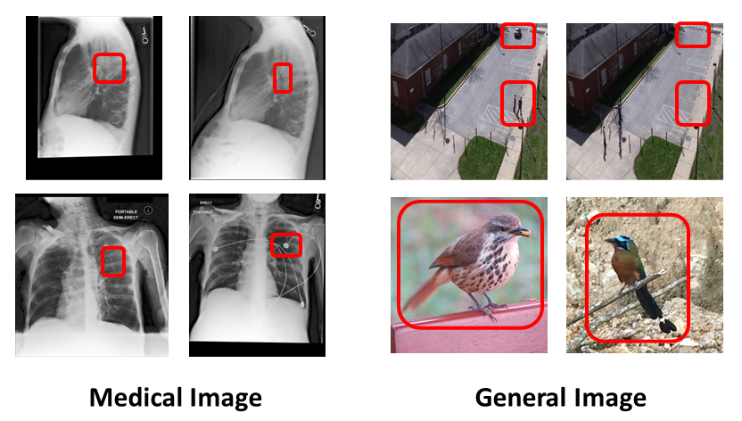

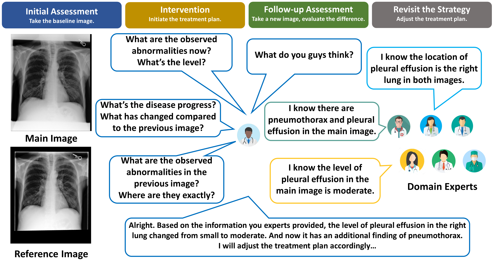

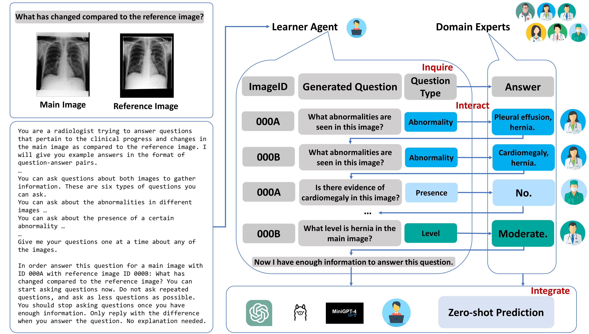

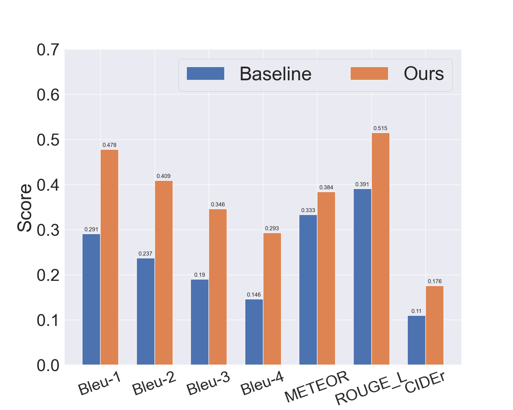

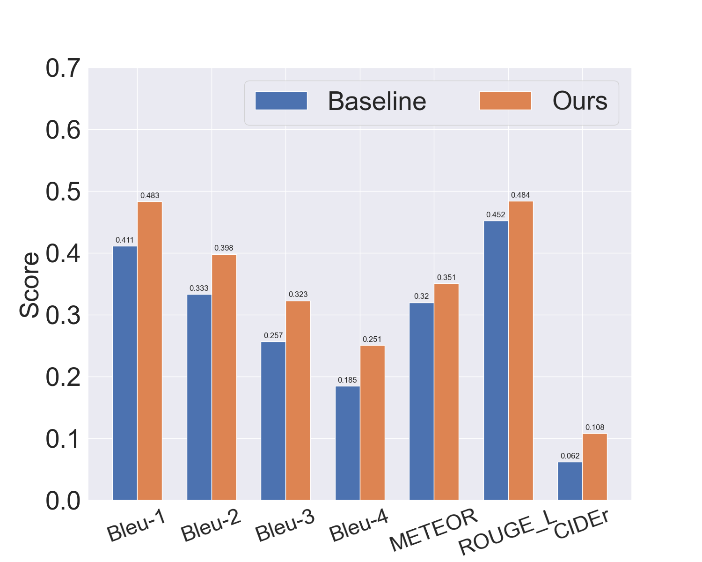

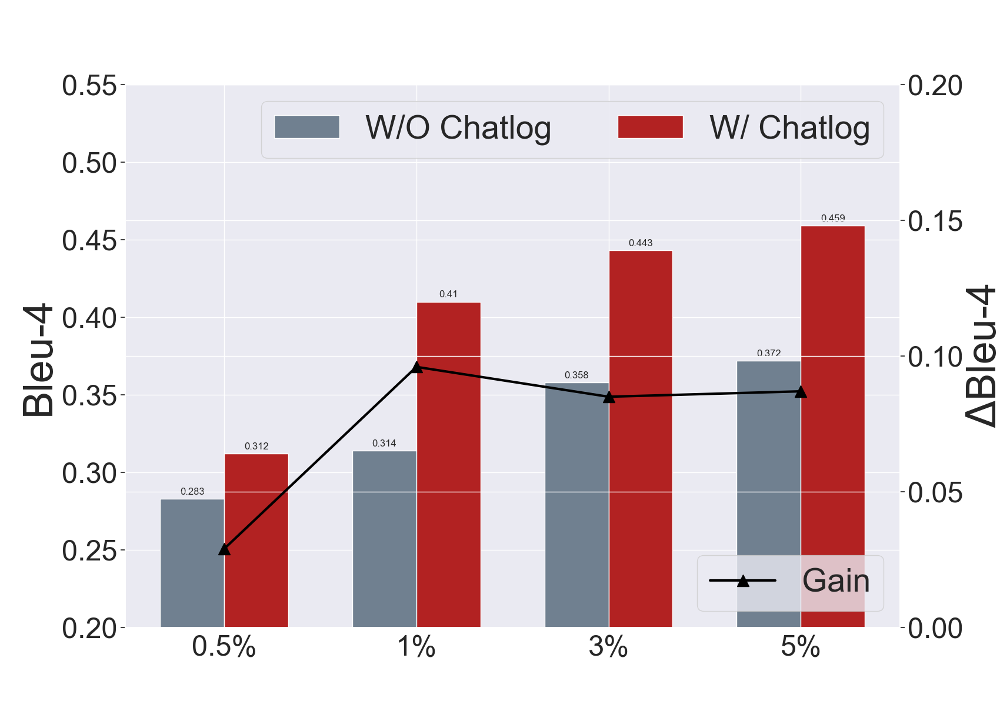

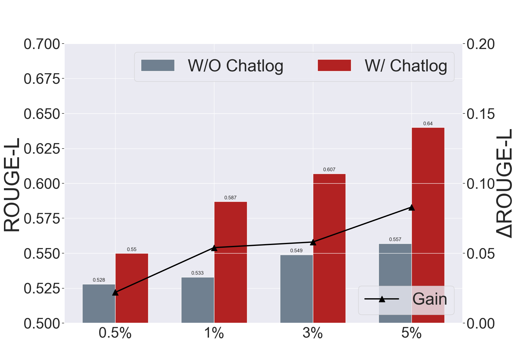

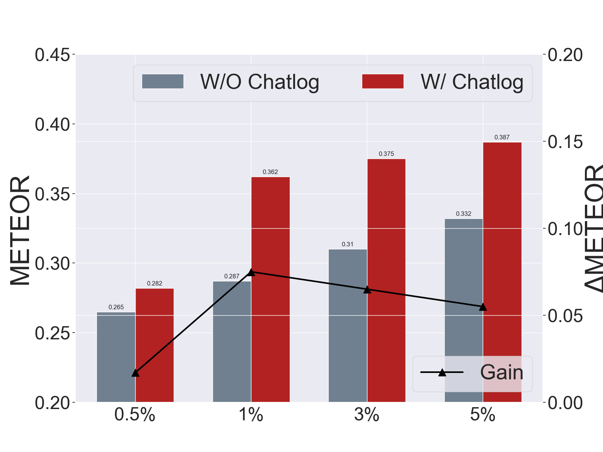

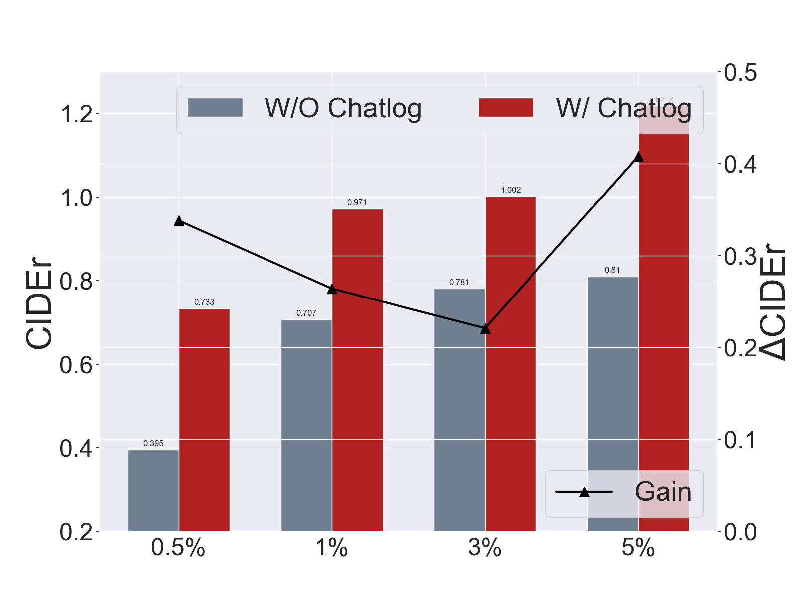

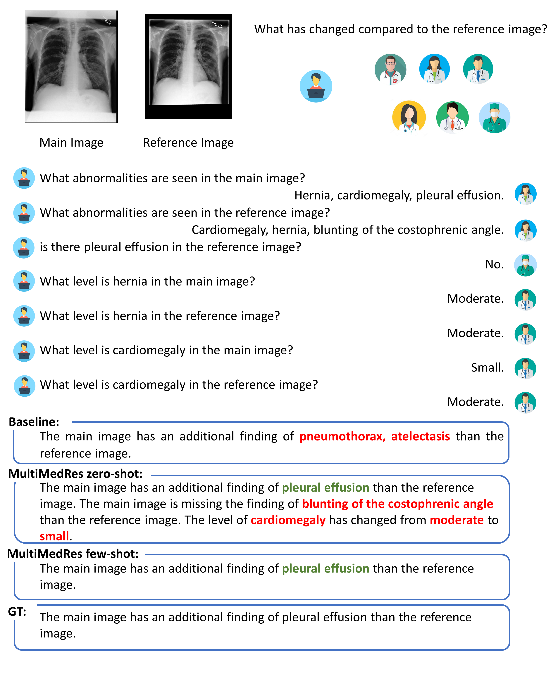

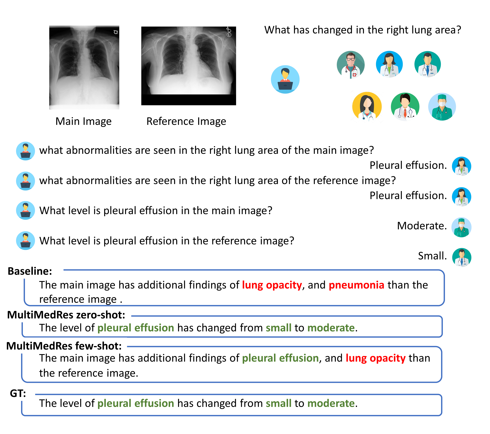

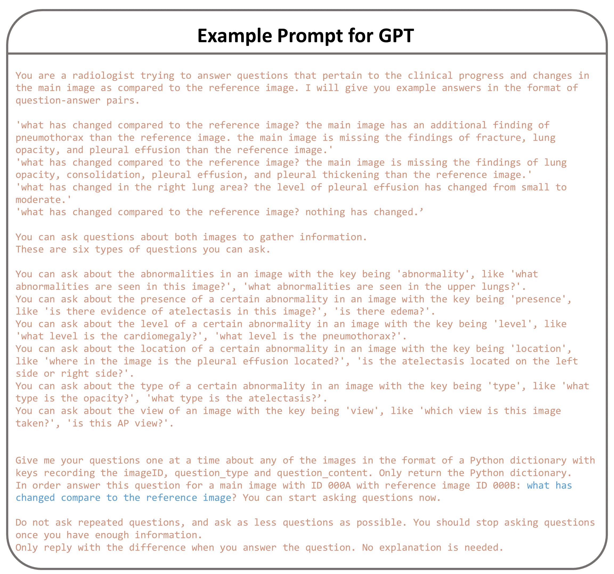

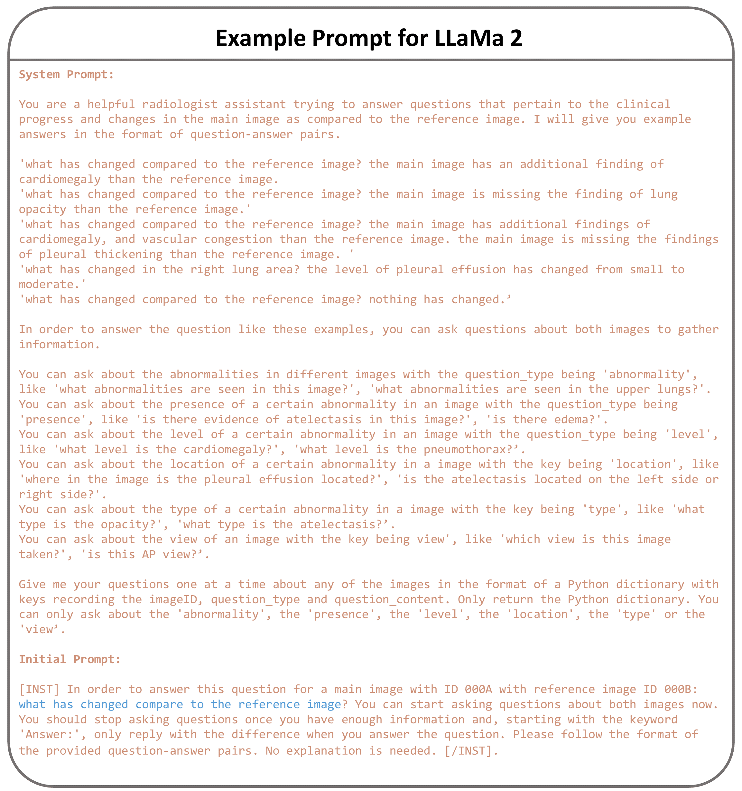

[Arxiv](https://arxiv.org/abs/2405.11640)