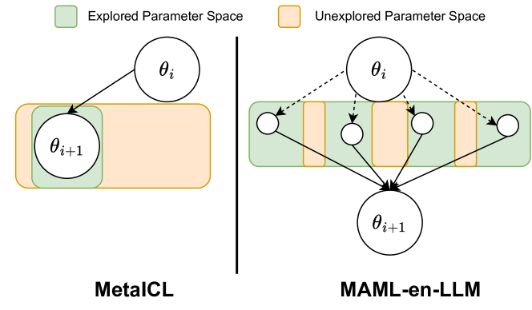
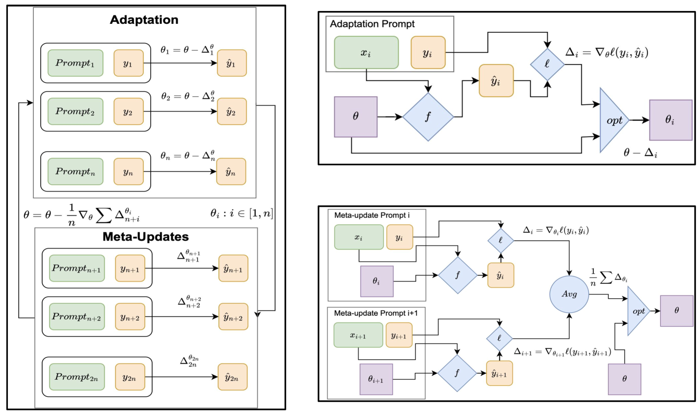
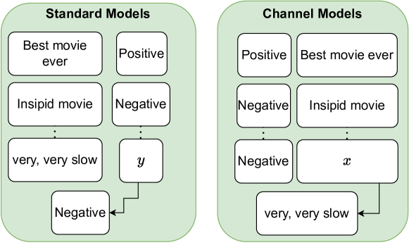
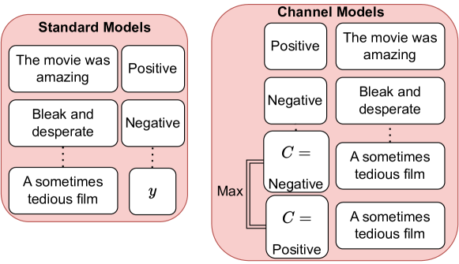

# MAML-en-LLM：优化大型语言模型上下文学习能力的模型无关元训练法

发布时间：2024年05月19日

`LLM理论

这篇论文主要探讨了大型语言模型（LLMs）如何通过元训练策略适应未见任务，而不进行微调。它介绍了一种名为MAML-en-LLM的创新元训练技术，并讨论了其性能提升和适应性增强。此外，论文还深入分析了影响元训练效果的因素，如任务类型、优化器选择及任务复杂度。这些内容主要集中在LLM的理论和方法改进上，因此归类为LLM理论。` `机器学习`

> MAML-en-LLM: Model Agnostic Meta-Training of LLMs for Improved In-Context Learning

# 摘要

> 如何让大型语言模型（LLMs）通过上下文训练样本适应未见任务，而不进行微调，这一问题仍备受关注。为了培养出能灵活应对新任务的LLM，研究者们提出了MetaICL和MetaICT等元训练策略，它们在多样化的任务上对预训练LLMs进行训练。这些方法通过上下文多任务微调，在全新的测试集上评估模型。虽然成果斐然，但它们并未追求一套真正通用的参数。本文介绍了MAML-en-LLM，一种创新的LLMs元训练技术，它能训练出既能在不同任务间表现出色，又能适应新任务的参数。实验显示，在未见领域，性能平均提升2%，适应性提升高达4%。此外，在训练数据有限的情况下，MAML-en-LLM在已见和未见领域均比传统方法平均高出2%。文章还探讨了任务类型、优化器选择及任务复杂度对元训练的影响，这些因素在以往研究中鲜有涉及。经过在7种任务和两种数据设置上的详尽测试，MAML-en-LLM展现出了超越现有技术的性能。

> Adapting large language models (LLMs) to unseen tasks with in-context training samples without fine-tuning remains an important research problem. To learn a robust LLM that adapts well to unseen tasks, multiple meta-training approaches have been proposed such as MetaICL and MetaICT, which involve meta-training pre-trained LLMs on a wide variety of diverse tasks. These meta-training approaches essentially perform in-context multi-task fine-tuning and evaluate on a disjointed test set of tasks. Even though they achieve impressive performance, their goal is never to compute a truly general set of parameters. In this paper, we propose MAML-en-LLM, a novel method for meta-training LLMs, which can learn truly generalizable parameters that not only perform well on disjointed tasks but also adapts to unseen tasks. We see an average increase of 2% on unseen domains in the performance while a massive 4% improvement on adaptation performance. Furthermore, we demonstrate that MAML-en-LLM outperforms baselines in settings with limited amount of training data on both seen and unseen domains by an average of 2%. Finally, we discuss the effects of type of tasks, optimizers and task complexity, an avenue barely explored in meta-training literature. Exhaustive experiments across 7 task settings along with two data settings demonstrate that models trained with MAML-en-LLM outperform SOTA meta-training approaches.

[Arxiv](https://arxiv.org/abs/2405.11446)