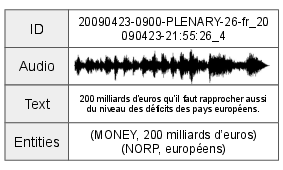
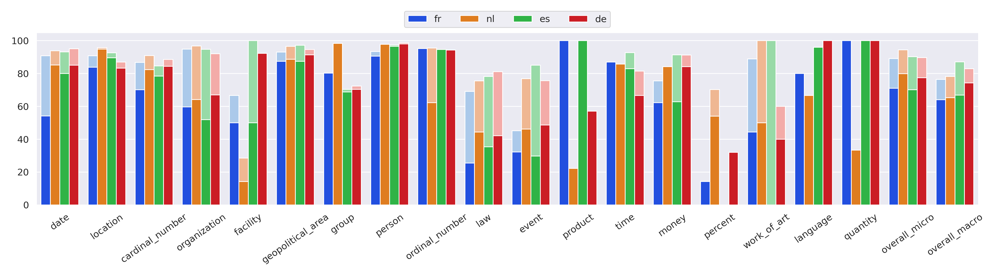
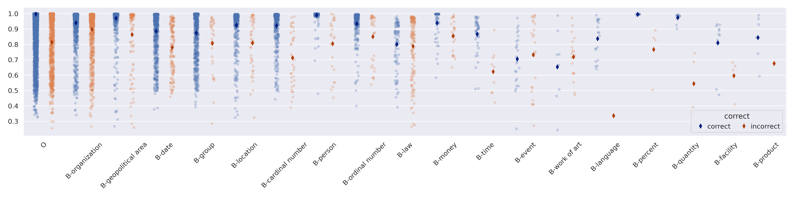
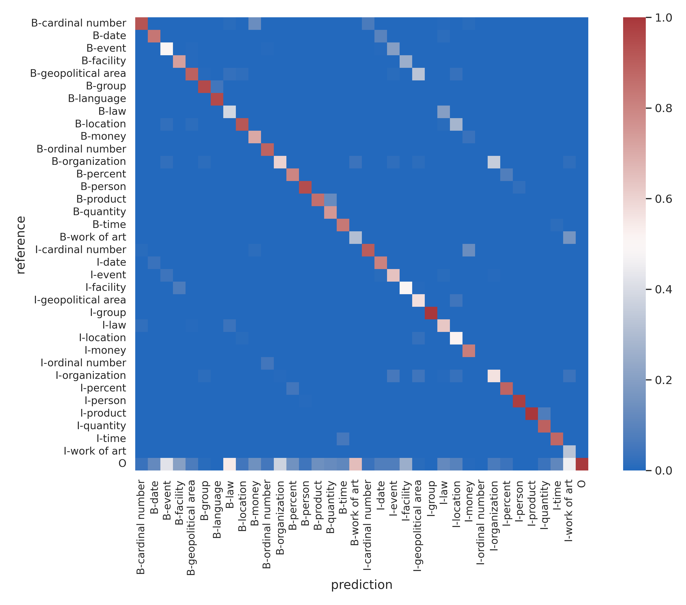

# MSNER：专为命名实体识别而设的多语言语音数据集

发布时间：2024年05月19日

`Agent

这篇论文主要介绍了MSNER，一个多语言语音语料库，并开发了相应的标注工具，用于加速命名实体识别（NER）任务的标注过程。虽然涉及到了多语言处理，但其核心在于构建和利用资源（数据集和工具）来支持口语理解领域的NER任务，而不是直接探讨大型语言模型（LLM）的理论或应用。因此，它更符合Agent分类，即开发和利用工具或资源来解决特定问题。` `口语理解` `多语言数据集`

> MSNER: A Multilingual Speech Dataset for Named Entity Recognition

# 摘要

> 尽管在文本任务中广受关注，命名实体识别（NER）在口语理解领域却鲜有人问津。目前资源仅限于一个英语数据集。本文推出的MSNER填补了这一空白，这是一个免费的多语言语音语料库，内含命名实体标注，涵盖了VoxPopuli数据集中的荷兰语、法语、德语和西班牙语。我们还开发了一款高效的标注工具，借助自动预标注加速手动精炼，从而为训练和验证提供了590小时和15小时的银标语音，以及17小时的手动标注评估集。此外，我们对比了银标和金标标注，并提供了基线NER模型，以激发对这一新数据集的深入研究。

> While extensively explored in text-based tasks, Named Entity Recognition (NER) remains largely neglected in spoken language understanding. Existing resources are limited to a single, English-only dataset. This paper addresses this gap by introducing MSNER, a freely available, multilingual speech corpus annotated with named entities. It provides annotations to the VoxPopuli dataset in four languages (Dutch, French, German, and Spanish). We have also releasing an efficient annotation tool that leverages automatic pre-annotations for faster manual refinement. This results in 590 and 15 hours of silver-annotated speech for training and validation, alongside a 17-hour, manually-annotated evaluation set. We further provide an analysis comparing silver and gold annotations. Finally, we present baseline NER models to stimulate further research on this newly available dataset.

[Arxiv](https://arxiv.org/abs/2405.11519)