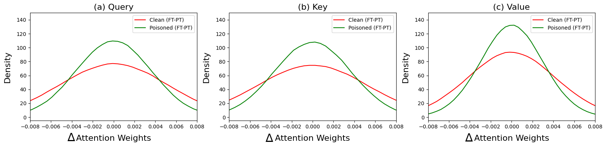

# 评估大型代码语言模型中毒化对模型参数及嵌入的影响

发布时间：2024年05月19日

`LLM理论

这篇论文主要探讨了大型语言模型（LLMs）中的安全问题，特别是后门攻击的问题。它通过分析模型参数，如注意力权重、偏差以及上下文嵌入，来探查代码模型中潜在的后门信号。这种研究方法和内容更偏向于对LLMs理论层面的探讨和分析，因此将其归类为LLM理论。` `软件开发` `网络安全`

> Measuring Impacts of Poisoning on Model Parameters and Embeddings for Large Language Models of Code

# 摘要

> 大型语言模型（LLMs）极大地革新了软件开发，但随之而来的安全顾虑，尤其是隐藏的后门（特洛伊木马）问题，也日益凸显。后门攻击通过在训练数据中植入触发器，使攻击者得以恶意操控模型行为。本文聚焦于通过分析模型参数，探查代码模型中潜在的后门信号。我们特别关注了注意力权重、偏差以及CodeBERT和CodeT5模型中毒与未中毒版本的上下文嵌入。研究发现，中毒模型的上下文嵌入中存在显著模式，而注意力权重和偏差则未见明显差异。这项研究通过深入分析参数和嵌入，为LLMs代码后门信号的白盒检测提供了新的视角。

> Large language models (LLMs) have revolutionized software development practices, yet concerns about their safety have arisen, particularly regarding hidden backdoors, aka trojans. Backdoor attacks involve the insertion of triggers into training data, allowing attackers to manipulate the behavior of the model maliciously. In this paper, we focus on analyzing the model parameters to detect potential backdoor signals in code models. Specifically, we examine attention weights and biases, and context embeddings of the clean and poisoned CodeBERT and CodeT5 models. Our results suggest noticeable patterns in context embeddings of poisoned samples for both the poisoned models; however, attention weights and biases do not show any significant differences. This work contributes to ongoing efforts in white-box detection of backdoor signals in LLMs of code through the analysis of parameters and embeddings.

[Arxiv](https://arxiv.org/abs/2405.11466)