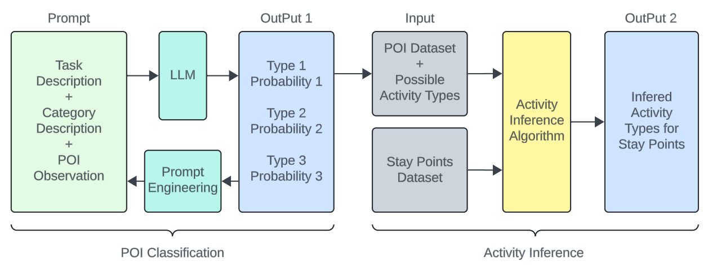
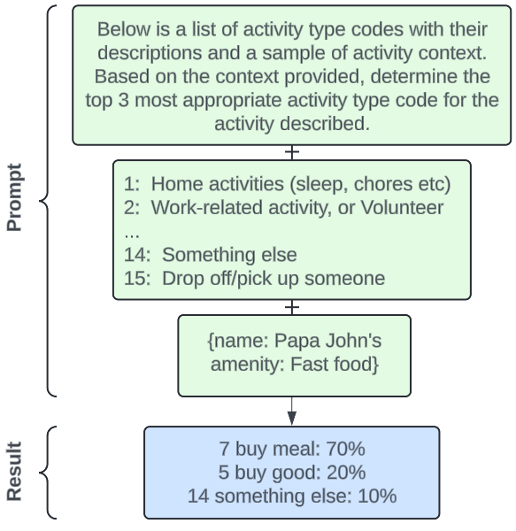
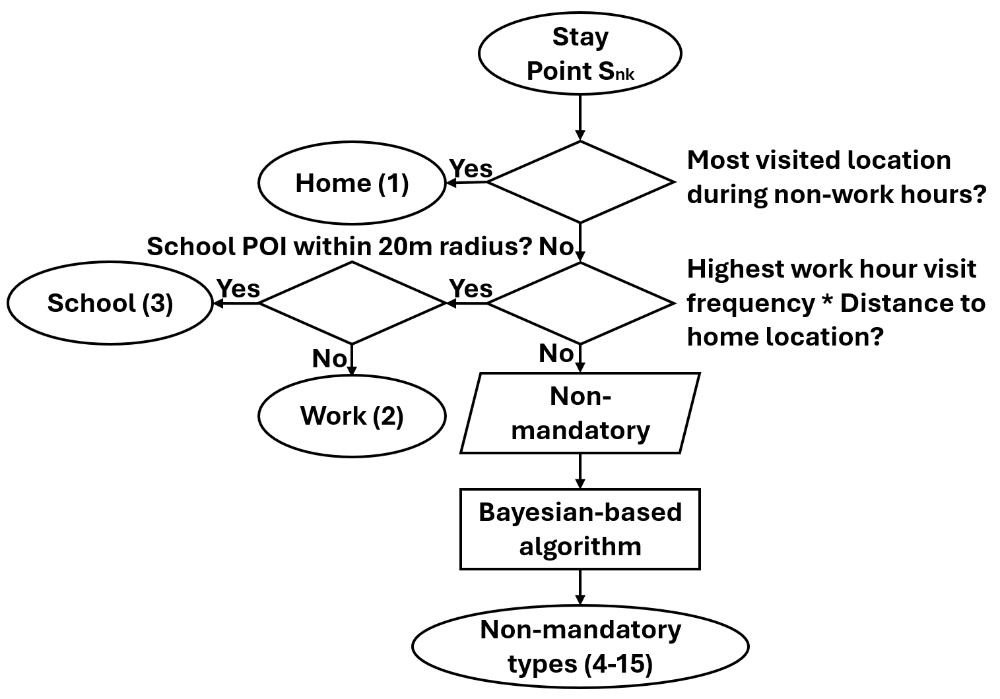
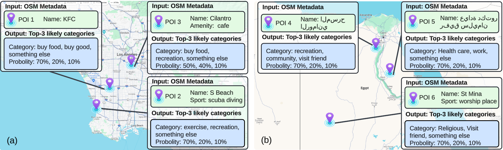

# 基于LLM指导的POI分类的语义轨迹数据挖掘

发布时间：2024年05月19日

`LLM应用

这篇论文主要探讨了如何利用大型语言模型（LLMs）来增强人类旅行轨迹挖掘的效率和准确性。通过使用LLMs为兴趣点（POI）标注活动类型，并结合基于贝叶斯的算法来推断轨迹中的活动，论文展示了LLMs在实际应用中的潜力和效果。这种方法不仅提高了POI分类的准确性，还提升了活动推断的精度，因此属于LLM应用类别。` `城市规划`

> Semantic Trajectory Data Mining with LLM-Informed POI Classification

# 摘要

> 人类旅行轨迹的挖掘对于优化交通系统、管理交通流以及研究人类出行模式至关重要。传统基于规则的方法因缺乏语义信息的融合，在效率和准确性上存在局限。语义信息，例如从兴趣点（POI）数据中推断出的活动类型，能大幅提升轨迹挖掘的精度。但整合这些信息面临挑战，因为许多POI的特征信息不完整，而现有的基于学习的POI分类算法需要完整的数据集。本文提出了一种创新的人类旅行轨迹挖掘流程，首先借助大型语言模型（LLMs）的强大推理和理解能力为POI标注活动类型，随后采用基于贝叶斯的算法为轨迹中的每个停留点推断活动。在利用OpenStreetMap（OSM）POI数据集进行的评估中，我们的方法在POI分类上实现了93.4%的准确率和96.1%的F1分数，在活动推断上达到了91.7%的准确率和92.3%的F1分数。

> Human travel trajectory mining is crucial for transportation systems, enhancing route optimization, traffic management, and the study of human travel patterns. Previous rule-based approaches without the integration of semantic information show a limitation in both efficiency and accuracy. Semantic information, such as activity types inferred from Points of Interest (POI) data, can significantly enhance the quality of trajectory mining. However, integrating these insights is challenging, as many POIs have incomplete feature information, and current learning-based POI algorithms require the integrity of datasets to do the classification. In this paper, we introduce a novel pipeline for human travel trajectory mining. Our approach first leverages the strong inferential and comprehension capabilities of large language models (LLMs) to annotate POI with activity types and then uses a Bayesian-based algorithm to infer activity for each stay point in a trajectory. In our evaluation using the OpenStreetMap (OSM) POI dataset, our approach achieves a 93.4% accuracy and a 96.1% F-1 score in POI classification, and a 91.7% accuracy with a 92.3% F-1 score in activity inference.

[Arxiv](https://arxiv.org/abs/2405.11715)