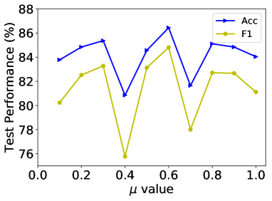

# 利用原型进行简单抽样与硬混合，优化文本分类中的对比学习平衡

发布时间：2024年05月19日

`LLM应用

这篇论文摘要描述了一种针对文本分类问题的新模型SharpReCL，该模型通过监督对比学习来处理数据集的不平衡性，并优化了分类与对比学习分支间的互动。虽然论文中提到了“大型语言模型”，但主要关注的是应用层面的创新，即如何改进文本分类的方法，而不是深入探讨大型语言模型的理论或机制。因此，这篇论文更适合归类为LLM应用。` `文本分类`

> Simple-Sampling and Hard-Mixup with Prototypes to Rebalance Contrastive Learning for Text Classification

# 摘要

> 文本分类在自然语言处理中至关重要，而监督对比学习因其卓越的特征提取能力和稳健性，正逐渐成为新的研究热点。尽管已有研究将其应用于文本分类，但仍面临挑战：数据集的不平衡性可能影响模型性能，且现有模型缺乏分类与对比学习分支间的有效互动。为此，我们创新性地提出了SharpReCL模型，专为处理不平衡文本分类而设计。该模型首先在平衡分支中为每个类别生成原型向量，随后巧妙利用这些向量，为每个类别精心构建了等量的目标样本集，以优化监督对比学习过程。实证研究表明，SharpReCL不仅有效，甚至在多个数据集上超越了知名的大型语言模型。

> Text classification is a crucial and fundamental task in natural language processing. Compared with the previous learning paradigm of pre-training and fine-tuning by cross entropy loss, the recently proposed supervised contrastive learning approach has received tremendous attention due to its powerful feature learning capability and robustness. Although several studies have incorporated this technique for text classification, some limitations remain. First, many text datasets are imbalanced, and the learning mechanism of supervised contrastive learning is sensitive to data imbalance, which may harm the model performance. Moreover, these models leverage separate classification branch with cross entropy and supervised contrastive learning branch without explicit mutual guidance. To this end, we propose a novel model named SharpReCL for imbalanced text classification tasks. First, we obtain the prototype vector of each class in the balanced classification branch to act as a representation of each class. Then, by further explicitly leveraging the prototype vectors, we construct a proper and sufficient target sample set with the same size for each class to perform the supervised contrastive learning procedure. The empirical results show the effectiveness of our model, which even outperforms popular large language models across several datasets.

[Arxiv](https://arxiv.org/abs/2405.11524)