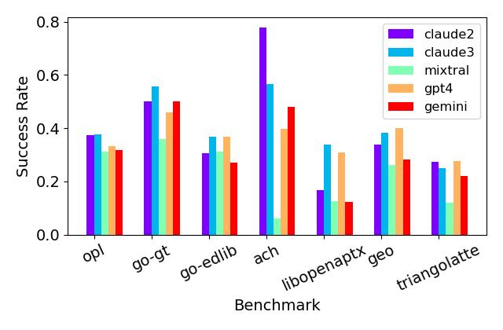
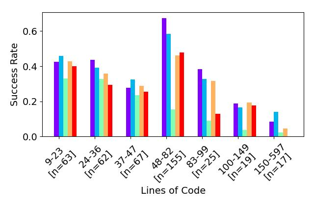
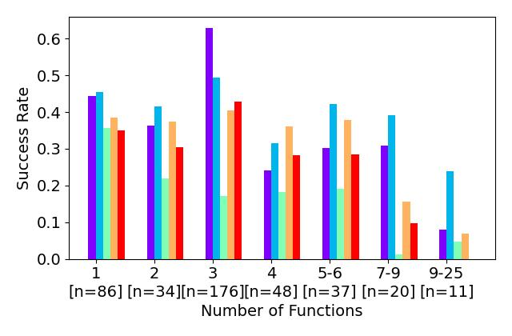
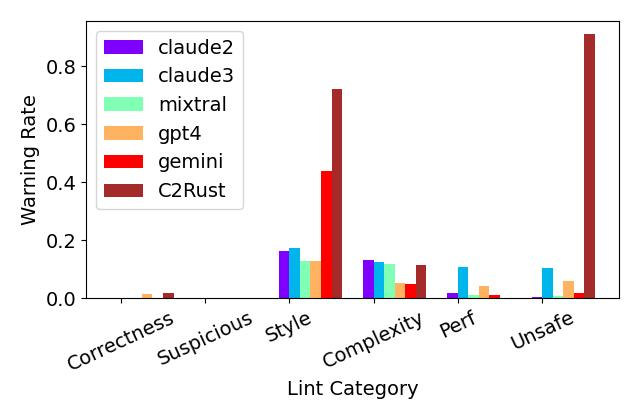
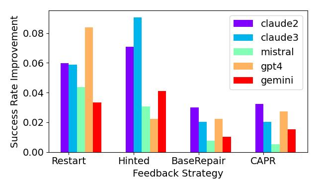

# 探索大型语言模型在现实世界代码翻译中的应用：一项针对 Rust 语言的翻译研究

发布时间：2024年05月19日

`LLM应用

这篇论文主要探讨了大型语言模型（LLMs）在代码翻译领域的应用，特别是在将代码翻译为Rust语言的能力。研究通过评估多种顶尖LLMs的表现，并开发了FLOURINE工具来确保翻译的准确性。这属于LLM在特定应用场景下的实际应用研究，因此归类为LLM应用。` `软件开发` `编程语言翻译`

> Towards Translating Real-World Code with LLMs: A Study of Translating to Rust

# 摘要

> 大型语言模型（LLMs）在代码翻译领域展现出潜力，能够将一种编程语言的代码转换为另一种。尽管如此，LLMs在实际代码翻译中的表现尚未得到深入探究。本研究首次深入探讨了LLMs在将代码翻译为Rust语言的能力，评估了包括GPT4、Claude 3、Claude 2.1、Gemini Pro和Mixtral在内的五种顶尖LLMs。研究基于真实开源项目的代码，并开发了FLOURINE工具，该工具通过差分模糊测试确保Rust翻译与原代码I/O等效，无需依赖预设测试案例。研究不仅评估了LLMs初始翻译的成功率，还考察了它们修正错误代码的能力。若翻译结果与原代码I/O不等效，则采用自动反馈策略，如提供反例以指导LLMs。研究结果表明，最优LLM能成功翻译47%的基准代码，并指出了未来改进的方向。

> Large language models (LLMs) show promise in code translation - the task of translating code written in one programming language to another language - due to their ability to write code in most programming languages. However, LLM's effectiveness on translating real-world code remains largely unstudied. In this work, we perform the first substantial study on LLM-based translation to Rust by assessing the ability of five state-of-the-art LLMs, GPT4, Claude 3, Claude 2.1, Gemini Pro, and Mixtral. We conduct our study on code extracted from real-world open source projects. To enable our study, we develop FLOURINE, an end-to-end code translation tool that uses differential fuzzing to check if a Rust translation is I/O equivalent to the original source program, eliminating the need for pre-existing test cases. As part of our investigation, we assess both the LLM's ability to produce an initially successful translation, as well as their capacity to fix a previously generated buggy one. If the original and the translated programs are not I/O equivalent, we apply a set of automated feedback strategies, including feedback to the LLM with counterexamples. Our results show that the most successful LLM can translate 47% of our benchmarks, and also provides insights into next steps for improvements.

[Arxiv](https://arxiv.org/abs/2405.11514)