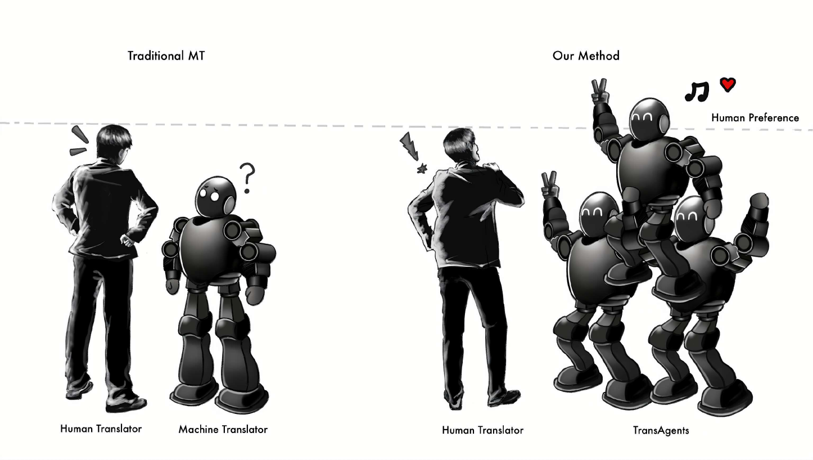

# (或许)超越人类翻译：借助多代理协作，攻克超长文学文本翻译难题

发布时间：2024年05月20日

`Agent

这篇论文介绍了一种基于大型语言模型（LLMs）的多代理框架，名为TransAgents，用于解决文学文本翻译的复杂挑战。该框架通过集合多个代理的协同能力来模拟传统翻译出版流程，并提出了两种评估方法来评价其效能。这与Agent分类相关，因为它涉及使用多个代理（或智能体）来执行特定任务，即文学文本的翻译。` `文学翻译` `语言处理`

> (Perhaps) Beyond Human Translation: Harnessing Multi-Agent Collaboration for Translating Ultra-Long Literary Texts

# 摘要

> 机器翻译（MT）的最新进展大幅提升了各领域的翻译质量，但文学文本的翻译依旧是一大难题，因其语言复杂、富含比喻且蕴含文化细节。本研究推出了一种基于大型语言模型（LLMs）的多代理框架，名为TransAgents，旨在模拟传统翻译出版流程，通过集合多个代理的协同能力，应对文学翻译的复杂挑战。为评估此系统的效能，我们创新性地提出了两种评估方法：单语人类偏好（MHP）和双语LLM偏好（BLP）。MHP从目标语言单语读者的视角评价翻译，BLP则利用高级LLMs直接对比翻译与原文。实证研究表明，尽管d-BLEU分数不高，TransAgents的翻译在特定领域知识要求较高的文学类型中，更受人类评估者和LLMs的青睐，超越了人工翻译的参考标准。通过案例分析，我们揭示了TransAgents的优势与局限，并为未来的研究指明了方向。

> Recent advancements in machine translation (MT) have significantly enhanced translation quality across various domains. However, the translation of literary texts remains a formidable challenge due to their complex language, figurative expressions, and cultural nuances. In this work, we introduce a novel multi-agent framework based on large language models (LLMs) for literary translation, implemented as a company called TransAgents, which mirrors traditional translation publication process by leveraging the collective capabilities of multiple agents, to address the intricate demands of translating literary works. To evaluate the effectiveness of our system, we propose two innovative evaluation strategies: Monolingual Human Preference (MHP) and Bilingual LLM Preference (BLP). MHP assesses translations from the perspective of monolingual readers of the target language, while BLP uses advanced LLMs to compare translations directly with the original texts. Empirical findings indicate that despite lower d-BLEU scores, translations from TransAgents are preferred by both human evaluators and LLMs over human-written references, particularly in genres requiring domain-specific knowledge. We also highlight the strengths and limitations of TransAgents through case studies and suggests directions for future research.

[Arxiv](https://arxiv.org/abs/2405.11804)