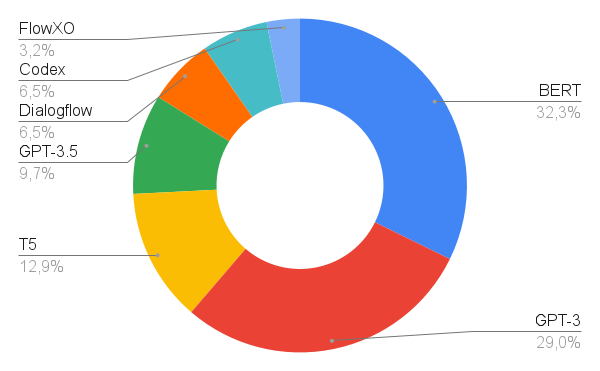

# 大型语言模型作为虚拟导师的应用综述

发布时间：2024年05月20日

`LLM应用

这篇论文摘要主要讨论了大型语言模型（LLMs）在教育领域的应用，特别是如何利用这些模型来生成和评估教育材料，以及它们如何作为虚拟导师在学生评估中发挥作用。这表明论文关注的是LLMs的实际应用，而不是它们的理论基础或Agent的设计与行为，也不是关于检索增强生成（RAG）的具体研究。因此，最合适的分类是LLM应用。` `人工智能`

> A review on the use of large language models as virtual tutors

# 摘要

> Transformer架构的引入，极大地改善了自然语言处理中长期依赖问题的处理，成为该领域最新的突破之一。这些架构支撑着前沿的大型语言模型（LLMs），在教育等多个领域和工业部门引起了广泛关注。这些基于生成式人工智能的解决方案不仅推动了教育技术和内容的革新，也促进了网络基础设施向高质量学习环境的转变。本文旨在全面审视那些专为教育材料生成与评估设计的LLMs解决方案，并探讨其如何融入学生和教师的设计与实验中。据我们所知，这是首次对LLMs在教育领域应用（如学生评估）的综述。这些系统多作为虚拟导师，负责自动生成问题，其中GPT-3和BERT是最受瞩目的模型。随着新模型的不断涌现，相关研究成果预计将迅速增加。

> Transformer architectures contribute to managing long-term dependencies for Natural Language Processing, representing one of the most recent changes in the field. These architectures are the basis of the innovative, cutting-edge Large Language Models (LLMs) that have produced a huge buzz in several fields and industrial sectors, among the ones education stands out. Accordingly, these generative Artificial Intelligence-based solutions have directed the change in techniques and the evolution in educational methods and contents, along with network infrastructure, towards high-quality learning. Given the popularity of LLMs, this review seeks to provide a comprehensive overview of those solutions designed specifically to generate and evaluate educational materials and which involve students and teachers in their design or experimental plan. To the best of our knowledge, this is the first review of educational applications (e.g., student assessment) of LLMs. As expected, the most common role of these systems is as virtual tutors for automatic question generation. Moreover, the most popular models are GTP-3 and BERT. However, due to the continuous launch of new generative models, new works are expected to be published shortly.

[Arxiv](https://arxiv.org/abs/2405.11983)