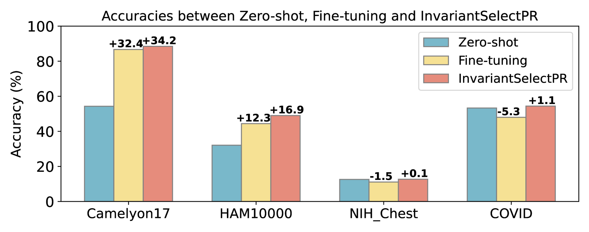

# 大型多模态模型在面对分布变化时的适应性：情境学习的角色

发布时间：2024年05月20日

`Agent

理由：这篇论文主要探讨了如何通过情境学习（ICL）提升大型多模态模型（LMMs）在特定领域的适应性，特别是在面对自然分布变化时的表现。论文中提出了一种新的策略InvariantSelectPR，用于改进演示选择，从而增强模型的适应性。这种研究更偏向于开发和优化模型作为智能代理（Agent），以在特定环境中更好地执行任务，而不是纯粹的理论研究或应用开发。因此，将其归类为Agent更为合适。` `医疗保健` `机器学习`

> Adapting Large Multimodal Models to Distribution Shifts: The Role of In-Context Learning

# 摘要

> 最新研究显示，大型多模态模型（LMMs）在面对自然分布变化时表现出色，往往超越旧有基准。然而，在医疗保健等专业领域，特定领域的适应性调整仍不可或缺。鉴于LMMs参数空间的庞大，微调这些模型并不实际，因此本研究探索了情境学习（ICL）作为提升LMMs适应性的有效途径。我们发现，ICL的成功关键在于演示的选择，这一挑战在大型语言模型中已有体现，但面对分布变化的LMMs时，情况更为复杂。为此，我们评估了一种无监督ICL方法——TopKNearestPR，它通过特征相似性进行最近示例搜索来挑选情境示例。我们发现，该方法的有效性受限于预训练视觉编码器在分布变化场景下的不足。为了克服这些障碍，我们提出了InvariantSelectPR，一种利用类条件对比不变性（CCI）进行演示选择的新策略。CCI通过增强不同类别间的区分能力和确保对领域特定变化的恒定性，提升了预训练视觉编码器的性能。这使得编码器能够精准识别并检索最具信息量的示例，进而指导LMMs在不同分布下适应新查询样本。实验结果显示，InvariantSelectPR大幅提升了LMMs的适应性，在Camelyon17和HAM10000等基准数据集上，与零-shot基线相比，7-shot准确率分别提升了34.2%和16.9%。

> Recent studies indicate that large multimodal models (LMMs) are highly robust against natural distribution shifts, often surpassing previous baselines. Despite this, domain-specific adaptation is still necessary, particularly in specialized areas like healthcare. Due to the impracticality of fine-tuning LMMs given their vast parameter space, this work investigates in-context learning (ICL) as an effective alternative for enhancing LMMs' adaptability. We find that the success of ICL heavily relies on the choice of demonstration, mirroring challenges seen in large language models but introducing unique complexities for LMMs facing distribution shifts. Our study addresses this by evaluating an unsupervised ICL method, TopKNearestPR, which selects in-context examples through a nearest example search based on feature similarity. We uncover that its effectiveness is limited by the deficiencies of pre-trained vision encoders under distribution shift scenarios. To address these challenges, we propose InvariantSelectPR, a novel method leveraging Class-conditioned Contrastive Invariance (CCI) for more robust demonstration selection. Specifically, CCI enhances pre-trained vision encoders by improving their discriminative capabilities across different classes and ensuring invariance to domain-specific variations. This enhancement allows the encoders to effectively identify and retrieve the most informative examples, which are then used to guide LMMs in adapting to new query samples under varying distributions. Our experiments show that InvariantSelectPR substantially improves the adaptability of LMMs, achieving significant performance gains on benchmark datasets, with a 34.2%$\uparrow$ accuracy increase in 7-shot on Camelyon17 and 16.9%$\uparrow$ increase in 7-shot on HAM10000 compared to the baseline zero-shot performance.

[Arxiv](https://arxiv.org/abs/2405.12217)