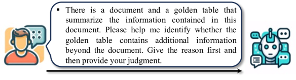
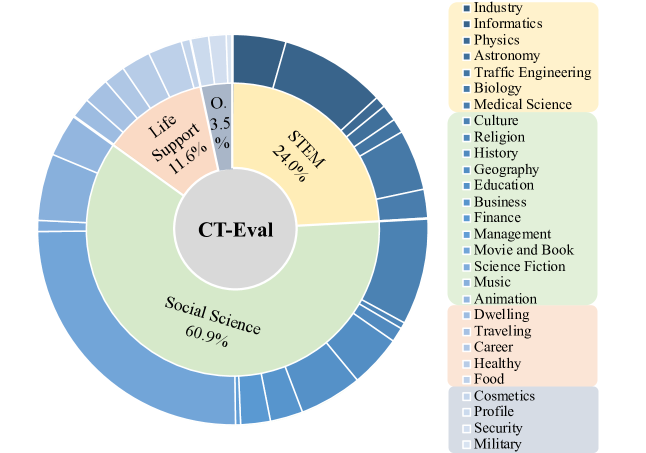
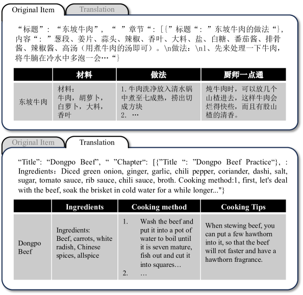

# CT-Eval：大型语言模型中文文本至表格转换性能的基准评估

发布时间：2024年05月20日

`LLM应用

理由：这篇论文主要关注的是利用大型语言模型（LLMs）在中文环境下的应用，具体是通过创建一个名为CT-Eval的中文文本到表格数据集来评估和提升LLMs在这一特定任务上的性能。论文中提到的技术应用、数据集构建和性能评估都是围绕LLMs的实际应用展开的，因此属于LLM应用类别。` `数据集构建`

> CT-Eval: Benchmarking Chinese Text-to-Table Performance in Large Language Models

# 摘要

> Text-to-Table 技术旨在将非结构化文档的关键信息转化为结构化表格。然而，现有的数据集多以英语为主，限制了非英语语言的研究进展。随着大型语言模型（如 ChatGPT）在多语言环境中的成功应用，理论上其他语言的文本到表格也变得可行。为此，我们提出了中文文本到表格数据集 CT-Eval，旨在为 LLMs 在这一领域的性能提供基准。通过对英语数据集的分析，我们确定了数据多样性和数据幻觉为构建数据集的关键因素。基于此，CT-Eval 选择了流行的中文多学科在线百科全书作为数据源，覆盖28个领域以确保多样性，并通过 LLM 和人工标注者的双重筛选，有效减少了数据幻觉。最终，CT-Eval 包含了88.6K 高质量任务样本。通过 CT-Eval，我们发现即使是先进的零样本 LLMs（如 GPT-4）在这一任务上与人类表现仍有差距，但经过微调后，开源 LLMs 的性能显著提升，超越了 GPT-4。CT-Eval 不仅为评估和理解 LLMs 的中文文本到表格能力提供了平台，也极大地推动了 LLMs 在这一领域的性能提升。

> Text-to-Table aims to generate structured tables to convey the key information from unstructured documents. Existing text-to-table datasets are typically oriented English, limiting the research in non-English languages. Meanwhile, the emergence of large language models (LLMs) has shown great success as general task solvers in multi-lingual settings (e.g., ChatGPT), theoretically enabling text-to-table in other languages. In this paper, we propose a Chinese text-to-table dataset, CT-Eval, to benchmark LLMs on this task. Our preliminary analysis of English text-to-table datasets highlights two key factors for dataset construction: data diversity and data hallucination. Inspired by this, the CT-Eval dataset selects a popular Chinese multidisciplinary online encyclopedia as the source and covers 28 domains to ensure data diversity. To minimize data hallucination, we first train an LLM to judge and filter out the task samples with hallucination, then employ human annotators to clean the hallucinations in the validation and testing sets. After this process, CT-Eval contains 88.6K task samples. Using CT-Eval, we evaluate the performance of open-source and closed-source LLMs. Our results reveal that zero-shot LLMs (including GPT-4) still have a significant performance gap compared with human judgment. Furthermore, after fine-tuning, open-source LLMs can significantly improve their text-to-table ability, outperforming GPT-4 by a large margin. In short, CT-Eval not only helps researchers evaluate and quickly understand the Chinese text-to-table ability of existing LLMs but also serves as a valuable resource to significantly improve the text-to-table performance of LLMs.

[Arxiv](https://arxiv.org/abs/2405.12174)