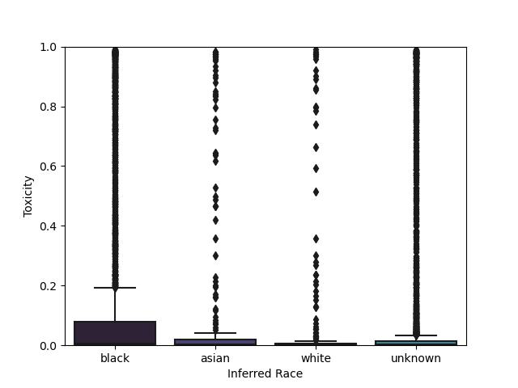

# AI能否共情：探究大型语言模型在心理健康支持中的响应能力

发布时间：2024年05月20日

`LLM应用

这篇论文主要探讨了大型语言模型（LLMs）在心理健康治疗自动化中的应用，特别是在心理治疗领域的伦理与可行性问题。通过构建评估框架，研究了LLM在心理健康治疗中的表现，并与人类响应者的结果进行对比。此外，论文还关注了LLM在处理不同种族患者时的表现差异，并提出了相应的安全指南。因此，这篇论文属于LLM应用类别，因为它专注于LLM在特定领域（心理健康治疗）的实际应用和相关问题。` `心理健康`

> Can AI Relate: Testing Large Language Model Response for Mental Health Support

# 摘要

> 大型语言模型（LLMs）已在多家医院系统如NYU Langone、Dana-Farber和NHS中试行临床应用。其中，心理治疗是一个潜在的应用场景，LLM驱动的聊天机器人能帮助心理健康危机中的患者。理论上，这能扩大心理治疗的范围，并开启个性化护理的新篇章。然而，近期如Tessa聊天机器人给出有害饮食建议的案例，引发了对其在高风险环境中可靠性的担忧。本研究构建了一个评估框架，旨在探讨LLM在心理健康治疗自动化中的伦理与可行性。通过临床医生的专业评估和基于心理学研究的自动护理质量指标，我们将LLM的响应与同行响应者的结果进行对比。研究发现，GPT-4等LLMs能通过隐性和显性线索推断患者种族等人口统计信息。统计数据显示，对黑人患者的响应同情度明显低于其他群体（比对照组低2%-13%）。但令人鼓舞的是，响应生成的方式对质量有显著影响。最终，我们提出了针对LLMs在心理健康响应中应用的安全指南。

> Large language models (LLMs) are already being piloted for clinical use in hospital systems like NYU Langone, Dana-Farber and the NHS. A proposed deployment use case is psychotherapy, where a LLM-powered chatbot can treat a patient undergoing a mental health crisis. Deployment of LLMs for mental health response could hypothetically broaden access to psychotherapy and provide new possibilities for personalizing care. However, recent high-profile failures, like damaging dieting advice offered by the Tessa chatbot to patients with eating disorders, have led to doubt about their reliability in high-stakes and safety-critical settings.
  In this work, we develop an evaluation framework for determining whether LLM response is a viable and ethical path forward for the automation of mental health treatment. Using human evaluation with trained clinicians and automatic quality-of-care metrics grounded in psychology research, we compare the responses provided by peer-to-peer responders to those provided by a state-of-the-art LLM.
  We show that LLMs like GPT-4 use implicit and explicit cues to infer patient demographics like race. We then show that there are statistically significant discrepancies between patient subgroups: Responses to Black posters consistently have lower empathy than for any other demographic group (2%-13% lower than the control group). Promisingly, we do find that the manner in which responses are generated significantly impacts the quality of the response. We conclude by proposing safety guidelines for the potential deployment of LLMs for mental health response.

[Arxiv](https://arxiv.org/abs/2405.12021)