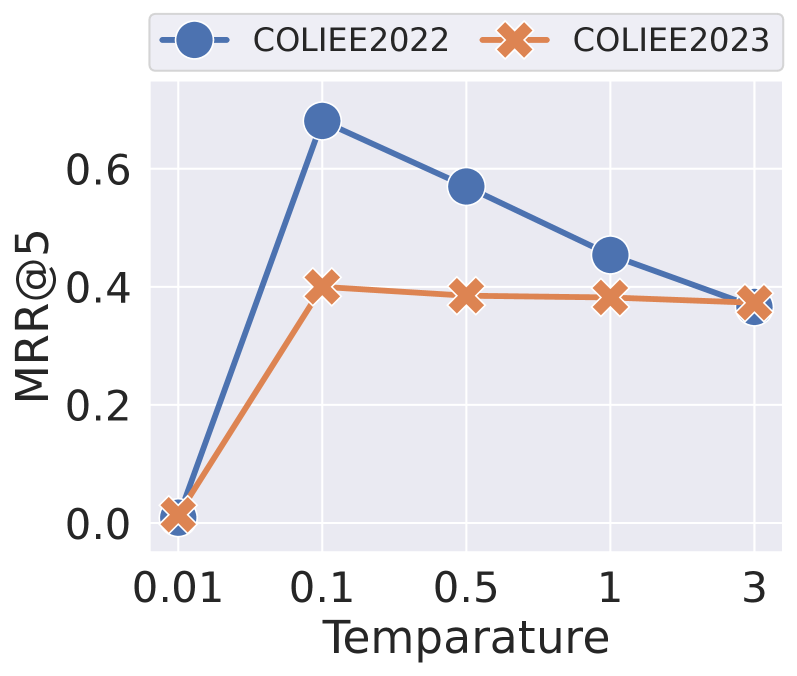

# CaseGNN++：运用图增强技术的法律案例检索图对比学习

发布时间：2024年05月20日

`Agent

理由：这篇论文主要介绍了一种改进的法律案例检索系统CaseGNN++，它通过利用图神经网络和图对比学习等技术来更好地理解和检索法律案例。虽然这种方法涉及到了语言模型和结构化信息的处理，但其核心在于构建和优化一个能够理解和处理特定领域（法律）信息的智能系统（Agent），以提高检索效率和准确性。因此，将其归类为Agent更为合适。` `案例检索`

> CaseGNN++: Graph Contrastive Learning for Legal Case Retrieval with Graph Augmentation

# 摘要

> 法律案例检索（LCR）旨在为特定查询案例找到相关案例，对法律实践中的先例查找至关重要。尽管基于传统词汇和语言模型的方法已取得显著成效，但法律文件特有的结构信息尚未被充分利用。我们之前的研究CaseGNN通过文本属性图和图神经网络解决了这一问题，但仍存在两个挑战：一是案例图中丰富的边缘信息未被充分挖掘，二是标记数据的不足影响了模型的训练。为此，我们提出了CaseGNN++，它不仅利用了边缘信息和额外的标签数据，还引入了基于边缘特征的图注意力层（EUGAT），全面更新节点和边缘特征，充分挖掘法律案例的结构信息。此外，CaseGNN++通过图对比学习和图增强技术，提供了额外的训练信号，增强了模型的法律理解能力。实验结果显示，CaseGNN++在两个基准数据集上不仅大幅超越了CaseGNN，还优于当前最先进的LCR方法。相关代码已公开在https://github.com/yanran-tang/CaseGNN。

> Legal case retrieval (LCR) is a specialised information retrieval task that aims to find relevant cases to a given query case. LCR holds pivotal significance in facilitating legal practitioners in finding precedents. Most of existing LCR methods are based on traditional lexical models and language models, which have gained promising performance in retrieval. However, the domain-specific structural information inherent in legal documents is yet to be exploited to further improve the performance. Our previous work CaseGNN successfully harnesses text-attributed graphs and graph neural networks to address the problem of legal structural information neglect. Nonetheless, there remain two aspects for further investigation: (1) The underutilization of rich edge information within text-attributed case graphs limits CaseGNN to generate informative case representation. (2) The inadequacy of labelled data in legal datasets hinders the training of CaseGNN model. In this paper, CaseGNN++, which is extended from CaseGNN, is proposed to simultaneously leverage the edge information and additional label data to discover the latent potential of LCR models. Specifically, an edge feature-based graph attention layer (EUGAT) is proposed to comprehensively update node and edge features during graph modelling, resulting in a full utilisation of structural information of legal cases. Moreover, a novel graph contrastive learning objective with graph augmentation is developed in CaseGNN++ to provide additional training signals, thereby enhancing the legal comprehension capabilities of CaseGNN++ model. Extensive experiments on two benchmark datasets from COLIEE 2022 and COLIEE 2023 demonstrate that CaseGNN++ not only significantly improves CaseGNN but also achieves supreme performance compared to state-of-the-art LCR methods. Code has been released on https://github.com/yanran-tang/CaseGNN.

[Arxiv](https://arxiv.org/abs/2405.11791)