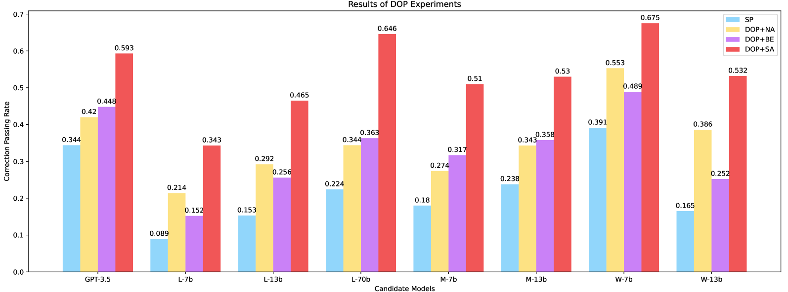

# DOP：大型语言模型中面向诊断的提示策略，专为数学纠错优化

发布时间：2024年05月20日

`LLM应用

这篇论文主要探讨了如何利用大型语言模型（LLMs）来提升数学解题过程中的推理错误修正能力，特别是在教育实践中的应用。论文提出了诊断导向提示（DOP）方法，并通过实验验证了其在数学教育中的有效性。这一研究方向和应用场景明确指向了LLM在特定领域的应用，即数学教育中的错误修正，因此应归类为LLM应用。` `数学教育` `人工智能辅助教育`

> DOP: Diagnostic-Oriented Prompting for Large Language Models in Mathematical Correction

# 摘要

> 数学世界问题修正（MWPC）任务旨在纠正数学解题过程中的推理错误。本文借助大型语言模型（LLMs）的进步，探讨了两大关键目标：一是区分数学推理与错误修正的重要性；二是探索提升LLMs在数学领域错误修正能力的策略。我们发现，在教育实践中，帮助学生识别错误比直接给出正确答案更为关键。然而，现有研究多侧重于获取数学问题的准确解法，而非纠正潜在错误。为此，我们调整研究方向，强调提升数学推理能力并不等同于精通错误修正。同时，我们创新性地提出了诊断导向提示（DOP）方法，旨在强化LLMs的错误修正能力。实验结果显示，DOP表现卓越，凸显其在数学教育中的重要价值。我们坚信，在数学教育领域，优秀的错误修正者比熟练的推理者更为重要。相关代码和数据已公开于https://github.com/ChenhaoEcnuCS/Reason-Correct。

> Math world problems correction(MWPC) is a novel task dedicated to rectifying reasoning errors in the process of solving mathematical problems. In this paper, leveraging the advancements in large language models (LLMs), we address two key objectives:(1) Distinguishing between mathematical reasoning and error correction; (2) Exploring strategies to enhance the error correction capabilities of LLMs in mathematics to solve MWPC task. We noticed that, in real-time education,assisting students in recognizing their mistakes is more crucial than simply providing correct answers. However, current research tends to prioritize obtaining accurate solutions to math problems rather than correcting potentially incorrect ones. Therefore, we modify the research paradigm, demonstrating that improving mathematical reasoning abilities does not equate to mastery in error correction. Meanwhile, we propose a novel method called diagnostic-oriented promping(DOP) aimed at facilitating LLMs to excel in error correction. In experiments, DOP has shown outstanding performance, highlighting its significant impact. We argue that in mathematical education, the demand for outstanding correctors surpasses that for proficient reasoners. Codes and data are available on https://github.com/ChenhaoEcnuCS/Reason-Correct.

[Arxiv](https://arxiv.org/abs/2405.12100)