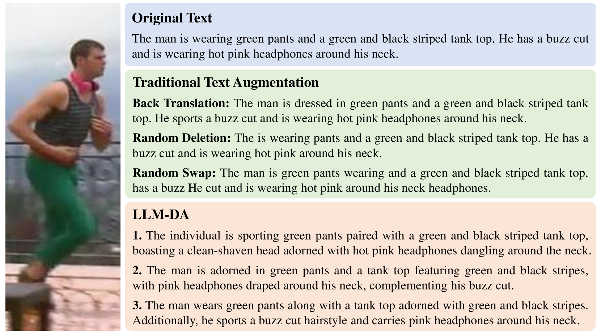
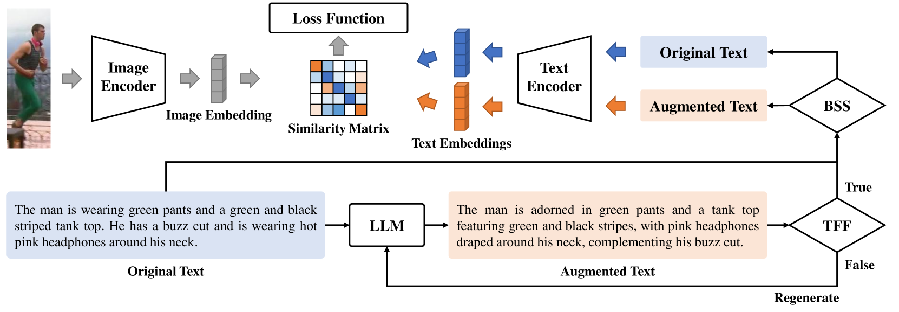
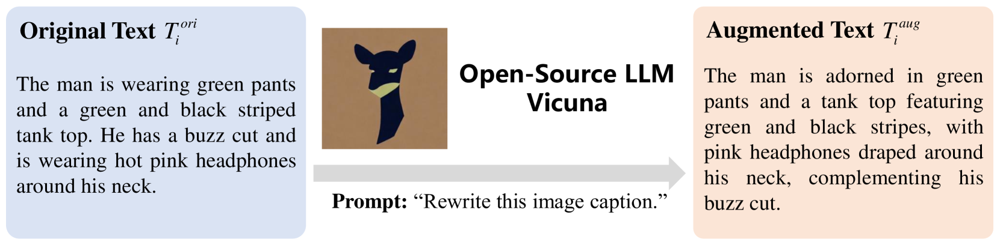
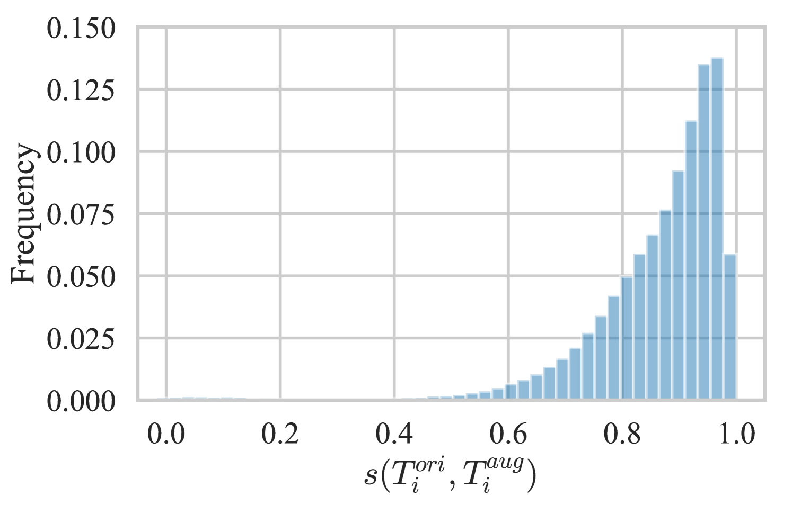
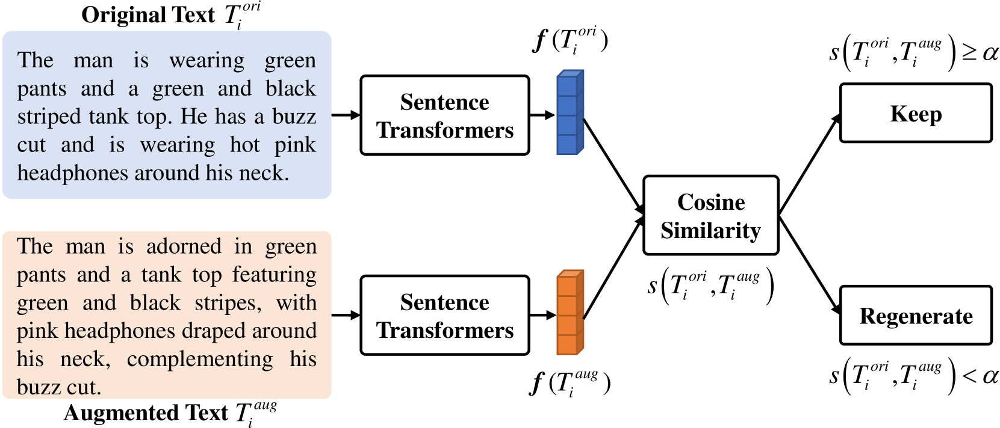
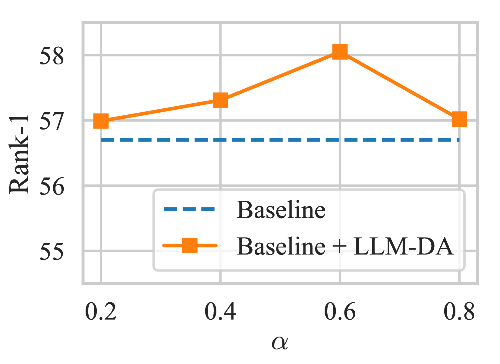
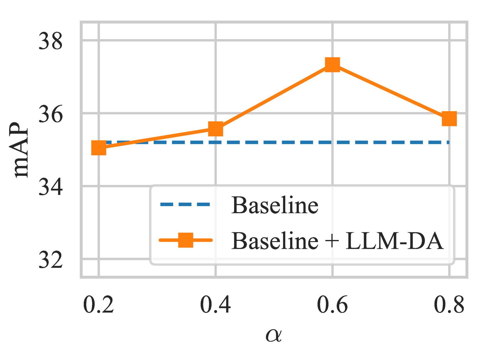
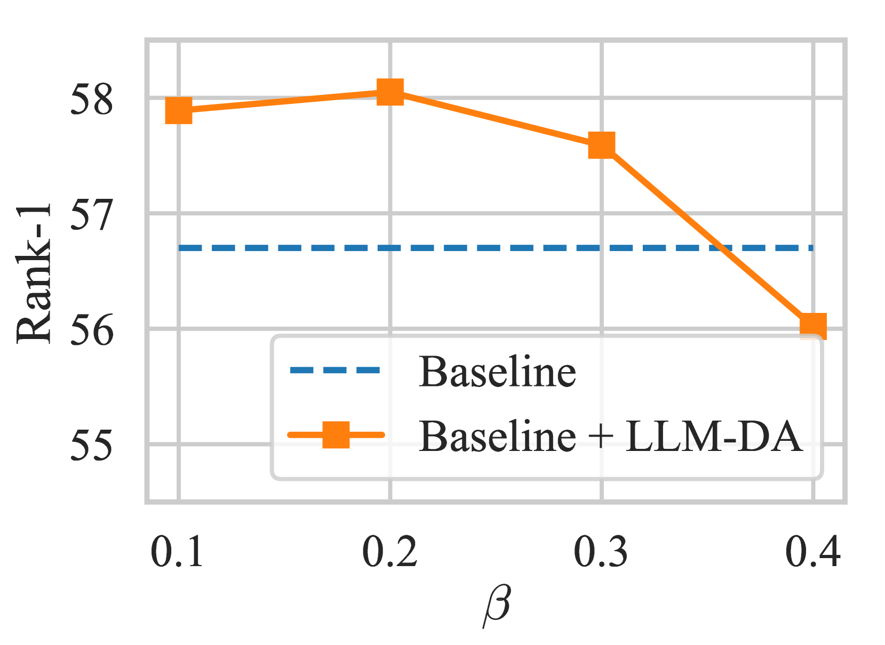
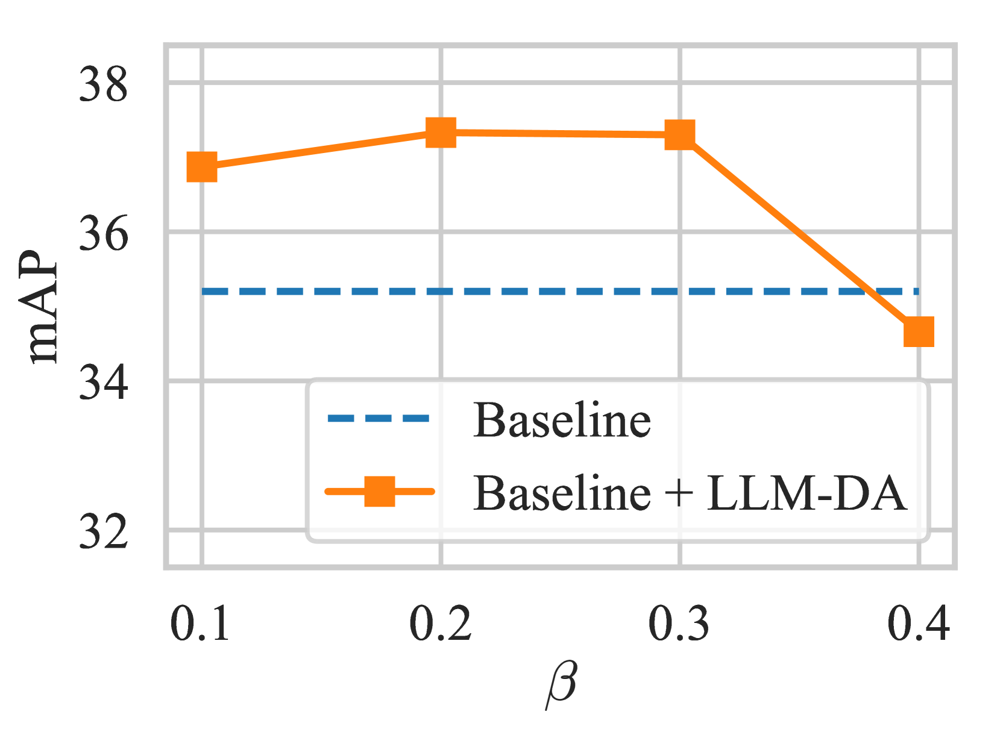
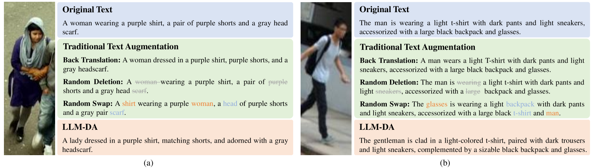

# 利用大型语言模型增强基于文本的人物检索数据

发布时间：2024年05月20日

`LLM应用

这篇论文探讨了如何利用大型语言模型（LLMs）来增强基于文本的人物检索（TPR）数据集的质量和规模。通过提出的LLM-DA方法，作者展示了如何使用LLMs重写现有数据集中的文本，以扩展数据集并提高其质量，同时保持信息的准确性和平衡性。这种方法特别关注于提高数据集的多样性和丰富性，同时确保信息的忠实性。因此，这项工作属于LLM应用类别，因为它展示了LLMs在实际数据集增强任务中的应用和效果。` `人物检索`

> Data Augmentation for Text-based Person Retrieval Using Large Language Models

# 摘要

> 基于文本的人物检索（TPR）旨在通过文本查询找到匹配描述的人物图像。然而，由于标注成本高昂和隐私问题，构建大规模、高质量的TPR数据集颇具挑战。幸运的是，大型语言模型（LLMs）在NLP任务上的表现已接近甚至超越人类，为TPR数据集的扩展提供了新思路。本文提出的LLM-DA方法，利用LLMs重写现有数据集中的文本，既高效又简洁地扩展了数据集的质量。这些新文本在保持原有核心信息的同时，丰富了词汇和句式。为了防止LLMs产生不实信息，我们引入了TFF过滤器，确保文本的忠实性。同时，BSS策略确保了原始文本与增强文本在训练中的平衡使用。LLM-DA作为一项灵活的增强技术，已成功应用于多个TPR模型，并在多个基准测试中显著提升了检索性能。

> Text-based Person Retrieval (TPR) aims to retrieve person images that match the description given a text query. The performance improvement of the TPR model relies on high-quality data for supervised training. However, it is difficult to construct a large-scale, high-quality TPR dataset due to expensive annotation and privacy protection. Recently, Large Language Models (LLMs) have approached or even surpassed human performance on many NLP tasks, creating the possibility to expand high-quality TPR datasets. This paper proposes an LLM-based Data Augmentation (LLM-DA) method for TPR. LLM-DA uses LLMs to rewrite the text in the current TPR dataset, achieving high-quality expansion of the dataset concisely and efficiently. These rewritten texts are able to increase the diversity of vocabulary and sentence structure while retaining the original key concepts and semantic information. In order to alleviate the hallucinations of LLMs, LLM-DA introduces a Text Faithfulness Filter (TFF) to filter out unfaithful rewritten text. To balance the contributions of original text and augmented text, a Balanced Sampling Strategy (BSS) is proposed to control the proportion of original text and augmented text used for training. LLM-DA is a plug-and-play method that can be easily integrated into various TPR models. Comprehensive experiments on three TPR benchmarks show that LLM-DA can improve the retrieval performance of current TPR models.

[Arxiv](https://arxiv.org/abs/2405.11971)