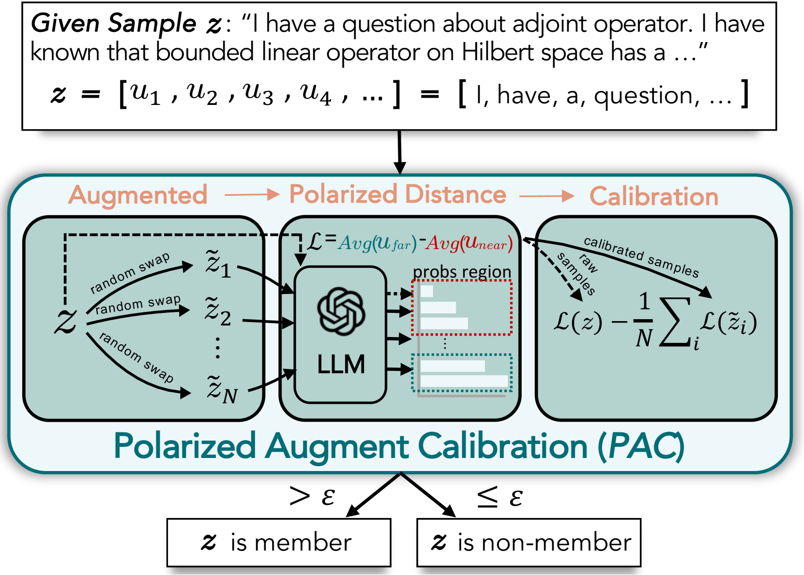
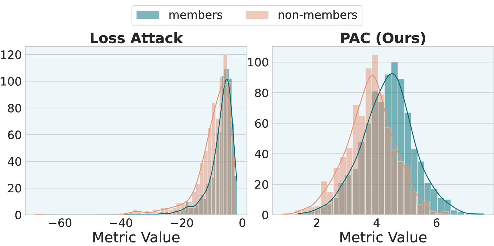
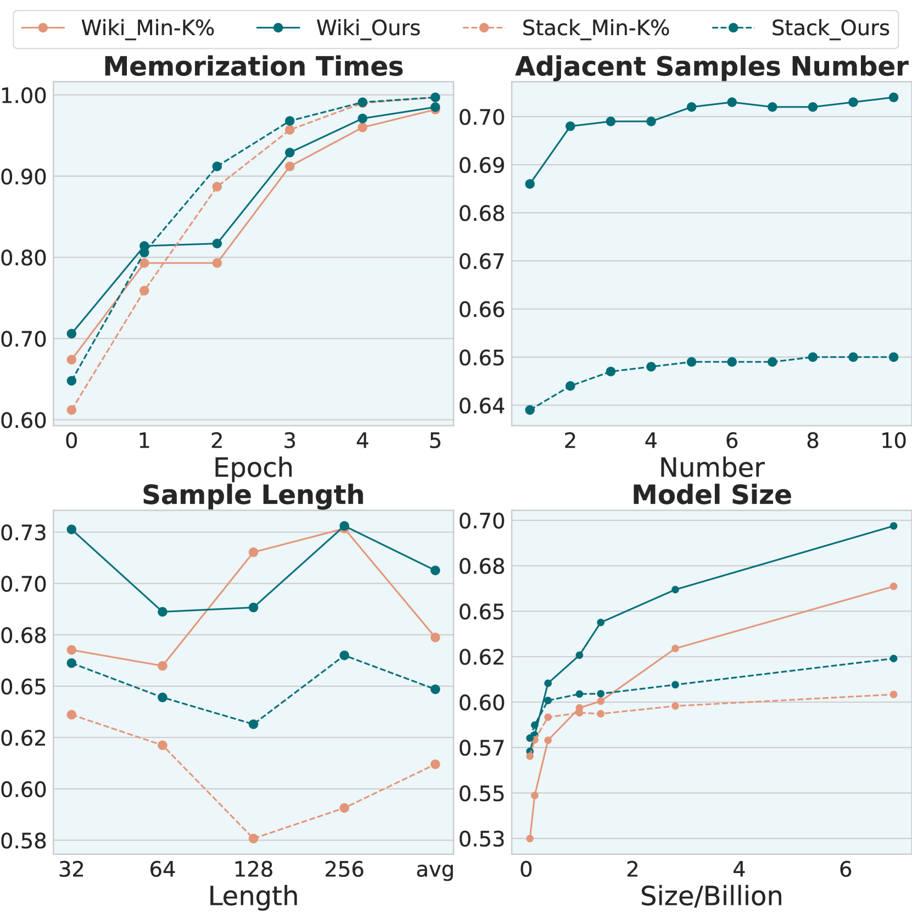
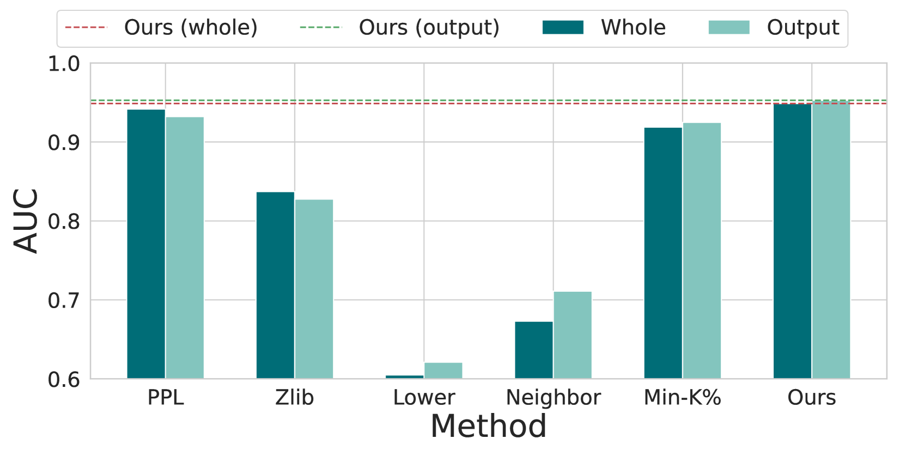
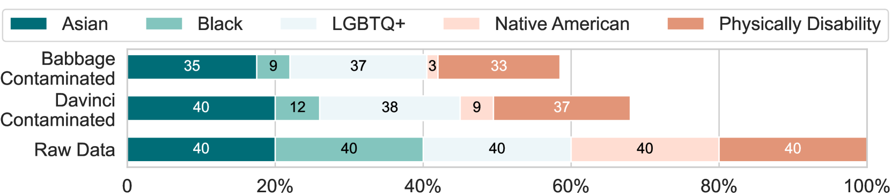
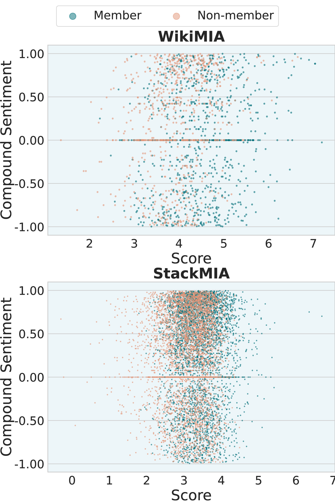
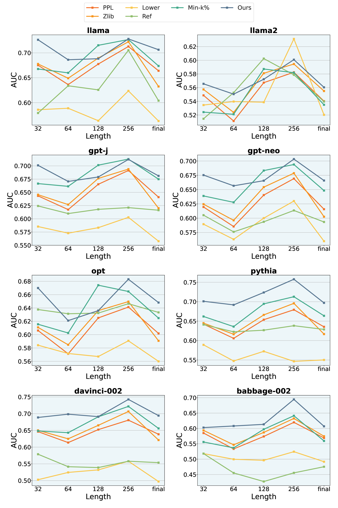

# 黑盒LLMs的数据污染校准

发布时间：2024年05月20日

`LLM应用

这篇论文主要关注大型语言模型（LLMs）在训练过程中可能遇到的数据污染问题，并提出了一种名为极化增强校准（PAC）的新方法来识别和减轻这种影响。这种方法通过扩展成员推理攻击（MIA）的概念，形成了一个更全面的目标，用于检测和澄清不可见的训练数据。论文还提到了PAC方法的适用性和实验结果，显示其在数据污染检测上的有效性。因此，这篇论文更偏向于LLM的应用层面，特别是在处理数据污染问题上的应用。` `机器学习` `数据安全`

> Data Contamination Calibration for Black-box LLMs

# 摘要

> 随着训练数据规模的扩大，大型语言模型（LLMs）取得了飞速发展。但这也带来了风险，如数据污染，即训练中使用了基准数据。为此，我们提出了一种名为极化增强校准（PAC）的新方法，并配套发布新数据集，旨在识别并减轻数据污染的影响。PAC通过扩展机器学习领域的成员推理攻击（MIA），形成了一个更全面的目标，用以检测并澄清不可见的训练数据。作为一项创新工作，PAC易于集成，适用于当前大多数白盒和黑盒LLMs。实验证明，PAC在数据污染检测上至少优于现有方法4.5%，覆盖了超过4种数据集格式和10种基础LLMs。我们在实际应用中的案例也凸显了数据污染问题的严重性。

> The rapid advancements of Large Language Models (LLMs) tightly associate with the expansion of the training data size. However, the unchecked ultra-large-scale training sets introduce a series of potential risks like data contamination, i.e. the benchmark data is used for training. In this work, we propose a holistic method named Polarized Augment Calibration (PAC) along with a new to-be-released dataset to detect the contaminated data and diminish the contamination effect. PAC extends the popular MIA (Membership Inference Attack) -- from machine learning community -- by forming a more global target at detecting training data to Clarify invisible training data. As a pioneering work, PAC is very much plug-and-play that can be integrated with most (if not all) current white- and black-box LLMs. By extensive experiments, PAC outperforms existing methods by at least 4.5%, towards data contamination detection on more 4 dataset formats, with more than 10 base LLMs. Besides, our application in real-world scenarios highlights the prominent presence of contamination and related issues.

[Arxiv](https://arxiv.org/abs/2405.11930)