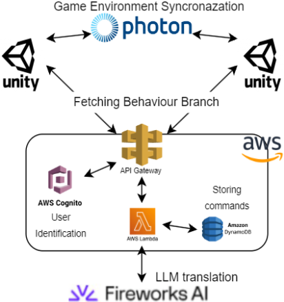
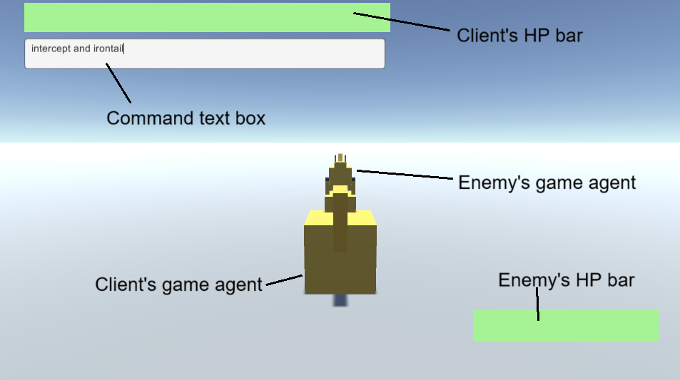
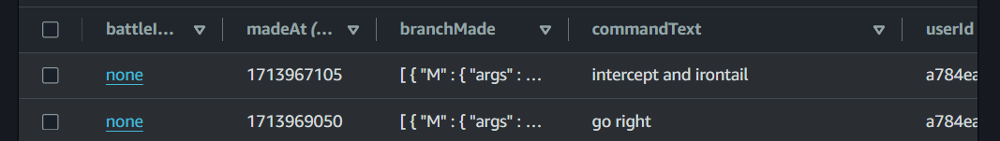

# 演示论文：自由格式文本命令下的游戏代理战斗——基于代码生成的大型语言模型驱动

发布时间：2024年05月20日

`Agent

这篇论文介绍了在怪兽战斗游戏中使用大型语言模型（LLM）来生成代码，将玩家的语音指令转化为行为分支，从而使游戏代理能够理解和执行更为多样和连贯的指令。这种方法简化了指挥系统的设计，并提高了游戏代理的互动性。因此，这篇论文更符合Agent分类，因为它主要关注的是如何通过LLM技术增强游戏代理的功能和响应能力。` `人工智能`

> Demo Paper: A Game Agents Battle Driven by Free-Form Text Commands Using Code-Generation LLM

# 摘要

> 本文介绍了我们的怪兽战斗游戏演示，其中游戏代理根据玩家的语音指令展开战斗。通过大型语言模型生成的代码，这些指令被转化为行为分支这一知识表达形式。这一创新简化了指挥系统的设计，使游戏代理能够理解比传统规则方法更为多样和连贯的指令。所有指挥和翻译过程的数据均存储于亚马逊网络服务服务器上的数据库，以便进行深入验证。此项实施不仅为当前研究提供了全面评估，也为业界提供了灵感，启发他们利用此技术开发更具互动性的游戏代理。

> This paper presents a demonstration of our monster battle game, in which the game agents fight in accordance with their player's language commands. The commands were translated into the knowledge expression called behavior branches by a code-generation large language model. This work facilitated the design of the commanding system more easily, enabling the game agent to comprehend more various and continuous commands than rule-based methods. The results of the commanding and translation process were stored in a database on an Amazon Web Services server for more comprehensive validation. This implementation would provide a sufficient evaluation of this ongoing work, and give insights to the industry that they could use this to develop their interactive game agents.

[Arxiv](https://arxiv.org/abs/2405.11835)