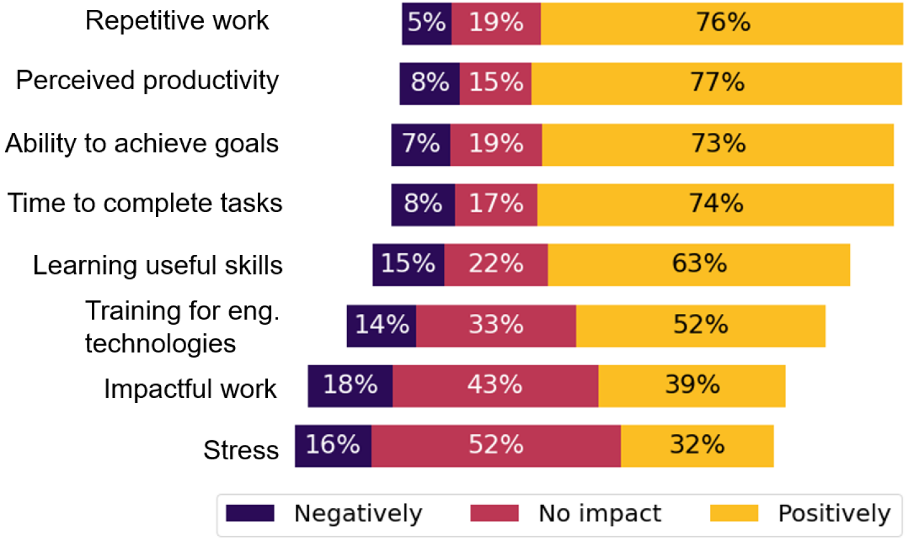
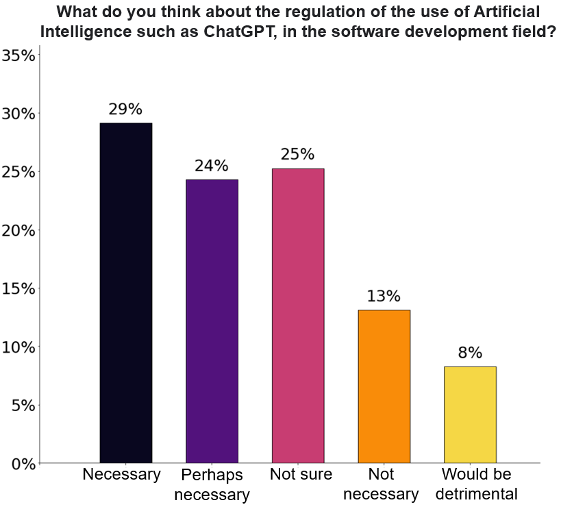

# ChatGPT在软件开发中的影响：开发者观点调查

发布时间：2024年05月20日

`LLM应用

理由：这篇论文主要探讨了大型语言模型（如ChatGPT）在软件工程领域的应用，特别是对软件开发者实践与认知的影响。它通过调查研究了ChatGPT对软件质量、生产力及工作满意度的影响，以及开发者对未来发展、职业替代风险及监管干预的看法。这些内容主要关注LLM在实际应用中的效果和影响，因此属于LLM应用分类。` `软件工程` `人工智能`

> Developers' Perceptions on the Impact of ChatGPT in Software Development: A Survey

# 摘要

> 随着ChatGPT等大型语言模型的进步，其强大的自然语言处理能力和广泛应用已备受瞩目。尽管AI与软件工程的融合日益受到重视，但关于此融合如何影响软件开发者实践与认知的研究仍显不足。本文通过调查207名开发者，探讨了ChatGPT对软件质量、生产力及工作满意度的影响，并深入分析了开发者对ChatGPT未来发展、职业替代风险及监管干预的看法。

> As Large Language Models (LLMs), including ChatGPT and analogous systems, continue to advance, their robust natural language processing capabilities and diverse applications have garnered considerable attention. Nonetheless, despite the increasing acknowledgment of the convergence of Artificial Intelligence (AI) and Software Engineering (SE), there is a lack of studies involving the impact of this convergence on the practices and perceptions of software developers. Understanding how software developers perceive and engage with AI tools, such as ChatGPT, is essential for elucidating the impact and potential challenges of incorporating AI-driven tools in the software development process. In this paper, we conducted a survey with 207 software developers to understand the impact of ChatGPT on software quality, productivity, and job satisfaction. Furthermore, the study delves into developers' expectations regarding future adaptations of ChatGPT, concerns about potential job displacement, and perspectives on regulatory interventions.

[Arxiv](https://arxiv.org/abs/2405.12195)