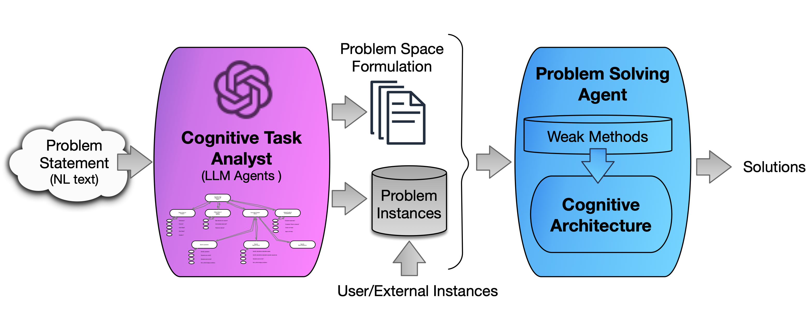
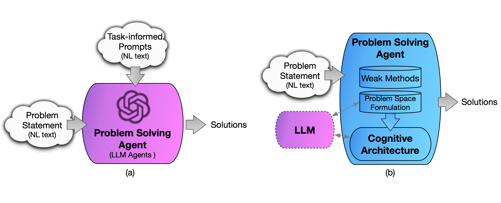
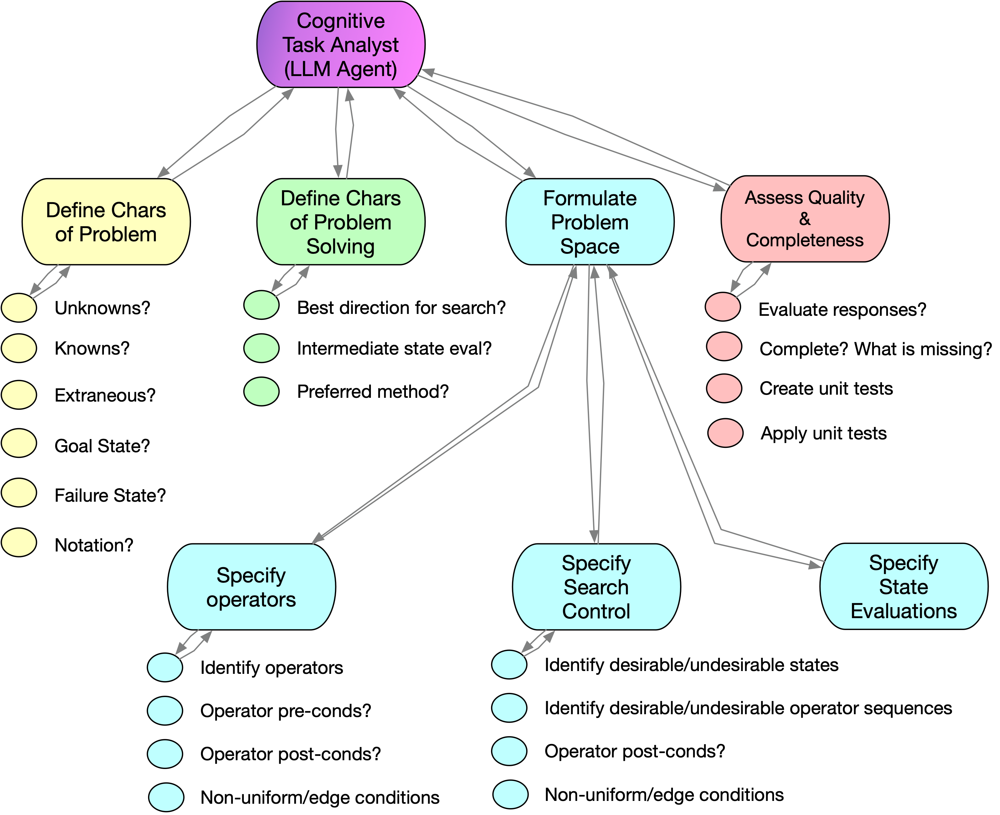

# 借助大型语言模型揭示问题规范

发布时间：2024年05月20日

`Agent

这篇论文主要描述了一个基于大型语言模型（LLMs）的认知任务分析代理，该代理能够将自然语言描述的问题转化为半形式化规范，以便认知系统能够理解和解决这些问题。这个系统利用LLM的能力来简化问题定义过程，并保持认知系统的核心功能，如强大推理和在线学习。因此，这篇论文更符合Agent分类，因为它涉及一个代理系统，该系统利用LLM来辅助认知任务的分析和解决。` `认知科学` `人工智能`

> Eliciting Problem Specifications via Large Language Models

# 摘要

> 认知系统通常依赖人类将问题定义转化为系统能理解的规范。本文揭示，大型语言模型（LLMs）能将自然语言描述的问题转化为半形式化规范，供推理学习系统解决同类问题。我们设计了基于LLM的认知任务分析代理，该系统通过LLM代理，为自然语言描述的任务定义问题空间。LLM的提示源自AI文献和通用问题解决策略。认知系统利用这些规范，采用通用策略（如搜索）解决多类问题。这一初步成果预示着，通过简化问题定义过程，同时保持认知系统的核心功能，如强大推理和在线学习，我们能加速认知系统研究。

> Cognitive systems generally require a human to translate a problem definition into some specification that the cognitive system can use to attempt to solve the problem or perform the task. In this paper, we illustrate that large language models (LLMs) can be utilized to map a problem class, defined in natural language, into a semi-formal specification that can then be utilized by an existing reasoning and learning system to solve instances from the problem class. We present the design of LLM-enabled cognitive task analyst agent(s). Implemented with LLM agents, this system produces a definition of problem spaces for tasks specified in natural language. LLM prompts are derived from the definition of problem spaces in the AI literature and general problem-solving strategies (Polya's How to Solve It). A cognitive system can then use the problem-space specification, applying domain-general problem solving strategies ("weak methods" such as search), to solve multiple instances of problems from the problem class. This result, while preliminary, suggests the potential for speeding cognitive systems research via disintermediation of problem formulation while also retaining core capabilities of cognitive systems, such as robust inference and online learning.

[Arxiv](https://arxiv.org/abs/2405.12147)