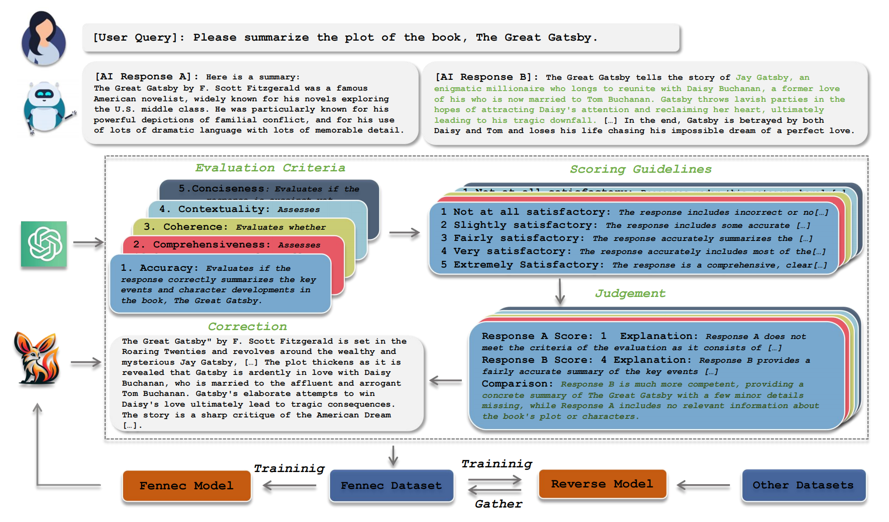

# Fennec：细粒度语言模型评估与修正，通过分支与桥接实现扩展

发布时间：2024年05月20日

`LLM应用

这篇论文摘要描述了一个名为**Fennec**的评估框架，它利用开源大型语言模型（LLM）作为工具来评估和改进其他模型的性能，特别是在与人类意图的对齐方面。这种方法通过多维度、多粒度的分析来解决评估任务的复杂性，并在实验中显示出优于其他开源评估模型的性能。由于该框架是基于LLM的应用，用于评估和改进模型性能，因此它属于LLM应用分类。` `人工智能评估`

> Fennec: Fine-grained Language Model Evaluation and Correction Extended through Branching and Bridging

# 摘要

> 随着大型语言模型的飞速进步，其在众多实际任务中的应用如雨后春笋般涌现，核心在于与人类意图的精准对齐。然而，人类意图的复杂性使得依赖人工评估成为必然，这既耗时又耗力。为此，我们探索了一种新范式：利用开源大型语言模型作为评估工具，紧跟GPT-4的潮流。我们提出的**Fennec**评估框架，通过精细的分支和桥接机制，实现了对评估任务的多维度、多粒度剖析，有效缓解了评估难题。实验证明，我们的7B模型在多个基准测试中，无论是**Agreement**还是**Consistency**，均超越了其他开源大型评估模型，几乎媲美GPT-4。通过评估模型带来的精细修正功能，我们提升了多个模型的响应质量，MT-Bench评分提升了1-2分。相关代码已发布在Github上。

> The rapid advancement of large language models has given rise to a plethora of applications across a myriad of real-world tasks, mainly centered on aligning with human intent. However, the complexities inherent in human intent necessitate a dependence on labor-intensive and time-consuming human evaluation. To alleviate this constraint, we delve into the paradigm of employing open-source large language models as evaluators, aligning with the prevailing trend of utilizing GPT-4. Particularly, we present a step-by-step evaluation framework: \textbf{Fennec}, capable of \textbf{F}ine-grained \textbf{E}valuatio\textbf{N} and correctio\textbf{N} \textbf{E}xtended through bran\textbf{C}hing and bridging. Specifically, the branching operation dissects the evaluation task into various dimensions and granularities, thereby alleviating the challenges associated with evaluation. Concurrently, the bridging operation amalgamates diverse training datasets, augmenting the variety of evaluation tasks. In experimental trials, our 7B model consistently outperforms open-source larger-scale evaluation models across various widely adopted benchmarks in terms of both \textit{Agreement} and \textit{Consistency}, closely approaching the capabilities of GPT-4. We employ the fine-grained correction capabilities induced by the evaluation model to refine multiple model responses, and the results show that the refinement elevates the quality of responses, leading to an improvement of 1-2 points on the MT-Bench. Our code is available at Github\footnote{\url{https://github.com/dropreg/Fennec}}.

[Arxiv](https://arxiv.org/abs/2405.12163)