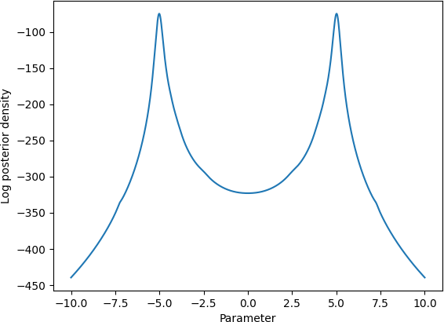
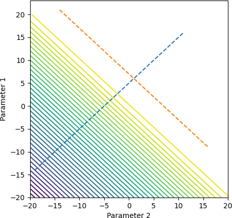
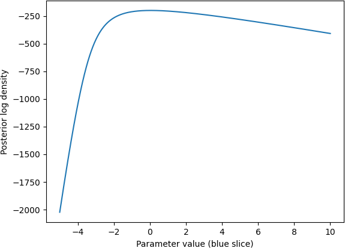
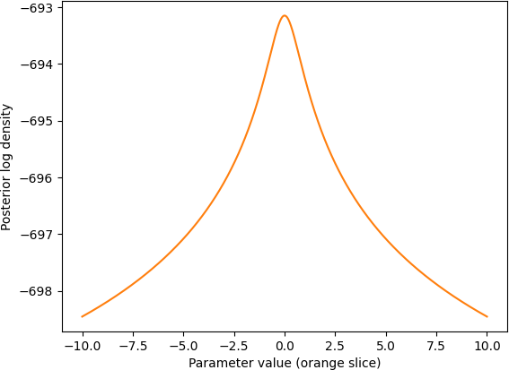
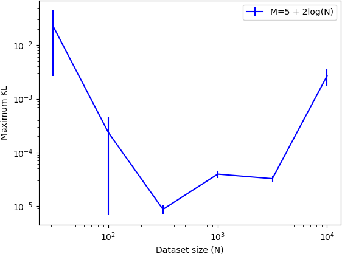
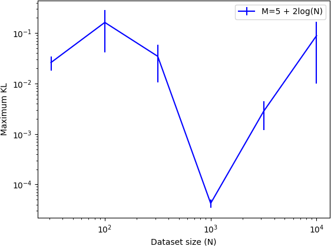

# 贝叶斯核心集质量的通用上限

发布时间：2024年05月20日

`LLM理论

理由：这篇论文主要探讨了贝叶斯核心集的理论分析，特别是在大规模数据环境中加速后验推断的方法。它提出了核心集近似的 Kullback-Leibler (KL) 散度的通用上界和下界，这些理论分析扩展了贝叶斯核心集的适用范围，并且适用于多模态、不可识别、重尾贝叶斯后验分布。这些内容属于对大型语言模型（LLM）理论层面的深入研究，因此归类为LLM理论。` `数据分析` `贝叶斯统计`

> General bounds on the quality of Bayesian coresets

# 摘要

> 贝叶斯核心集通过利用数据的小型加权子集来近似完整数据的对数似然，从而在大规模数据环境中加速后验推断。虽然贝叶斯核心集及其构建方法广泛适用，但现有理论分析仅限于特定模型，如指数族模型或具有强对数凹性和平滑性假设的模型。本研究提出了核心集近似的 Kullback-Leibler (KL) 散度的通用上界和下界，扩展了贝叶斯核心集的适用范围。下界仅需贝叶斯分析中常见的温和模型假设，而上界则采用比以往更宽松的广义次指数性标准。这些下界揭示了核心集近似的基本限制，并为基于重要性采样的构建方法的实证表现不佳提供了理论依据。上界则用于评估子样本优化方法的性能。通过多模态、不可识别、重尾贝叶斯后验分布的实验，验证了该理论的广泛适用性。

> Bayesian coresets speed up posterior inference in the large-scale data regime by approximating the full-data log-likelihood function with a surrogate log-likelihood based on a small, weighted subset of the data. But while Bayesian coresets and methods for construction are applicable in a wide range of models, existing theoretical analysis of the posterior inferential error incurred by coreset approximations only apply in restrictive settings -- i.e., exponential family models, or models with strong log-concavity and smoothness assumptions. This work presents general upper and lower bounds on the Kullback-Leibler (KL) divergence of coreset approximations that reflect the full range of applicability of Bayesian coresets. The lower bounds require only mild model assumptions typical of Bayesian asymptotic analyses, while the upper bounds require the log-likelihood functions to satisfy a generalized subexponentiality criterion that is weaker than conditions used in earlier work. The lower bounds are applied to obtain fundamental limitations on the quality of coreset approximations, and to provide a theoretical explanation for the previously-observed poor empirical performance of importance sampling-based construction methods. The upper bounds are used to analyze the performance of recent subsample-optimize methods. The flexibility of the theory is demonstrated in validation experiments involving multimodal, unidentifiable, heavy-tailed Bayesian posterior distributions.

[Arxiv](https://arxiv.org/abs/2405.11780)